# LX-AICODING Agent 核心课件

> 面向对象：高级级 Agent 工程师。  
> 授课讲师： 肖斌。  
> 课程范围：只围绕 `agent/` 目录中智能体构建、运行、文件后端、长期记忆、中间件、流式事件和持久化等核心内容展开。前端只作为展示层轻讲。  
> 当前版本日期：2026-07-05。  

---

## 0. 课件使用方式

### 0.1 课程目标

本课件不是讲“如何调用一次大模型”，而是讲一个真实 Agent Coding 项目的工程化搭建顺序。

完成课程后，学员应能理解：

| 能力 | 学完后应达到的理解 |
|---|---|
| Agent Loop | 模型如何在“思考、调用工具、读取反馈、继续行动”之间循环 |
| DeepAgents | `create_deep_agent` 如何把模型、工具、文件系统、子 Agent、skills 和 middleware 组合成 harness |
| 文件后端 | 为什么 Agent 需要一个受控的 backend，而不能直接读写全盘 |
| 长期记忆 | 记忆、skills、prompt、checkpoint 分别解决什么问题 |
| 中间件 | 如何在工具调用前清洗参数、在工具失败后恢复运行 |
| 运行调度 | 为什么要先生成方案、等待确认，再进入编码实现 |
| 流式展示 | 如何把 DeepAgents raw event 转成页面可见步骤 |
| 持久化 | 为什么业务 Store 和 LangGraph checkpoint 要分开 |

### 0.2 官方资料

本课件参考了以下官方资料，课堂中可以打开对照讲解：

| 主题 | 官方资料 |
|---|---|
| Deep Agents 总览 | [Deep Agents overview](https://docs.langchain.com/oss/python/deepagents/overview) |
| DeepAgents Backends | [Backends](https://docs.langchain.com/oss/python/deepagents/backends) |
| DeepAgents Permissions | [Permissions](https://docs.langchain.com/oss/python/deepagents/permissions) |
| DeepAgents Memory | [Memory](https://docs.langchain.com/oss/python/deepagents/memory) |
| DeepAgents Skills | [Skills](https://docs.langchain.com/oss/python/deepagents/skills) |
| DeepAgents Streaming | [Streaming](https://docs.langchain.com/oss/python/deepagents/streaming) |
| DeepAgents Event Streaming | [Event streaming](https://docs.langchain.com/oss/python/deepagents/event-streaming) |
| LangChain Agents | [Agents](https://docs.langchain.com/oss/python/langchain/agents) |
| LangChain Middleware | [Middleware overview](https://docs.langchain.com/oss/python/langchain/middleware/overview) |
| LangGraph Persistence | [Persistence](https://docs.langchain.com/oss/python/langgraph/persistence) |
| LangGraph Streaming | [Streaming](https://docs.langchain.com/oss/python/langgraph/streaming) |

### 0.3 当前项目的核心结论

LX-AICODING 当前不是简单封装 LangChain tool，也不是旧版的 `build_tools` 结构。它已经迁移到更接近 open-swe 的架构：

```text
FastAPI API
  -> runtime.py
  -> server.py:get_agent(config)
  -> create_deep_agent(...)
  -> LocalShellBackend
  -> Middleware
  -> Skills
  -> LangGraph Checkpoint
  -> streaming_runtime.py
  -> store.sqlite / dashboard SSE
```

---

## 1. 先建立 Agent 项目全局画像

### 1.1 前置知识点

初级工程师需要先理解三个概念：

| 概念 | 简单解释 |
|---|---|
| Agent | 一个模型在循环中调用工具，直到任务完成 |
| Harness | 包在模型外面的工程外壳：prompt、tools、middleware、memory、filesystem、streaming 等 |
| Runtime | 真正驱动 Agent 执行、保存状态、输出事件的运行层 |

LangChain 官方把 Agent 描述为“模型在循环中调用工具直到任务完成”。DeepAgents 则在普通 Agent Loop 之上内置了文件系统、task planning、subagent、memory、skills 等能力。

### 1.2 当前项目解决什么问题

LX-AICODING 是一个本地 Windows 版 Gitee Coding Agent 教学项目。

它要解决的问题是：

| 问题 | 项目中的解决方式 |
|---|---|
| Agent 如何安全操作代码仓库 | `LocalShellBackend` 限定 `E:\ai_workspace` 虚拟工作区 |
| Agent 如何理解任务类型 | `task_intent.py` 本地关键词分类 |
| Agent 如何先方案后编码 | `runtime.py` 规划阶段和确认阶段 |
| Agent 如何读写文件和执行命令 | DeepAgents 原生 filesystem tools + 自定义 backend |
| Agent 如何创建 Gitee PR | `gitee_tools.py` 和 `gitee_api.py` |
| Agent 如何处理工具错误 | `ToolErrorMiddleware` 转成可恢复 ToolMessage |
| Agent 如何防止危险路径 | `SanitizeToolInputsMiddleware` 清洗工具入参 |
| Agent 如何展示实时过程 | `streaming_runtime.py` 写入 `run_events`，Dashboard SSE 轮询 |
| Agent 如何保存运行状态 | `store.sqlite` 保存业务状态，`checkpoints.sqlite` 保存 LangGraph 状态 |

### 1.3 总体架构图

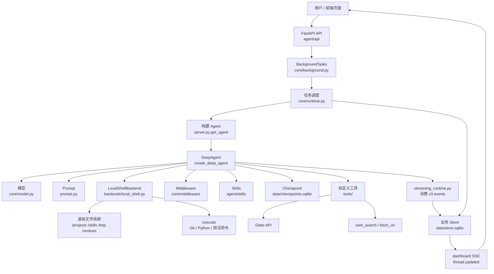
```mermaid
flowchart TD
    U["用户 / 前端页面"] --> API["FastAPI API<br/>agent/api"]
    API --> BG["BackgroundTasks<br/>core/background.py"]
    BG --> RT["任务调度<br/>core/runtime.py"]
    RT --> GA["构建 Agent<br/>server.py:get_agent"]

    GA --> DA["DeepAgent<br/>create_deep_agent"]
    DA --> M["模型<br/>core/model.py"]
    DA --> P["Prompt<br/>prompt.py"]
    DA --> B["LocalShellBackend<br/>backends/local_shell.py"]
    DA --> MW["Middleware<br/>core/middleware"]
    DA --> SK["Skills<br/>agent/skills"]
    DA --> CP["Checkpoint<br/>data/checkpoints.sqlite"]

    B --> FS["虚拟文件系统<br/>/projects /skills /tmp /reviews"]
    B --> EX["execute<br/>Git / Python / 测试命令"]
    DA --> T["自定义工具<br/>tools/"]
    T --> GITEE["Gitee API"]
    T --> WEB["web_search / fetch_url"]

    RT --> ST["业务 Store<br/>data/store.sqlite"]
    DA --> SR["streaming_runtime.py<br/>消费 v3 events"]
    SR --> ST
    ST --> SSE["dashboard SSE<br/>thread.updated"]
    SSE --> U
```

### 1.4 代码目录速览

```text
agent/
├─ app.py                    FastAPI 应用入口
├─ server.py                 当前 DeepAgent 工厂，最核心
├─ prompt.py                 系统提示词和任务提示词
├─ env_utils.py              环境变量加载
├─ api/                      FastAPI 路由与 Dashboard 适配
├─ core/                     runtime、streaming、settings、middleware、checkpoint
├─ backends/                 本地 Windows backend 和路径安全
├─ tools/                    Gitee、web_search、fetch_url、reviewer 等自定义工具
├─ store/                    业务 SQLite Store
├─ skills/                   DeepAgents skills
└─ memory/                   长期记忆文件
```

---

## 2. 第一步：搭建服务入口和配置加载

### 2.1 前置知识点

Agent 项目不是只有 Agent 本身，还需要一个服务入口把它变成可调用系统。

在本项目中：

| 层 | 文件 | 作用 |
|---|---|---|
| Web 服务入口 | `agent/app.py` | 创建 FastAPI app |
| 环境加载 | `agent/env_utils.py` | 加载 DeepSeek、Gitee、搜索等密钥 |
| 路径配置 | `agent/core/settings.py` | 配置 data、logs、workspace |
| 日志配置 | `agent/core/logging_config.py` | 配置控制台日志、全量后端日志、Agent 专用日志和按日期轮转 |
| 日志 API | `agent/api/routes.py` | 提供 `/api/logs/backend` 和 `/api/logs/agent` 读取日志 |

这一章的重点不是 FastAPI 语法，而是让学员理解一个真实 Agent 项目启动之前必须先准备好的基础设施：

| 基础设施 | 解决的问题 |
|---|---|
| `.env` 加载 | 模型密钥、Gitee token、搜索 key 从哪里来 |
| 路径集中配置 | SQLite、日志、工作区路径不能散落在各个文件里 |
| 日志系统 | Agent 运行时间长、工具调用多，必须能在控制台和文件中追踪 |
| 健康检查 | 服务启动后要有一个最小可验证入口 |
| 日志读取 API | 前端和课堂浏览器可以直接查看后端日志 |

### 2.2 开发顺序

一个初级 Agent 工程师应先写这些基础设施：

1. 写 `env_utils.py`，统一加载 `.env`。
2. 写 `settings.py`，固定项目数据目录和 Agent 工作区。
3. 写 `logging_config.py`，保证后续所有运行可追踪。
4. 写 `app.py`，启动 FastAPI 并挂载 API。
5. 写日志读取接口，方便页面和课堂直接查看日志。

课堂建议按这个顺序讲：

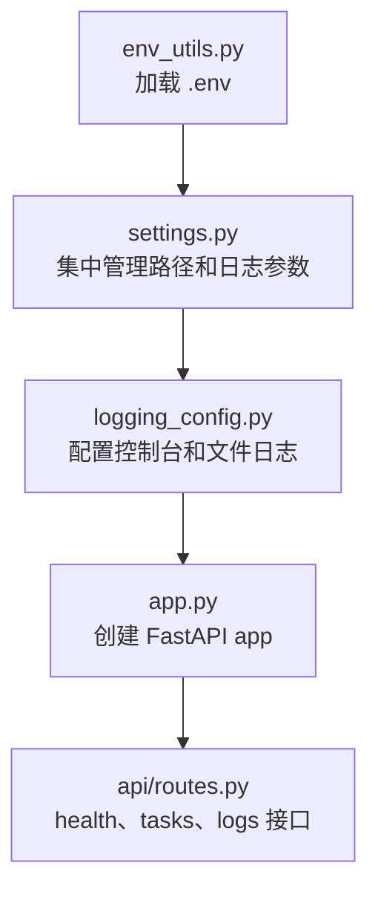
```mermaid
flowchart TD
    A["env_utils.py<br/>加载 .env"] --> B["settings.py<br/>集中管理路径和日志参数"]
    B --> C["logging_config.py<br/>配置控制台和文件日志"]
    C --> D["app.py<br/>创建 FastAPI app"]
    D --> E["api/routes.py<br/>health、tasks、logs 接口"]
```

### 2.3 当前项目关键配置

| 配置 | 默认值 | 作用 |
|---|---|---|
| `PROJECT_ROOT` | `E:\my_project\LX_AICoding` | 当前教学项目源码目录 |
| `DATA_DIR` | `data/` | SQLite 数据目录 |
| `STORE_DB_PATH` | `data/store.sqlite` | 业务 Store |
| `CHECKPOINT_DB_PATH` | `data/checkpoints.sqlite` | LangGraph checkpoint |
| `LOG_DIR` | `logs/` | 日志目录 |
| `LX_AICODING_LOG_LEVEL` | `INFO` | 日志级别 |
| `LX_AICODING_LOG_RETENTION_DAYS` | `14` | 日志保留天数 |
| `LX_AICODING_LOG_WHEN` | `midnight` | 日志轮转周期 |
| `LX_AICODING_LOG_INTERVAL` | `1` | 日志轮转间隔，配合 `LX_AICODING_LOG_WHEN` 使用 |
| `WORKSPACE_ROOT` | `E:\ai_workspace` | Agent 真正操作用户仓库的工作区 |
| `PROJECTS_DIR` | `E:\ai_workspace\projects` | Gitee 仓库目录 |
| `SKILLS_DIR` | `E:\ai_workspace\skills` | DeepAgents skills 目录 |

其中日志相关配置都在 `agent/core/settings.py` 中集中定义：

| 函数或常量 | 作用 |
|---|---|
| `LOG_DIR` | 当前项目日志目录，默认是 `E:\my_project\LX_AICoding\logs` |
| `LOG_LEVEL` | 日志级别，非法配置会在 `logging_config.py` 中回退到 `INFO` |
| `LOG_ROTATION_WHEN` | 轮转时间点，默认 `midnight` |
| `LOG_ROTATION_INTERVAL` | 轮转间隔，默认 `1` |
| `LOG_RETENTION_DAYS` | 历史日志保留数量，默认 `14` |
| `backend_log_path()` | 返回 `backend.log` 或历史 `backend.log.YYYY-MM-DD` |
| `agent_log_path()` | 返回 `agent-runs.log` 或历史 `agent-runs.log.YYYY-MM-DD` |

### 2.4 日志系统改造后的设计

当前项目已经不是简单“每天生成一个日志文件”的手写方案，而是采用 Python 标准库 `TimedRotatingFileHandler` 做日志轮转。

日志文件分为两类：

| 日志文件 | 内容范围 | 用途 |
|---|---|---|
| `logs/backend.log` | 全量后端日志 | 排查 FastAPI、任务创建、API 请求、Store、工具异常等所有后端问题 |
| `logs/agent-runs.log` | 只记录 `agent.run.*` logger | 专门观察 Agent 执行链路、工具调用、中间件、流式事件 |

每天轮转后，标准库会生成历史文件：

| 当前文件 | 历史文件格式 |
|---|---|
| `backend.log` | `backend.log.YYYY-MM-DD` |
| `agent-runs.log` | `agent-runs.log.YYYY-MM-DD` |

举例：

```text
logs/
├── backend.log
├── backend.log.2026-07-10
├── agent-runs.log
└── agent-runs.log.2026-07-10
```

课堂讲解重点：

> 当前正在写入的日志文件名是固定的，历史日志才带日期后缀。这是 `TimedRotatingFileHandler` 的标准行为，也更容易控制保留天数。

### 2.5 `logging_config.py` 的核心逻辑

`agent/core/logging_config.py` 做了五件事：

| 步骤 | 代码点 | 说明 |
|---|---|---|
| 1 | `_configure_console_encoding()` | 尽量把控制台输出切换成 UTF-8，降低 Windows 中文乱码概率 |
| 2 | `_close_and_remove_handlers()` | 清理旧 handler，避免 reload 或测试时重复写日志 |
| 3 | `_make_timed_file_handler()` | 创建按时间轮转的文件日志 handler |
| 4 | `PrefixLoggerFilter("agent.run")` | 让 `agent-runs.log` 只接收 Agent 运行链路日志 |
| 5 | `configure_logging()` | 统一挂载 console、backend、agent 三类 handler |

伪代码可以这样讲：

```python
def configure_logging():
    # 1. 修正控制台编码，减少中文乱码
    configure_console_encoding()

    # 2. 准备 logs 目录
    LOG_DIR.mkdir(parents=True, exist_ok=True)

    # 3. 清理旧 handler，避免重复写日志
    close_and_remove_handlers(root_logger)

    # 4. 控制台输出所有日志
    root_logger.addHandler(console_handler)

    # 5. backend.log 写入全量后端日志
    root_logger.addHandler(backend_file_handler)

    # 6. agent-runs.log 只写入 agent.run.* 日志
    agent_file_handler.addFilter(PrefixLoggerFilter("agent.run"))
    root_logger.addHandler(agent_file_handler)
```

这里特别适合讲一个工程化思想：

> 不要在业务代码里到处手动写不同日志文件。应该通过 logger name 和 handler filter，把日志分流规则集中放在日志配置层。

### 2.6 为什么需要 `agent.run.*` 专用日志

Agent 运行时会产生很多不同类型的日志：

| 日志来源 | 示例 logger | 是否进入 `backend.log` | 是否进入 `agent-runs.log` |
|---|---|---|---|
| API 请求 | `agent.api` | 是 | 否 |
| 后台任务 | `agent.run.background` | 是 | 是 |
| runtime 调度 | `agent.run.runtime` | 是 | 是 |
| streaming 事件 | `agent.run.streaming` | 是 | 是 |
| shell 执行 | `agent.run.shell` | 是 | 是 |
| Gitee 工具 | `agent.run.gitee` | 是 | 是 |
| 中间件 | `agent.run.middleware.tool_error` | 是 | 是 |
| memory 加载 | `agent.memory` | 是 | 否 |

这样设计的好处：

| 好处 | 说明 |
|---|---|
| 全量问题看 `backend.log` | 服务启动、API 请求、配置加载、Store 失败都能看到 |
| Agent 问题看 `agent-runs.log` | 不被普通 API 日志干扰，排查任务执行更快 |
| 前端日志页面更清晰 | 可以分别展示后端日志和 Agent 执行日志 |
| 课堂复盘更方便 | 学员可以只看 Agent 运行链路 |

### 2.7 日志 API 如何读取文件

日志读取接口位于 `agent/api/routes.py`：

| API | 读取内容 |
|---|---|
| `/api/logs/backend` | 读取后端全量日志 |
| `/api/logs/agent` | 读取 Agent 执行日志 |

支持参数：

| 参数 | 示例 | 说明 |
|---|---|---|
| `limit` | `?limit=200` | 读取最近多少行 |
| `date` | `?date=2026-07-10` | 读取某一天的历史日志 |

示例：

```text
http://127.0.0.1:2024/api/logs/backend?limit=200
http://127.0.0.1:2024/api/logs/agent?limit=200
http://127.0.0.1:2024/api/logs/backend?date=2026-07-10
http://127.0.0.1:2024/api/logs/agent?date=2026-07-10
```

课堂讲解点：

> 日志 API 只暴露当前标准命名规则：当前文件是 `backend.log` / `agent-runs.log`，历史文件是 `.YYYY-MM-DD` 后缀。

### 2.8 日志系统在启动链路中的位置

`agent/app.py` 中会先调用：

```python
configure_logging()
```

然后再创建 FastAPI app。

启动顺序可以这样理解：

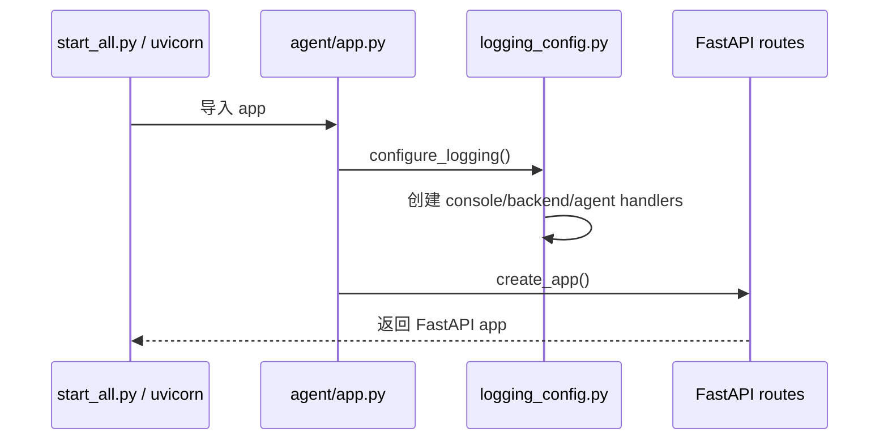
```mermaid
sequenceDiagram
    participant Start as start_all.py / uvicorn
    participant App as agent/app.py
    participant Log as logging_config.py
    participant API as FastAPI routes

    Start->>App: 导入 app
    App->>Log: configure_logging()
    Log->>Log: 创建 console/backend/agent handlers
    App->>API: create_app()
    API-->>Start: 返回 FastAPI app
```

为什么日志配置要尽量靠前？

| 原因 | 说明 |
|---|---|
| 捕获启动期错误 | 配置、路由、数据库初始化失败也要能写入日志 |
| 避免重复 handler | reload 或测试时要先清理旧 handler |
| 保证格式统一 | 后续所有模块只需要 `logging.getLogger(...)` |

### 2.9 日志系统与控制台输出的关系

当前日志系统同时写两个地方：

| 输出位置 | 作用 |
|---|---|
| 控制台 | PyCharm、PowerShell、uvicorn 运行窗口实时查看 |
| 文件 | `logs/backend.log` 和 `logs/agent-runs.log` 持久化留痕 |

日志格式包含：

```text
时间 级别 [logger名称] [pid=进程号 thread=线程名] 消息
```

这样设计是为了排查三类问题：

| 问题 | 为什么需要 pid/thread |
|---|---|
| FastAPI 后台任务 | 同一个请求可能进入后台线程 |
| SSE 或轮询 | 前端可能频繁读取任务状态和日志 |
| Agent 工具调用 | shell、Gitee、streaming 事件可能交错出现 |

### 2.10 课堂演示建议

打开以下文件讲解：

```text
agent/app.py
agent/env_utils.py
agent/core/settings.py
agent/core/logging_config.py
agent/api/routes.py
```

建议按这个顺序演示：

1. 打开 `agent/core/settings.py`，说明 `LOG_DIR`、`backend_log_path()`、`agent_log_path()`。
2. 打开 `agent/core/logging_config.py`，说明三个 handler：console、backend file、agent file。
3. 重点讲 `PrefixLoggerFilter("agent.run")`，解释为什么 `agent-runs.log` 只记录 Agent 执行链路。
4. 打开 `agent/app.py`，说明为什么启动时先 `configure_logging()`。
5. 打开 `agent/api/routes.py`，说明 `/api/logs/backend` 和 `/api/logs/agent` 如何读取日志。
6. 启动服务后访问健康检查。
7. 再访问日志接口，观察返回结果。

健康检查：

```text
http://127.0.0.1:2024/health
```

日志接口：

```text
http://127.0.0.1:2024/api/logs/backend
http://127.0.0.1:2024/api/logs/agent
```

如果要演示历史日志读取，可以使用：

```text
http://127.0.0.1:2024/api/logs/backend?date=2026-07-10
http://127.0.0.1:2024/api/logs/agent?date=2026-07-10
```

### 2.11 为什么项目源码和 Agent 工作区要分开

课堂重点：

> `E:\my_project\LX_AICoding` 是教学项目本身；`E:\ai_workspace` 是 Agent 操作用户代码的工作区。两者分开，能降低 Agent 误改课程项目的风险。

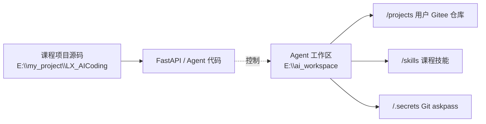
```mermaid
flowchart LR
    A["课程项目源码<br/>E:\\my_project\\LX_AICoding"] --> B["FastAPI / Agent 代码"]
    C["Agent 工作区<br/>E:\\ai_workspace"] --> D["/projects 用户 Gitee 仓库"]
    C --> E["/skills 课程技能"]
    C --> F["/.secrets Git askpass"]
    B -. "控制" .-> C
```

### 2.12 本章课堂总结

本章最后可以给学员总结三句话：

1. Agent 项目要先有服务入口、配置系统和日志系统，再谈智能体能力。
2. 当前日志系统采用“控制台 + 全量后端日志 + Agent 专用日志”的三路输出。
3. 日志文件使用 `TimedRotatingFileHandler` 自动按日期轮转，当前文件固定叫 `backend.log` / `agent-runs.log`，历史文件才带日期后缀。

---

## 3. 第二步：设计本地工作区和文件后端

### 3.1 前置知识点

DeepAgents 提供虚拟文件系统能力。官方文档中，Agent 可以通过 `ls`、`read_file`、`write_file`、`edit_file`、`glob`、`grep` 访问文件；如果 backend 支持 shell，还会出现 `execute`。

对于初级工程师，先记住：

| 概念 | 作用 |
|---|---|
| Backend | 文件和命令真正执行的位置 |
| Virtual filesystem | Agent 看到的是 `/projects/a.py` 这种虚拟路径 |
| Permission | 限制 Agent 可以读写哪些虚拟路径 |
| Sandbox | 给 `execute` 提供受控执行环境 |

### 3.2 为什么本项目要自定义 LocalShellBackend

DeepAgents 官方的 `LocalShellBackend` 直接操作宿主机，官方文档也提示它只适合受控开发环境。LX-AICODING 面向课堂和本地 Windows，因此自定义了 [agent/backends/local_shell.py](../agent/backends/local_shell.py)：

| 需求 | 项目实现 |
|---|---|
| Windows 路径兼容 | 把虚拟路径映射到 `E:\ai_workspace` |
| DeepAgents 文件协议 | 实现 `ls/read/write/edit/glob/grep` |
| 命令执行 | 实现 `execute` 和旧兼容 `run` |
| Gitee 认证 | 自动生成 askpass 文件，不把 token 写入命令 |
| 安全目录 | `/skills`、`/policies`、`/runtimes`、`/logs` 拒绝写入 |
| 旧代码兼容 | 保留 `read_file/write_file/list_files/run` |

### 3.3 LocalShellBackend 的核心优势和亮点

`LocalShellBackend` 是本项目的工程底座。它不是一个简单的 `subprocess.run()` 包装器，而是把 DeepAgents 文件后端、Windows 本地执行、Gitee 认证、安全边界和旧代码兼容封装到一个统一对象里。

| 亮点 | 解决的问题 | 对应代码位置 |
|---|---|---|
| DeepAgents 原生 backend 协议 | 让 `ls/read_file/write_file/edit_file/glob/grep/execute` 这些原生工具可用 | `LocalShellBackend(BaseSandbox)` |
| 虚拟路径映射 | 模型只看到 `/projects/demo`，不需要知道 Windows 真实盘符 | `_resolve_virtual_path()`、`_to_virtual_path()` |
| Windows 本地兼容 | 兼容 `E:\ai_workspace`、PowerShell、Git、Python venv、路径分隔符 | `__init__()`、`_normalize_compat_path()` |
| 工作区初始化 | 自动创建 `projects/skills/policies/reviews/runtimes/tmp/logs/.secrets` | `_ensure_layout()` |
| 默认策略文件 | 自动生成 workspace/git/security 策略说明 | `_ensure_policy_files()` |
| Gitee askpass | Git 操作自动认证，不把 token 拼进 clone URL 或命令 | `_ensure_gitee_askpass_files()`、`_execution_env()` |
| 命令安全防护 | 拦截危险命令、工作区外绝对路径、路径穿越 | `_deny_reason()`、`_prepare_run_command()` |
| 虚拟路径命令替换 | 命令里写 `/projects/repo` 时自动替换成本地真实路径 | `_virtual_command_path_replacement()` |
| token 脱敏 | 日志和工具返回中隐藏 Gitee token | `_mask_token()` |
| 旧接口兼容 | 保留旧版 runtime/pull-only 分支使用的 `run/list_files/read_file/write_file` | 兼容方法区域 |

课堂可以这样讲：

> 如果把 Agent 比作一个开发人员，`LocalShellBackend` 就是它的“电脑、文件系统、终端、凭据管理和安全边界”。没有这个 backend，模型只能说话，不能可靠地完成代码任务。

### 3.4 LocalShellBackend 的分层结构

`LocalShellBackend` 可以拆成四层理解：

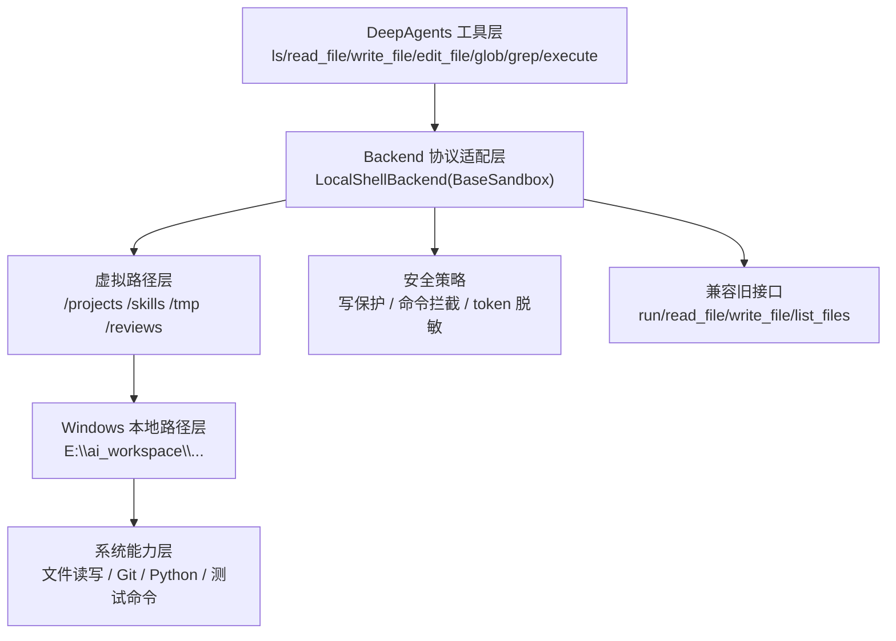
```mermaid
flowchart TD
    A["DeepAgents 工具层<br/>ls/read_file/write_file/edit_file/glob/grep/execute"] --> B["Backend 协议适配层<br/>LocalShellBackend(BaseSandbox)"]
    B --> C["虚拟路径层<br/>/projects /skills /tmp /reviews"]
    C --> D["Windows 本地路径层<br/>E:\\ai_workspace\\..."]
    D --> E["系统能力层<br/>文件读写 / Git / Python / 测试命令"]

    B --> F["安全策略<br/>写保护 / 命令拦截 / token 脱敏"]
    B --> G["兼容旧接口<br/>run/read_file/write_file/list_files"]
```

这张图要让学员理解：DeepAgents 调用的是统一 backend 协议，而不是直接操作 Windows 文件。

### 3.5 虚拟目录设计

| 虚拟路径 | 本地路径 | 写入策略 | 说明 |
|---|---|---|---|
| `/projects` | `E:\ai_workspace\projects` | 可写 | 用户 Gitee 仓库源码 |
| `/skills` | `E:\ai_workspace\skills` | 只读 | DeepAgents skills |
| `/policies` | `E:\ai_workspace\policies` | 只读 | 工作区策略 |
| `/reviews` | `E:\ai_workspace\reviews` | 可写 | 审查资料和输出 |
| `/runtimes` | `E:\ai_workspace\runtimes` | 只读 | 共享运行环境 |
| `/tmp` | `E:\ai_workspace\tmp` | 可写 | 临时文件 |
| `/logs` | `E:\ai_workspace\logs` | 只读 | 工作区日志 |
| `/.secrets` | `E:\ai_workspace\.secrets` | 禁止读写展示 | Git askpass 和敏感凭据 |

这套目录不是随意设计的。它把 Agent 能处理的内容分成几类：

| 类型 | 目录 | 工程意义 |
|---|---|---|
| 业务源码 | `/projects` | Agent 真正开发、测试、提交的地方 |
| 能力资料 | `/skills` | 给 Agent 看的专业流程，默认只读 |
| 规则资料 | `/policies` | 工作区、Git、安全规则，默认只读 |
| 输出资料 | `/reviews`、`/tmp` | 允许 Agent 写审查结果和临时文件 |
| 运行环境 | `/runtimes` | Python/Node 等共享环境，不允许模型随意改 |
| 敏感信息 | `/.secrets` | 只给 backend 使用，不给模型读取 |

### 3.6 文件后端调用关系

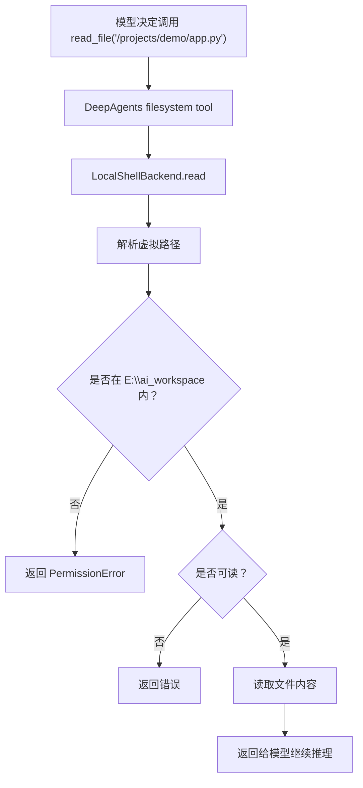
```mermaid
flowchart TD
    A["模型决定调用 read_file('/projects/demo/app.py')"] --> B["DeepAgents filesystem tool"]
    B --> C["LocalShellBackend.read"]
    C --> D["解析虚拟路径"]
    D --> E{"是否在 E:\\ai_workspace 内？"}
    E -->|否| F["返回 PermissionError"]
    E -->|是| G{"是否可读？"}
    G -->|否| H["返回错误"]
    G -->|是| I["读取文件内容"]
    I --> J["返回给模型继续推理"]
```

### 3.7 DeepAgents permissions 是什么

DeepAgents permissions 是传给 `create_deep_agent(..., permissions=[...])` 的声明式文件权限规则。它主要控制 DeepAgents 原生文件工具能对哪些虚拟路径执行读写操作。

官方概念可以简化为：

| 字段 | 含义 |
|---|---|
| `operations` | 控制 `read`、`write` 或两者 |
| `paths` | 虚拟路径 glob，例如 `/projects/**` |
| `mode` | `allow` 或 `deny` |
| 匹配顺序 | 按规则顺序匹配，先匹配先生效 |

课堂重点：

> permissions 管的是 DeepAgents 文件工具的可见能力；backend 管的是最终本地路径和命令执行安全。两者不能互相替代。

### 3.8 当前项目的主 Agent permissions

当前主 Agent 权限在 [agent/server.py](../agent/server.py) 的 `_agent_filesystem_permissions()` 中定义。

| 规则顺序 | operations | paths | mode | 工程含义 |
|---:|---|---|---|---|
| 1 | `read` | `/projects/**`、`/skills/**`、`/policies/**`、`/reviews/**`、`/runtimes/**`、`/logs/**`、`/tmp/**` | allow | 主 Agent 可以读取这些工作区资料 |
| 2 | `write` | `/projects/**`、`/reviews/**`、`/tmp/**` | allow | 主 Agent 可以改业务源码、写审查资料和临时文件 |
| 3 | `write` | `/skills/**`、`/policies/**`、`/runtimes/**`、`/logs/**` | deny | 防止模型修改技能、策略、运行环境和日志 |
| 4 | `read/write` | `/**` | deny | 默认拒绝未显式授权路径 |

用 Mermaid 表示：

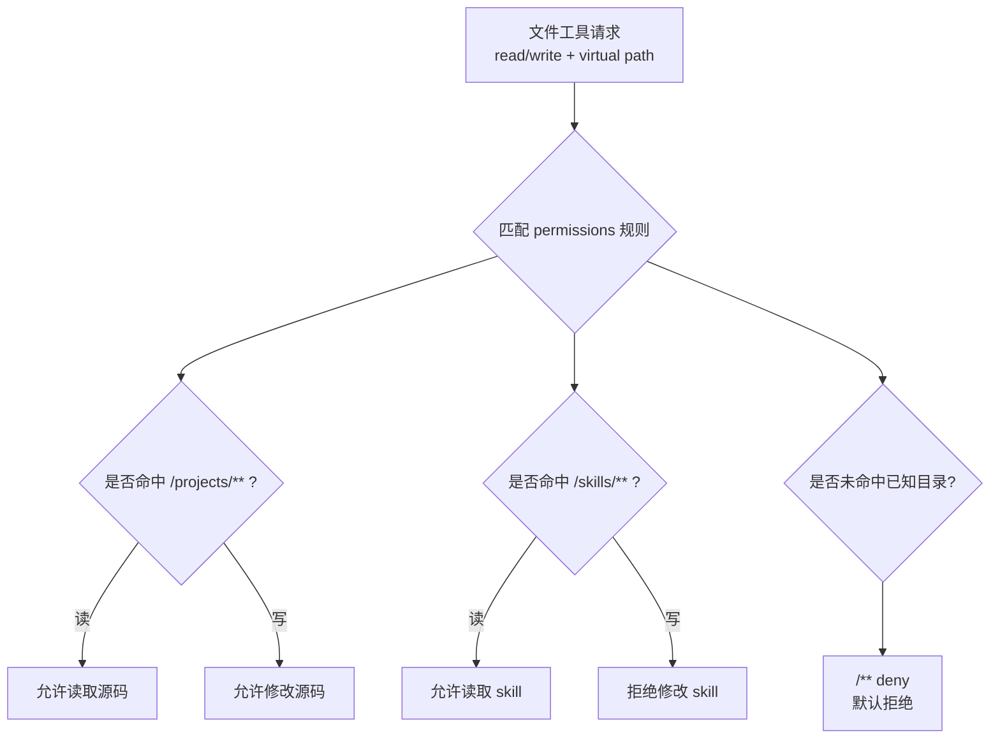
```mermaid
flowchart TD
    A["文件工具请求<br/>read/write + virtual path"] --> B{"匹配 permissions 规则"}
    B --> C{"是否命中 /projects/** ?"}
    C -->|读| D["允许读取源码"]
    C -->|写| E["允许修改源码"]
    B --> F{"是否命中 /skills/** ?"}
    F -->|读| G["允许读取 skill"]
    F -->|写| H["拒绝修改 skill"]
    B --> I{"是否未命中已知目录?"}
    I --> J["/** deny<br/>默认拒绝"]
```

### 3.9 子 Agent permissions 为什么更窄

当前项目还为 general-purpose subagent 设置了单独权限。子 Agent 可以读 `/projects`，但不能写 `/projects`。

| 角色 | `/projects` 读 | `/projects` 写 | 设计目的 |
|---|---:|---:|---|
| 主 Agent | 允许 | 允许 | 负责最终开发实现 |
| 子 Agent | 允许 | 禁止 | 只做分析和建议，避免并行子任务误改源码 |

课堂解释：

> 子 Agent 适合读代码、总结结构、提出建议；真正修改文件的权力应该留给主 Agent。这样主流程更可控，责任边界更清晰。

### 3.10 本项目如何基于 DeepAgents permissions 工程化落地

可以把落地过程拆成 7 步：

| 步骤 | 工程动作 | 当前项目文件 |
|---:|---|---|
| 1 | 先定义工作区根目录，明确 Agent 只能操作 `E:\ai_workspace` | `core/settings.py` |
| 2 | 设计虚拟目录，把源码、技能、策略、日志、临时文件分开 | `backends/local_shell.py` |
| 3 | 在 backend 中实现虚拟路径到真实路径的安全解析 | `_resolve_virtual_path()` |
| 4 | 在 backend 中给敏感目录和只读目录加硬防护 | `_write_deny_reason()` |
| 5 | 在 `server.py` 中声明主 Agent 文件权限 | `_agent_filesystem_permissions()` |
| 6 | 在 `server.py` 中声明子 Agent 更窄的文件权限 | `_general_purpose_subagent()` |
| 7 | 用 middleware 在工具调用前清洗路径，减少错误调用 | `core/middleware/tool_sanitize.py` |

这个落地过程体现了三层边界：

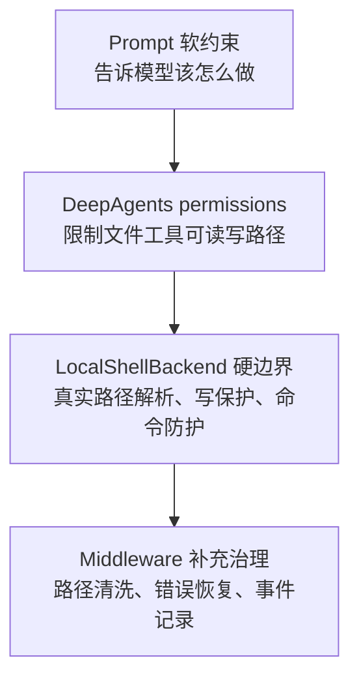
```mermaid
flowchart TD
    A["Prompt 软约束<br/>告诉模型该怎么做"] --> B["DeepAgents permissions<br/>限制文件工具可读写路径"]
    B --> C["LocalShellBackend 硬边界<br/>真实路径解析、写保护、命令防护"]
    C --> D["Middleware 补充治理<br/>路径清洗、错误恢复、事件记录"]
```

### 3.11 permissions 与 backend 的边界

| 能力 | DeepAgents permissions | LocalShellBackend |
|---|---|---|
| 控制 `read_file/write_file/edit_file` 能否读写某路径 | 主要负责 | 最终兜底 |
| 控制虚拟路径映射到哪个 Windows 目录 | 不负责 | 负责 |
| 控制 `execute` 命令能否访问系统路径 | 不足以负责 | 必须负责 |
| 防止写 `.secrets` | 可以通过 deny 辅助 | 必须硬防护 |
| Gitee token 注入和脱敏 | 不负责 | 负责 |
| 旧工具兼容 | 不负责 | 负责 |

课堂强调：

> permissions 是 DeepAgents 层的权限声明；backend 是本地执行层的安全边界。工程落地时两层都要写，不能只写其中一层。

### 3.12 execute 的课堂重点

`execute` 是风险最大的能力，因为它允许模型运行 shell 命令。

本项目通过多层防护降低风险：

| 防护点 | 实现位置 |
|---|---|
| 工作目录固定 | `LocalShellBackend.execute()` 默认在 projects 附近执行 |
| 虚拟路径替换 | `_virtual_command_path_replacement()` |
| 危险命令拦截 | `_deny_reason()` |
| 旧命令白名单 | `permissions.py:normalize_safe_command()` |
| Git token 注入 | `_execution_env()` + `.secrets/gitee_askpass.*` |
| token 脱敏 | `_mask_token()` |

### 3.13 课堂提醒

不要把“文件权限”理解成唯一安全边界。DeepAgents permissions 只控制文件工具；`execute` 能做更多事，所以还必须在 backend 自己做命令和路径防护。

---

## 4. 第三步：接入模型

### 4.1 前置知识点

Agent 的核心循环需要一个聊天模型。LangChain Agent 和 DeepAgents 都可以接收模型标识或已经初始化的模型对象。

LX-AICODING 使用 OpenAI-compatible 调用方式接入 DeepSeek：

```text
agent/core/model.py
```

### 4.2 当前模型配置

| 字段 | 当前设置 |
|---|---|
| 模型类 | `langchain_openai.ChatOpenAI` |
| 默认模型 | `deepseek-v4-pro` |
| API Key | `DEEPSEEK_API_KEY` |
| Base URL | `DEEPSEEK_BASE_URL` |
| max_tokens | `25600` |
| streaming | `True` |
| thinking | disabled |

### 4.3 代码讲解点

```python
def make_main_model() -> ChatOpenAI:
    return ChatOpenAI(
        model=get_env("MAIN_MODEL", "deepseek-v4-pro"),
        temperature=1.1,
        openai_api_key=require_env("DEEPSEEK_API_KEY"),
        openai_api_base=require_env("DEEPSEEK_BASE_URL"),
        max_tokens=DEEPSEEK_V4_MAX_TOKENS,
        streaming=True,
        extra_body={"thinking": {"type": "disabled"}},
    )
```

讲给初级工程师的重点：

1. 模型不是 Agent 的全部，只是 Agent Loop 的决策器。
2. `streaming=True` 不等于前端自动流式展示，还需要后续解析事件。
3. `require_env()` 让关键配置缺失时尽早失败。

---

## 5. 第四步：编写 Prompt 和任务规则

### 5.1 前置知识点

Prompt 在 Agent 项目里不是“写一段好听的话”，而是运行规约。

它至少要回答：

| 问题 | Prompt 中怎么约束 |
|---|---|
| 支持什么平台 | 当前只支持 Gitee |
| 输出语言 | 面向用户必须中文 |
| 文件路径怎么写 | 使用 `/projects/<repo>` 虚拟路径 |
| 使用哪些工具 | DeepAgents 原生工具和自定义工具 |
| 编码任务怎么做 | 读取、修改、验证、提交、PR |
| 只读任务怎么做 | 禁止修改、提交、push、PR |
| 何时使用 skill | 首次分析仓库或生成方案时使用 repo-bootstrap-analysis |

### 5.2 当前 Prompt 结构

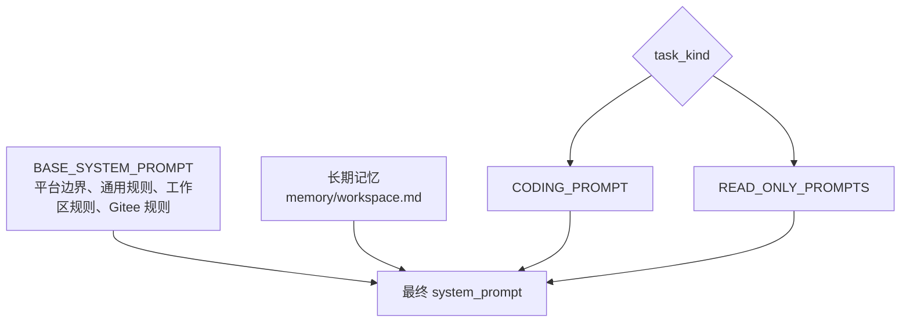
```mermaid
flowchart TD
    A["BASE_SYSTEM_PROMPT<br/>平台边界、通用规则、工作区规则、Gitee 规则"] --> D["最终 system_prompt"]
    B["长期记忆<br/>memory/workspace.md"] --> D
    C{"task_kind"} --> E["CODING_PROMPT"]
    C --> F["READ_ONLY_PROMPTS"]
    E --> D
    F --> D
```

### 5.3 提示词和任务规则定义在哪些文件

这一节上课时必须让学员知道：Prompt 不是只写在一个地方。当前项目把“提示词文本”“任务分类规则”“运行时阶段规则”“工具权限兜底”拆在不同文件里。

| 文件 | 定义内容 | 学员修改场景 |
|---|---|---|
| `agent/prompt.py` | `BASE_SYSTEM_PROMPT`、`CODING_PROMPT`、`READ_ONLY_PROMPTS`、`get_system_prompt()`、`REVIEWER_PROMPT` | 修改模型行为规则、任务类型提示词、输出语言、工具使用规范 |
| `agent/core/task_intent.py` | `TaskKind`、`classify_task_kind()`、关键词分类规则、只读任务判断 | 新增任务类型、调整“哪些话算开发/方案/分析/问答” |
| `agent/core/runtime.py` | 方案生成提示、确认实施判断、最终发给 Agent 的用户内容 | 修改“先方案后实施”流程、确认关键词、plan prompt 模板 |
| `agent/server.py` | `task_kind` 如何进入 `get_system_prompt()`、Agent permissions、middleware、skills | 修改不同任务对应的 Agent 构建方式和权限 |
| `agent/tools/runtime_context.py` | 工具运行时读取 `task_kind`，判断是否只读 | 工具内部需要根据任务类型拒绝高风险动作 |
| `agent/tools/gitee_tools.py` | `open_gitee_pull_request()` 对只读任务拒绝创建 PR | 调整 PR 工具的权限兜底 |
| `agent/core/middleware/tool_sanitize.py` | 工具入参清洗和危险参数拒绝 | 增加路径、URL、参数级安全规则 |
| `agent/skills/repo-bootstrap-analysis/SKILL.md` | 首次仓库分析、方案生成的方法论 | 修改陌生仓库分析流程和方案输出要求 |
| `agent/memory/workspace.md` | 长期工作区知识 | 修改工作区目录语义、团队长期约定 |

课堂讲解时可以用一句话总结：

> `prompt.py` 规定模型“应该怎么做”；`task_intent.py` 判断当前任务“属于哪一类”；`runtime.py` 决定任务“先走方案还是直接执行”；`server.py` 把任务类型转成真实 Agent 配置；middleware 和 tools 做最后兜底。

### 5.4 agent/prompt.py 中具体写了什么

`agent/prompt.py` 是提示词主文件，建议按变量讲：

| 变量或函数 | 作用 | 课堂重点 |
|---|---|---|
| `BASE_SYSTEM_PROMPT` | 所有任务共享的基础规则 | 平台边界、中文输出、虚拟路径、Gitee、命令、联网搜索、skill 规则 |
| `CODING_PROMPT` | 开发实现任务专用规则 | 允许修改代码、测试、Git push、创建 Gitee PR |
| `READ_ONLY_PROMPTS` | 只读任务规则字典 | `analysis/planning/qa/inspect/sync` 分别有不同禁止事项 |
| `get_system_prompt(task_kind)` | 根据任务类型拼最终 system prompt | 会把长期记忆 `workspace.md` 插入到 prompt 中 |
| `SYSTEM_PROMPT` | 默认 coding prompt | 兼容旧代码或调试使用 |
| `REVIEWER_PROMPT` | Reviewer Agent 提示词 | 只审查真实问题，不提纯风格建议 |

`get_system_prompt()` 的拼接逻辑：

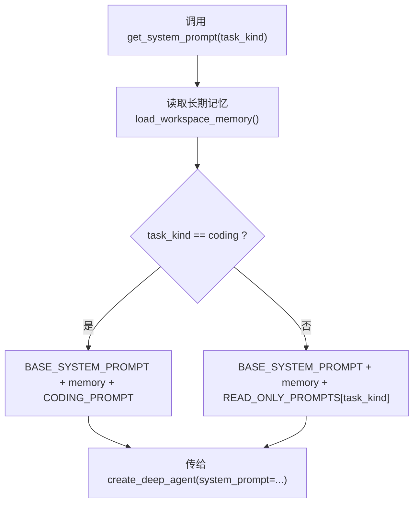
```mermaid
flowchart TD
    A["调用 get_system_prompt(task_kind)"] --> B["读取长期记忆<br/>load_workspace_memory()"]
    B --> C{"task_kind == coding ?"}
    C -->|是| D["BASE_SYSTEM_PROMPT + memory + CODING_PROMPT"]
    C -->|否| E["BASE_SYSTEM_PROMPT + memory + READ_ONLY_PROMPTS[task_kind]"]
    D --> F["传给 create_deep_agent(system_prompt=...)"]
    E --> F
```

### 5.5 agent/core/task_intent.py 中具体写了什么

`task_intent.py` 负责把用户输入分类成固定任务类型。它不调用模型，而是用本地关键词判断。

| 代码元素 | 作用 |
|---|---|
| `TaskKind` | 定义允许的任务类型：`coding/analysis/planning/qa/sync/inspect` |
| `_normalize_prompt()` | 规整用户输入，便于关键词匹配 |
| `is_pull_only_task()` | 判断是否只是同步远程代码 |
| `is_workspace_listing_task()` | 判断是否只是查看工作区项目 |
| `classify_task_kind()` | 主分类函数 |
| `is_read_only_task()` | 判断任务是否只读 |

为什么不用模型分类？

| 原因 | 说明 |
|---|---|
| 权限边界必须可预测 | 任务类型会影响是否允许写文件、push、PR |
| 降低模型误判风险 | 如果模型把“分析项目”误判成 coding，风险很高 |
| 易于测试 | `scripts/verify_task_intent.py` 可以稳定验证关键词规则 |

分类逻辑简化图：

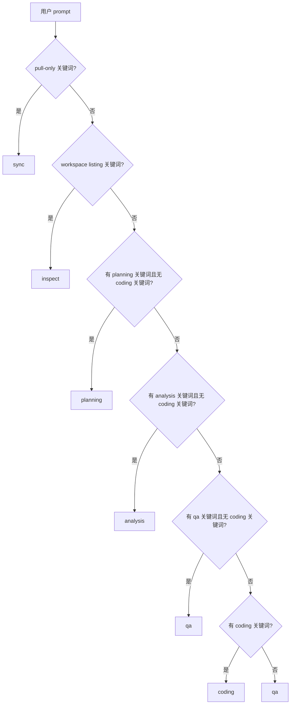
```mermaid
flowchart TD
    A["用户 prompt"] --> B{"pull-only 关键词?"}
    B -->|是| C["sync"]
    B -->|否| D{"workspace listing 关键词?"}
    D -->|是| E["inspect"]
    D -->|否| F{"有 planning 关键词且无 coding 关键词?"}
    F -->|是| G["planning"]
    F -->|否| H{"有 analysis 关键词且无 coding 关键词?"}
    H -->|是| I["analysis"]
    H -->|否| J{"有 qa 关键词且无 coding 关键词?"}
    J -->|是| K["qa"]
    J -->|否| L{"有 coding 关键词?"}
    L -->|是| M["coding"]
    L -->|否| N["qa"]
```

### 5.6 agent/core/runtime.py 中和 Prompt 相关的规则

`runtime.py` 不直接定义系统提示词，但它定义了“发给 Agent 的用户内容”和“方案确认流程”。

| 函数 | 作用 |
|---|---|
| `_build_agent_user_content()` | 构造普通任务发给 DeepAgent 的 user message |
| `_build_plan_user_content()` | 构造方案生成阶段的 user message |
| `_is_approval_prompt()` | 判断用户是否在确认实施 |
| `_latest_confirmable_plan_message()` | 找到最近一条等待确认的技术方案 |
| `run_plan_response_task()` | coding 需求未确认前，先生成方案 |
| `run_agent_task()` | 根据任务类型和确认状态调度完整流程 |

这里要强调：

> `prompt.py` 是系统提示词；`runtime.py` 生成的是本轮用户消息。两者会一起影响模型行为。

例如方案生成阶段，`_build_plan_user_content()` 会明确告诉模型：

```text
请只生成技术方案，不要修改文件、不要提交、不要 push、不要创建 Pull Request。
最后必须单独输出一句：是否确认实施该方案？
```

这就是“方案先行”的运行时规则。

### 5.7 从用户输入到最终 system prompt 的完整链路

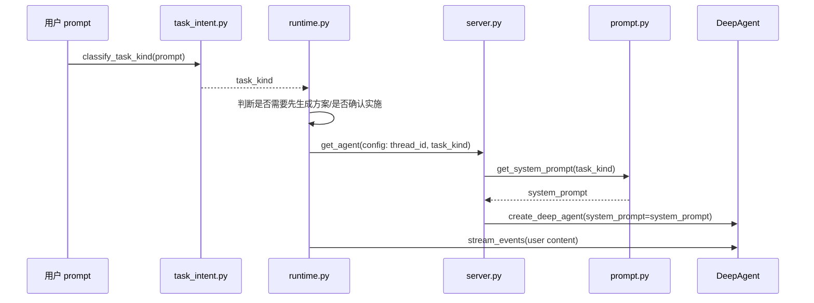
```mermaid
sequenceDiagram
    participant U as 用户 prompt
    participant TI as task_intent.py
    participant RT as runtime.py
    participant SV as server.py
    participant PR as prompt.py
    participant DA as DeepAgent

    U->>TI: classify_task_kind(prompt)
    TI-->>RT: task_kind
    RT->>RT: 判断是否需要先生成方案/是否确认实施
    RT->>SV: get_agent(config: thread_id, task_kind)
    SV->>PR: get_system_prompt(task_kind)
    PR-->>SV: system_prompt
    SV->>DA: create_deep_agent(system_prompt=system_prompt)
    RT->>DA: stream_events(user content)
```

### 5.8 常见修改需求应该改哪里

| 修改需求 | 应该优先改的文件 | 注意事项 |
|---|---|---|
| 增加一个新的任务类型 | `agent/core/task_intent.py`、`agent/prompt.py`、`agent/server.py` | 要同步更新 `TaskKind`、`READ_ONLY_PROMPTS` 或 coding 规则 |
| 调整哪些词算 coding | `agent/core/task_intent.py` | 修改 `coding_keywords` 后跑 `verify_task_intent.py` |
| 调整方案输出格式 | `agent/core/runtime.py` 的 `_build_plan_user_content()` | 这是方案阶段 user message，不是 system prompt |
| 调整所有任务的通用规则 | `agent/prompt.py` 的 `BASE_SYSTEM_PROMPT` | 影响所有 task_kind |
| 调整开发任务流程 | `agent/prompt.py` 的 `CODING_PROMPT` | 例如是否必须测试、是否必须 PR |
| 调整只读任务限制 | `agent/prompt.py` 的 `READ_ONLY_PROMPTS` | 只改 prompt 不够，高风险工具仍要在 tool 内兜底 |
| 调整“确认实施”的识别 | `agent/core/runtime.py` 的 `_is_approval_prompt()` | 避免误把普通“确认”当成执行旧任务 |
| 调整首次仓库分析方法 | `agent/skills/repo-bootstrap-analysis/SKILL.md` | 这是 skill 方法论，不是固定 prompt |
| 调整工作区长期规则 | `agent/memory/workspace.md` | 会通过 `load_workspace_memory()` 拼入 system prompt |
| 禁止某类工具参数 | `agent/core/middleware/tool_sanitize.py` | 属于工程硬约束，不应只写在 prompt |
| 禁止只读任务创建 PR | `agent/tools/gitee_tools.py` | 工具内部已有 `runtime_is_read_only_task()` 兜底 |

### 5.9 task_kind 与提示词

| task_kind | 提示词来源 | 权限语义 |
|---|---|---|
| `coding` | `CODING_PROMPT` | 可以修改代码、执行验证、提交、push、创建 PR |
| `planning` | `READ_ONLY_PROMPTS["planning"]` | 只生成方案，禁止修改和 PR |
| `analysis` | `READ_ONLY_PROMPTS["analysis"]` | 只读分析项目结构 |
| `qa` | `READ_ONLY_PROMPTS["qa"]` | 只读问答 |
| `inspect` | `READ_ONLY_PROMPTS["inspect"]` | 只检查工作区 |
| `sync` | `READ_ONLY_PROMPTS["sync"]` | 只同步仓库 |

### 5.10 从提示词工程角度看当前项目的设计亮点

当前项目的提示词工程不是“把所有要求堆到一个超长 prompt 里”，而是把模型行为拆成多层规则，再通过 runtime、middleware、backend 做工程闭环。

| 设计点 | 体现位置 | 优势 |
|---|---|---|
| 基础规则集中化 | `BASE_SYSTEM_PROMPT` | 所有任务共享平台边界、语言、路径、Gitee、命令、联网规则 |
| 任务规则分层 | `CODING_PROMPT`、`READ_ONLY_PROMPTS` | 不同任务类型有不同约束，避免分析任务误写代码 |
| 任务分类前置 | `task_intent.py` | 在构建 Agent 前确定 `task_kind`，权限和提示词都可预测 |
| 长期记忆注入 | `load_workspace_memory()` + `workspace.md` | 把稳定工作区知识从 prompt 代码中拆出去，方便维护 |
| 技能方法论外置 | `repo-bootstrap-analysis/SKILL.md` | 首次仓库分析流程不用塞进主 prompt，按需使用 |
| 方案阶段 user prompt 独立 | `_build_plan_user_content()` | coding 需求先变成 planning，明确禁止修改和 PR |
| 确认后携带方案 | `_build_agent_user_content(approved_plan=...)` | 用户确认的方案会成为执行依据，减少 Agent 偏离 |
| 工具名与路径规范明确 | `BASE_SYSTEM_PROMPT` | 模型知道使用 DeepAgents 原生 `ls/read_file/edit_file/execute` 和 `/projects/...` |
| 外部资料边界清楚 | 联网搜索规则 | 避免模型用搜索结果替代本地代码分析 |
| 中文输出约束 | 通用规则 + dashboard 展示清洗 | 保证课程展示和用户体验一致 |

### 5.11 当前提示词工程的分层模型

可以把项目中的提示词工程理解成 5 层：

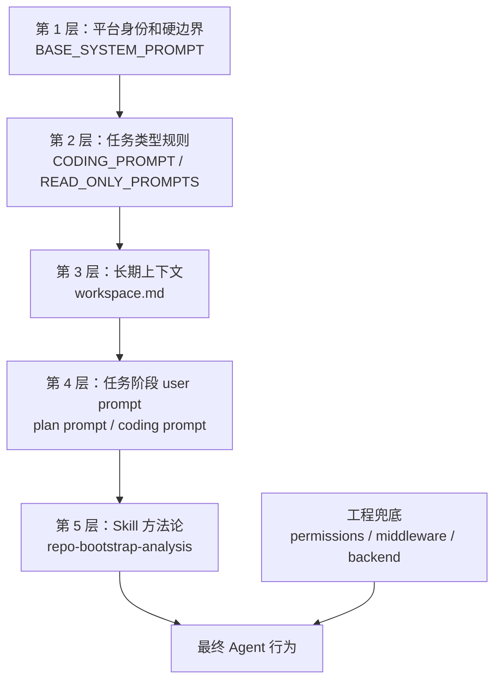
```mermaid
flowchart TD
    A["第 1 层：平台身份和硬边界<br/>BASE_SYSTEM_PROMPT"] --> B["第 2 层：任务类型规则<br/>CODING_PROMPT / READ_ONLY_PROMPTS"]
    B --> C["第 3 层：长期上下文<br/>workspace.md"]
    C --> D["第 4 层：任务阶段 user prompt<br/>plan prompt / coding prompt"]
    D --> E["第 5 层：Skill 方法论<br/>repo-bootstrap-analysis"]
    E --> F["最终 Agent 行为"]
    G["工程兜底<br/>permissions / middleware / backend"] --> F
```

这套分层的好处是：

1. **可维护**：通用规则、任务规则、长期记忆、skill 方法论各放各的位置。
2. **可测试**：任务分类可以用 `verify_task_intent.py` 单独测，不依赖模型。
3. **可扩展**：新增任务类型时，只需要同步 `TaskKind`、提示词和 runtime 逻辑。
4. **可控风险**：Prompt 只做行为引导，危险动作还要经过 permissions、middleware、backend。
5. **适合教学**：学员能看到从“规则定义”到“运行执行”的完整链路。

### 5.12 当前项目提示词工程的优势亮点

#### 5.12.1 不是单 prompt，而是“提示词系统”

很多初级工程师会把 Prompt Engineering 理解成：

```text
写一段很长的系统提示词。
```

当前项目更接近真实工程做法：

```text
系统提示词 + 任务提示词 + 长期记忆 + skill + runtime user message + 工具兜底
```

这种方式的优点是：不同规则有不同生命周期。稳定规则放 `BASE_SYSTEM_PROMPT`，仓库分析流程放 skill，工作区知识放 memory，当前任务方案放 runtime message。

#### 5.12.2 把“开发前先方案”写成运行协议

项目没有只在 prompt 里说“请先生成方案”，而是在 runtime 中实现：

```text
coding 需求 -> planning 阶段 -> 保存等待确认的方案 -> 用户确认 -> coding 阶段
```

这比单纯 prompt 更稳，因为流程由代码控制。

#### 5.12.3 明确区分系统规则和本轮任务内容

| 类型 | 文件 | 例子 |
|---|---|---|
| 系统规则 | `agent/prompt.py` | “只能使用 Gitee”“路径使用 `/projects`” |
| 本轮任务内容 | `agent/core/runtime.py` | “用户需求：xxx，请只生成技术方案” |
| 已确认上下文 | `thread_messages.metadata` + approved plan | “用户已确认以下技术方案，请按方案实施” |

这能避免系统提示词不断膨胀，也让每轮任务的上下文更清晰。

#### 5.12.4 对工具使用做了明确语言约束

Prompt 里明确告诉模型：

- 文件操作统一使用 `ls/read_file/write_file/edit_file/glob/grep`。
- 命令统一使用 `execute`。
- Git 操作通过普通 git 命令执行。
- PR 创建必须调用 `open_gitee_pull_request`。
- 搜索资料使用 `web_search`，明确 URL 使用 `fetch_url`。

这降低了模型乱造工具名、误用旧工具、手写 API 的概率。

#### 5.12.5 把只读任务和编码任务分开

`READ_ONLY_PROMPTS` 明确禁止：

- 修改文件。
- 提交。
- push。
- 创建 Pull Request。

但项目没有只依赖这句话。`gitee_tools.py` 里 `open_gitee_pull_request()` 还会读取 runtime task kind，只读任务直接拒绝创建 PR。

这就是提示词工程和工具工程的结合。

#### 5.12.6 长期记忆避免主 prompt 过载

工作区目录语义放在：

```text
agent/memory/workspace.md
```

这样做比直接塞进 `BASE_SYSTEM_PROMPT` 更好：

| 放在主 prompt | 放在 memory |
|---|---|
| 文件越来越长，难维护 | 独立维护工作区知识 |
| 改目录说明要改代码 | 改 Markdown 即可 |
| 不利于未来 repo/team 级扩展 | 可以继续扩展 repo/team memory |

#### 5.12.7 Skill 让复杂方法论模块化

首次分析仓库不是简单几句话，而是一整套流程：

1. 准备 Gitee 仓库。
2. 读取 README、依赖、入口、测试。
3. 判断技术栈。
4. 输出目录结构、启动方式、测试方式。
5. 给出风险和下一步建议。

这类流程适合放到 `repo-bootstrap-analysis/SKILL.md`，而不是全部塞进主提示词。

### 5.13 当前提示词工程还可以继续优化的方向

| 优化方向 | 说明 |
|---|---|
| 给每个 task_kind 增加 few-shot 示例 | 让模型更稳定地区分分析、方案、编码总结 |
| 把 PR 总结模板拆成 skill 或独立 prompt | 避免最终总结风格漂移 |
| 增加 repo 级 memory | 每个仓库保存自己的启动方式、测试方式、架构约定 |
| 增加 prompt 版本号 | 方便回溯某次 Agent 行为来自哪版提示词 |
| 增加 prompt 单元测试 | 检查关键约束是否仍存在，例如“不写 token”“只支持 Gitee” |
| 把确认实施设计成结构化状态 | 减少自然语言“确认”误判 |

### 5.14 给学员的提示词工程检查清单

修改本项目提示词时，建议逐项检查：

| 检查项 | 是否必须 |
|---|---|
| 是否明确任务类型 | 必须 |
| 是否明确允许和禁止的动作 | 必须 |
| 是否明确工具名和路径格式 | 必须 |
| 是否明确输出语言和最终回答格式 | 必须 |
| 是否避免把 token、私钥、绝对路径写入输出 | 必须 |
| 是否把稳定知识放 memory，而不是塞进主 prompt | 建议 |
| 是否把复杂流程放 skill，而不是塞进主 prompt | 建议 |
| 是否有代码层兜底，而不只靠 prompt | 必须 |
| 是否跑过 `verify_task_intent.py` 等相关验证 | 必须 |

### 5.15 课堂重点

Prompt 是软约束，不能替代工具权限和 backend 防护。

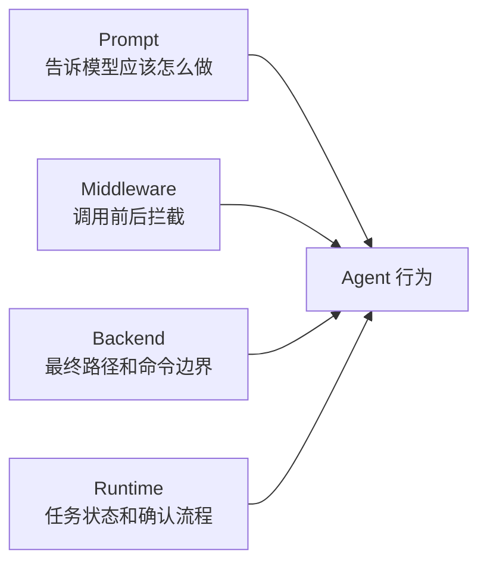
```mermaid
flowchart LR
    P["Prompt<br/>告诉模型应该怎么做"] --> A["Agent 行为"]
    M["Middleware<br/>调用前后拦截"] --> A
    B["Backend<br/>最终路径和命令边界"] --> A
    DB["Runtime<br/>任务状态和确认流程"] --> A
```

---

## 6. 第五步：引入长期记忆和 Skills

### 6.1 前置知识点

DeepAgents 官方把上下文管理分成多个层次：

| 类型 | 加载时机 | 适合放什么 |
|---|---|---|
| System Prompt | 每次 Agent 构建时 | 全局行为规则 |
| Memory | 稳定、长期有效 | 项目偏好、团队规范、工作区约定 |
| Skill | 按需加载 | 特定任务流程、专项知识、模板、参考资料 |
| Checkpoint | 运行中自动保存 | 对话历史、图状态、工具调用状态 |

### 6.2 本项目的长期记忆

```text
agent/core/memory.py
agent/memory/workspace.md
```

`workspace.md` 说明工作区目录语义。它解决的问题是：

| 如果没有长期记忆 | 可能出现的问题 |
|---|---|
| 不知道 `/projects` 才是项目目录 | 把 `/runtimes`、`/logs` 当成项目分析 |
| 不知道 `.secrets` 是敏感目录 | 误读或暴露 token 辅助文件 |
| 不知道 `/skills` 是只读能力目录 | 误改 skill |

### 6.3 workspace.md 如何创建

当前项目的长期记忆文件是一个普通 Markdown 文件：

```text
agent/memory/workspace.md
```

它不是 DeepAgents 自动生成的，也不是 SQLite 里的一条记录，而是项目源码中的一份稳定文档。创建方式很直接：

1. 在 `agent/` 下创建 `memory/` 目录。
2. 新建 `workspace.md`。
3. 写入对工作区目录、长期行为规则、敏感目录约束的说明。
4. 在 `agent/core/memory.py` 中固定读取这个文件。

当前文件内容结构：

```text
agent/memory/workspace.md
├─ 标题：本地工作区记忆
├─ 工作区说明：E:\ai_workspace
├─ 目录语义
│  ├─ projects/
│  ├─ runtimes/
│  ├─ policies/
│  ├─ reviews/
│  ├─ logs/
│  ├─ tmp/
│  ├─ .secrets/
│  └─ .ai_coding_workspace.json
└─ 行为规则
   ├─ 查询项目时只列 projects/
   ├─ 开发任务先定位 projects/仓库名
   ├─ 不主动修改 runtimes/
   ├─ policies/ 只读参考
   ├─ 不读取 .secrets/
   └─ 命令优先在 projects/仓库名 下运行
```

### 6.4 workspace.md 应该写什么，不应该写什么

长期记忆适合写“长期稳定、跨任务复用”的知识，不适合写临时任务内容。

| 适合写入 workspace.md | 不适合写入 workspace.md |
|---|---|
| 工作区目录语义 | 某一次用户需求 |
| 团队长期编码规范摘要 | 某一次模型回答 |
| 敏感目录和安全边界 | API Key、token、私钥 |
| 项目通用操作习惯 | 临时调试日志 |
| 跨任务稳定偏好 | 某个未确认方案 |

课堂重点：

> 长期记忆不是聊天历史，也不是任务草稿。它应该像“团队工程手册”一样稳定。

### 6.5 如何修改 workspace.md

修改长期记忆时，直接编辑：

```text
agent/memory/workspace.md
```

常见修改场景：

| 修改场景 | 应该怎么改 |
|---|---|
| 新增工作区目录 | 在“目录语义”中增加目录说明 |
| 调整安全规则 | 在“行为规则”中增加禁止或推荐动作 |
| 新增团队规范 | 增加“团队约定”或“编码规范摘要”小节 |
| 增加测试习惯 | 写明优先测试命令或测试目录判断规则 |
| 删除过时规则 | 直接删掉对应 Markdown 条目 |

修改后不需要迁移数据库，也不需要清空 checkpoint。下一次构建 Agent 时，`load_workspace_memory()` 会重新读取文件内容。

如果后端进程长期运行，注意两点：

1. `get_system_prompt()` 每次构建 Agent 时都会调用 `load_workspace_memory()`。
2. 已经开始运行的那一轮 Agent 不会自动刷新 prompt；下一轮新任务或新 Agent 构建才会用到新内容。

### 6.6 长期记忆如何注入到提示词

注入链路很短，但非常关键：

```text
agent/memory/workspace.md
  -> agent/core/memory.py:load_workspace_memory()
  -> agent/prompt.py:get_system_prompt(task_kind)
  -> agent/server.py:create_deep_agent(system_prompt=...)
```

对应代码逻辑：

```python
workspace_memory = load_workspace_memory()
memory_section = f"\n\n长期记忆：\n{workspace_memory}" if workspace_memory else ""

if task_kind == "coding":
    return f"{BASE_SYSTEM_PROMPT}{memory_section}\n\n{CODING_PROMPT}"
return f"{BASE_SYSTEM_PROMPT}{memory_section}\n\n{READ_ONLY_PROMPTS.get(task_kind, READ_ONLY_PROMPTS['qa'])}"
```

Mermaid 链路图：

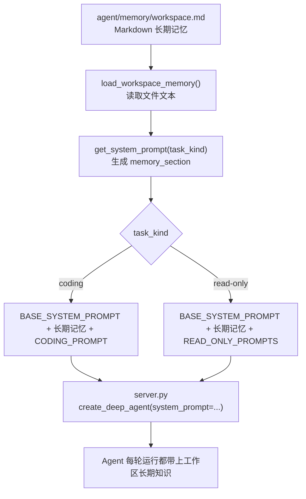
```mermaid
flowchart TD
    A["agent/memory/workspace.md<br/>Markdown 长期记忆"] --> B["load_workspace_memory()<br/>读取文件文本"]
    B --> C["get_system_prompt(task_kind)<br/>生成 memory_section"]
    C --> D{"task_kind"}
    D -->|coding| E["BASE_SYSTEM_PROMPT + 长期记忆 + CODING_PROMPT"]
    D -->|read-only| F["BASE_SYSTEM_PROMPT + 长期记忆 + READ_ONLY_PROMPTS"]
    E --> G["server.py<br/>create_deep_agent(system_prompt=...)"]
    F --> G
    G --> H["Agent 每轮运行都带上工作区长期知识"]
```

### 6.7 workspace.md 会不会和 prompt.py 重复

会有一部分“语义重叠”，但不应该大段重复。

当前项目里，`prompt.py` 和 `workspace.md` 的分工是：

| 位置 | 作用 | 应该放什么 |
|---|---|---|
| `agent/prompt.py` | Agent 的全局行为规约 | 输出语言、支持 Gitee、必须用哪些工具、禁止越界路径、任务类型规则 |
| `agent/memory/workspace.md` | 工作区长期知识 | `E:\ai_workspace` 下各目录的语义、哪些目录是项目、哪些目录只读、`.secrets` 是敏感目录 |

因此，像“不要读取 `.secrets`”“`projects/` 是仓库目录”这种关键规则，确实可能在两边都有一点重复。这是可以接受的，因为：

1. `prompt.py` 是硬性的行为总纲，强调“禁止做什么”。
2. `workspace.md` 是背景知识，解释“这些目录是什么、为什么这样使用”。
3. 长期记忆可以独立更新，不需要修改 Python 代码。
4. 对安全边界和工作区语义做轻微重复，可以提高模型遵守概率。

但如果两边出现大段相同文本，就应该整理。

推荐边界：

| 内容类型 | 放在 prompt.py | 放在 workspace.md |
|---|---|---|
| 平台身份 | 是，例如“你是 LX-AICODING” | 否 |
| 支持平台 | 是，例如“第一版只支持 Gitee” | 通常不放 |
| 输出语言 | 是，例如“必须中文输出” | 否 |
| 工具使用规则 | 是，例如“使用 `ls/read_file/edit_file/execute`” | 否 |
| 任务类型约束 | 是，例如 coding/planning/analysis 的行为限制 | 否 |
| 工作区目录语义 | 简短提及 | 详细说明 |
| `.secrets` 安全提醒 | 简短禁止 | 解释它是什么、为什么不能读 |
| 团队长期习惯 | 不建议 | 适合 |
| 某次任务需求 | 否 | 否 |

示例：

```text
prompt.py 中写短规则：
禁止尝试读取 E:\、C:\、用户目录、系统目录、.secrets 或工作区外路径。

workspace.md 中写解释性知识：
.secrets/：敏感凭据辅助目录。禁止读取、展示、复制、提交或写入用户可见结果。
```

一句话总结：

> `prompt.py` 管行为约束，`workspace.md` 管长期上下文。少量重复是为了强化关键安全边界，大段重复就需要删减。

### 6.8 长期记忆是否持久化

是的，但它的持久化方式不是 SQLite，而是文件持久化。

| 状态类型 | 持久化位置 | 谁维护 | 用途 |
|---|---|---|---|
| 长期记忆 | `agent/memory/workspace.md` | 开发者/课程维护者 | 稳定工作区知识 |
| Agent checkpoint | `data/checkpoints.sqlite` | LangGraph | 保存 messages、工具状态、图状态 |
| 业务 Store | `data/store.sqlite` | 本项目后端 | 保存 threads、runs、run_events、thread_messages |
| Skills | `agent/skills/**/SKILL.md` 和 `/skills/` 映射目录 | 开发者/课程维护者 | 专项任务方法论 |

所以课堂上要明确：

> `workspace.md` 的持久化是源码文件级持久化；`checkpoints.sqlite` 的持久化是 Agent 运行状态级持久化；`store.sqlite` 的持久化是产品业务状态级持久化。

### 6.9 长期记忆与 Checkpoint 的区别

| 对比项 | 长期记忆 `workspace.md` | LangGraph Checkpoint |
|---|---|---|
| 保存位置 | Markdown 文件 | SQLite |
| 保存内容 | 稳定规则、工作区知识 | 运行过程中的消息、工具调用、图状态 |
| 谁写入 | 人工维护为主 | 框架自动写入 |
| 是否每轮注入 prompt | 是，构建 Agent 时注入 | 不是以 prompt 文本方式注入 |
| 适合放安全边界说明 | 适合 | 不适合 |
| 适合保存聊天历史 | 不适合 | 适合 |

### 6.10 长期记忆与 Skills 的区别

| 对比项 | 长期记忆 | Skill |
|---|---|---|
| 粒度 | 全局稳定知识 | 某类任务的方法论 |
| 当前示例 | `workspace.md` | `repo-bootstrap-analysis/SKILL.md` |
| 使用方式 | 每次拼入 system prompt | DeepAgents 按 skill 机制读取 |
| 适合内容 | 工作区目录语义、安全规则 | 首次仓库分析流程、代码审查流程 |
| 更新频率 | 较低 | 可按专项任务迭代 |

简单理解：

```text
长期记忆：Agent 应该长期知道什么。
Skill：Agent 遇到某类任务时应该怎么做。
Checkpoint：Agent 这一轮已经发生了什么。
Store：前端和后端业务要展示什么。
```

### 6.11 长期记忆的工程化落地步骤

如果以后要给项目新增一类长期记忆，可以按这个流程做：

| 步骤 | 动作 |
|---:|---|
| 1 | 明确这份记忆是否长期稳定，避免把临时任务写进去 |
| 2 | 在 `agent/memory/` 下创建 Markdown 文件 |
| 3 | 在 `agent/core/memory.py` 中新增读取函数 |
| 4 | 在 `agent/prompt.py:get_system_prompt()` 中决定是否注入 |
| 5 | 控制长度，避免长期记忆无限膨胀 |
| 6 | 写验证脚本，确认记忆确实进入最终 system prompt |
| 7 | 课堂或生产环境中记录版本变更，方便追踪行为差异 |

可以设计成：

```text
agent/memory/
├─ workspace.md          工作区长期记忆
├─ coding_style.md       团队编码风格
├─ testing.md            测试策略
└─ gitee.md              Gitee 使用约定
```

当前项目只实现了 `workspace.md`，这是为了教学阶段保持简单。

### 6.12 本项目的 Skills

```text
agent/skills/repo-bootstrap-analysis/SKILL.md
agent/skills/code-review/SKILL.md
```

| Skill | 作用 |
|---|---|
| `repo-bootstrap-analysis` | 首次分析 Gitee 仓库，建立技术栈、目录、启动、测试、风险画像 |
| `code-review` | 代码审查 finding 规则 |

### 6.13 repo-bootstrap-analysis 的课堂价值

它相当于把一名资深工程师接手陌生仓库的流程固化下来：

1. 确认 Gitee 地址。
2. 查看 `/projects` 是否已有仓库。
3. clone 或 fetch。
4. 读取 README、依赖文件、入口文件、测试目录。
5. 总结技术栈和风险。
6. 如果要改代码，先输出方案并等待确认。

### 6.14 Skill 加载路径

当前 Agent 在 [agent/server.py](../agent/server.py) 里配置：

```python
skills=["/skills/"]
```

而 `/skills` 由 `LocalShellBackend` 映射到：

```text
E:\ai_workspace\skills
```

课堂中可以强调：skills 不是普通 prompt 拼接，而是按需读取的流程知识。

---

## 7. 第六步：创建 DeepAgent 工厂

### 7.1 前置知识点

普通 LangChain Agent 的核心组件是：

```text
Agent = Model + Tools + System Prompt + Middleware
```

DeepAgents 在这个基础上增加了：

```text
Filesystem Backend + Permissions + Skills + Memory + Subagents + Todo Planning
```

这一节要先区分三个概念：

| 概念 | 说明 | 当前项目中的承载位置 |
|---|---|---|
| Agent 实例 | `create_deep_agent(...)` 返回的可运行图对象 | `agent/server.py:get_agent` 每次按配置构建 |
| 运行状态 | 对话、图执行状态、checkpoint | `agent/core/graph.py:get_checkpointer()` |
| 工作区资源 | 本地文件系统、命令执行、Gitee 凭据注入 | `agent/backends/local_shell.py`，按 `thread_id` 缓存 |

课堂上要强调：**非单例 Agent 并不等于状态丢失**。状态应该由 checkpointer、业务 Store、文件后端承担，而不是隐式藏在一个长期存活的 Python 对象里。

### 7.2 当前核心文件

```text
agent/server.py
```

这是当前项目最关键的 Agent 构建文件。

### 7.3 get_agent 的构建步骤

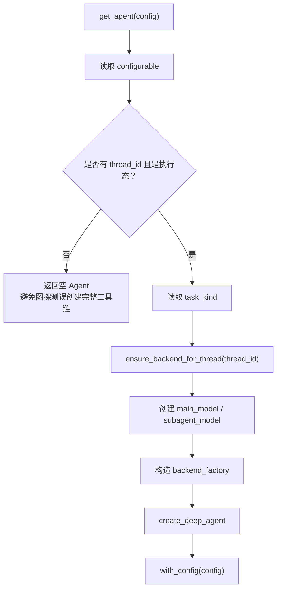
```mermaid
flowchart TD
    A["get_agent(config)"] --> B["读取 configurable"]
    B --> C{"是否有 thread_id 且是执行态？"}
    C -->|否| D["返回空 Agent<br/>避免图探测误创建完整工具链"]
    C -->|是| E["读取 task_kind"]
    E --> F["ensure_backend_for_thread(thread_id)"]
    F --> G["创建 main_model / subagent_model"]
    G --> H["构造 backend_factory"]
    H --> I["create_deep_agent"]
    I --> J["with_config(config)"]
```

对应代码要点：

| 代码位置 | 作用 |
|---|---|
| `graph_loaded_for_execution(config)` | 判断当前是不是“真实执行态” |
| `ensure_backend_for_thread(thread_id)` | 为当前会话创建或复用 `LocalShellBackend` |
| `_task_kind_from_config(configurable)` | 从配置读取任务类型 |
| `_agent_filesystem_permissions()` | 生成主 Agent 文件权限 |
| `_general_purpose_subagent(subagent_model)` | 生成通用分析子 Agent |
| `create_deep_agent(...)` | 组装模型、工具、提示词、后端、权限、中间件、skills 和 checkpoint |

### 7.4 create_deep_agent 的组成

| 参数 | 当前项目传入 | 作用 |
|---|---|---|
| `model` | `make_main_model()` | 主 Agent 模型 |
| `tools` | `web_search`、`fetch_url`、Gitee PR、reviewer tools | 自定义外部能力 |
| `system_prompt` | `get_system_prompt(task_kind)` | 任务规则 |
| `subagents` | general-purpose subagent | 委派分析任务 |
| `backend` | `backend_factory` | DeepAgents 文件和命令后端 |
| `permissions` | `_agent_filesystem_permissions()` | 文件读写权限 |
| `middleware` | sanitize、model call limit、tool error | 安全、限制、恢复 |
| `skills` | `["/skills/"]` | 技能目录 |
| `checkpointer` | `get_checkpointer()` | LangGraph 状态恢复 |

### 7.5 为什么 Agent 实例采用非单例

当前项目不是把 `create_deep_agent(...)` 的结果做成全局单例，而是在 `get_agent(config)` 中按运行配置创建 Agent 实例。

核心原因如下：

| 原因 | 说明 |
|---|---|
| 任务类型不同 | `coding`、`planning`、`analysis`、`qa` 会拿到不同的 `system_prompt` |
| 会话上下文不同 | 每个 `thread_id` 对应不同工作区、checkpoint 和业务记录 |
| 权限可能变化 | 不同任务或未来不同用户可以使用不同 permissions |
| 长期记忆要新鲜 | `get_system_prompt(task_kind)` 会读取 `workspace.md`，重建 Agent 可以拿到最新记忆 |
| 避免跨会话污染 | 单例对象容易把工具状态、middleware 状态、config 状态混在一起 |
| 方便调试和热更新 | 修改 Prompt、Skills、权限后，新运行可以直接使用新配置 |

这套设计的关键不是“所有东西都重新创建”，而是把生命周期拆开：

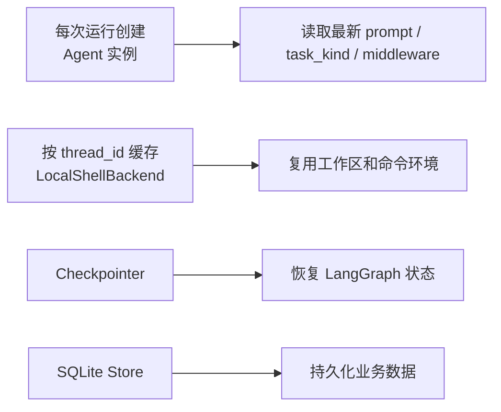
```mermaid
flowchart LR
    A["每次运行创建<br/>Agent 实例"] --> B["读取最新 prompt / task_kind / middleware"]
    C["按 thread_id 缓存<br/>LocalShellBackend"] --> D["复用工作区和命令环境"]
    E["Checkpointer"] --> F["恢复 LangGraph 状态"]
    G["SQLite Store"] --> H["持久化业务数据"]
```

因此，Agent 实例是轻生命周期；backend、checkpoint、store 才是承载长期状态的部分。

### 7.6 企业项目中 Agent 实例的常见管理方案

`create_deep_agent(...)` 执行后会得到一个 Agent 实例。企业项目里通常有几种管理方式：

| 方案 | 做法 | 优势 | 风险或代价 | 适合场景 |
|---|---|---|---|---|
| 全局单例 Agent | 服务启动时创建一个 Agent，全局复用 | 实现简单，创建开销低 | 配置容易陈旧，权限和用户上下文容易串线 | Demo、内部单用户工具 |
| 按线程缓存 Agent | `thread_id -> Agent` 缓存 | 会话隔离更好，复用成本较低 | 缓存淘汰复杂，Prompt/Tools 更新后可能不生效 | 会话长、配置变化少的产品 |
| 按请求创建 Agent | 每次运行重新 `create_deep_agent` | 配置最新，隔离清晰，调试简单 | 每次有一定构建开销 | 多租户、多任务类型、权限变化频繁 |
| 工厂 + 资源池 | Agent 按请求创建，模型、backend、store、checkpoint 由容器管理 | 工程边界清晰，利于扩展和观测 | 需要更完整的生命周期管理 | 企业级 Agent 平台 |
| 远程图服务托管 | 由 LangGraph Server 或平台托管 graph 生命周期 | 服务化能力强，便于水平扩容 | 运维和平台依赖更重 | 大规模生产系统 |

当前项目采用的是接近“按请求创建 Agent + 线程级 backend 缓存 + 持久化 checkpoint/store”的混合方案。

| 当前项目设计 | 具体体现 | 好处 |
|---|---|---|
| Agent 不做全局单例 | `get_agent(config)` 中调用 `create_deep_agent(...)` | 每次运行拿到最新任务规则、长期记忆和权限配置 |
| backend 按线程复用 | `_BACKENDS: dict[str, LocalShellBackend]` | 同一会话复用本地工作区、askpass、环境变量和路径映射 |
| checkpoint 独立持久 | `checkpointer=get_checkpointer()` | Agent 对象销毁后，对话和图状态仍可恢复 |
| 业务数据进入 SQLite | `agent/store/sqlite_store.py` | run、message、review finding、settings 可以长期查询 |
| 非执行态返回空 Agent | 没有 `thread_id` 或 `__is_for_execution__` 时返回轻量 Agent | 避免图探测阶段误创建完整工具链 |

课堂总结：

> 当前项目不依赖“长寿命 Agent 对象”保存状态，而是让 Agent 成为一次运行的装配结果，让后端、checkpoint 和数据库承担可恢复状态。这比单例更适合企业项目中的多线程、多任务、多权限场景。

### 7.7 为什么要有 graph_loaded_for_execution

`graph_loaded_for_execution(config)` 用来避免非执行态时误创建完整 Agent。

课堂解释：

> 在复杂 Agent 系统里，框架有时会为了探测图结构加载 Agent。如果这时就创建 backend、读写文件或初始化重资源，会产生副作用。因此项目要求 `__is_for_execution__=True` 才返回完整 Agent。

### 7.8 子 Agent 的作用是什么

当前项目在 `agent/server.py` 中定义了一个通用子 Agent：

```text
_general_purpose_subagent(model)
```

它的定位不是“另一个可以随意写代码的 Agent”，而是主 Agent 的分析助手。

| 维度 | 主 Agent | 通用子 Agent |
|---|---|---|
| 职责 | 最终理解用户需求、修改代码、调用 PR 工具、输出结论 | 阅读、分析、总结、提出建议 |
| 写源码权限 | 可以写 `/projects/**` | 不允许写 `/projects/**` |
| 适合任务 | 实施方案、修复代码、创建 PR | 代码结构分析、大范围检索、风险梳理、方案对比 |
| 责任边界 | 对最终行为负责 | 给主 Agent 提供辅助结论 |

为什么要引入子 Agent：

1. **降低主 Agent 上下文压力**：大仓库分析可以委派给子 Agent，主 Agent 聚焦决策和执行。
2. **隔离权限风险**：子 Agent 默认不能改源码，适合作为只读分析角色。
3. **形成专业分工**：未来可以继续增加 reviewer、test-planner、security-auditor 等专用子 Agent。
4. **让复杂任务更可控**：主 Agent 负责调度，子 Agent 负责局部问题，边界更清晰。

### 7.9 主 Agent 与子 Agent 权限差异

| 角色 | 能读 | 能写 | 不允许 |
|---|---|---|---|
| 主 Agent | `/projects`、`/skills`、`/policies`、`/reviews`、`/runtimes`、`/logs`、`/tmp` | `/projects`、`/reviews`、`/tmp` | 写 `/skills`、`/policies`、`/runtimes`、`/logs` |
| 子 Agent | 多数目录只读 | `/reviews`、`/tmp` | 写 `/projects` |

这体现了一个工程原则：

> 子 Agent 可以分析，但不应该拥有最终修改源码的权限。

### 7.10 子 Agent 与权限的调用关系

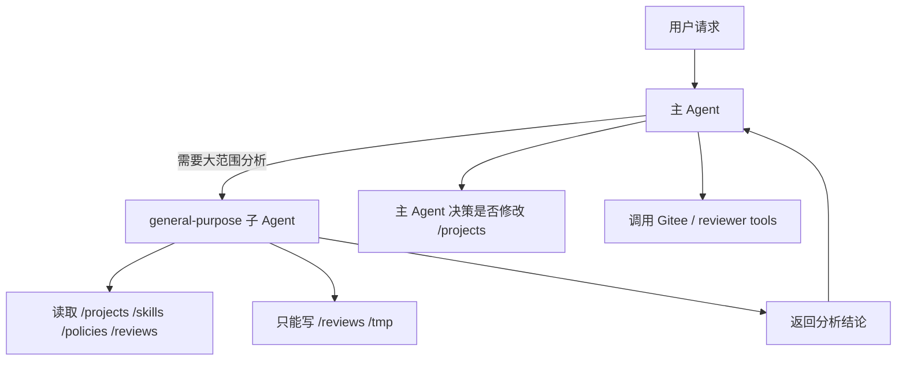
```mermaid
flowchart TD
    U["用户请求"] --> M["主 Agent"]
    M -->|"需要大范围分析"| S["general-purpose 子 Agent"]
    S --> R["读取 /projects /skills /policies /reviews"]
    S --> W["只能写 /reviews /tmp"]
    S --> D["返回分析结论"]
    D --> M
    M --> P["主 Agent 决策是否修改 /projects"]
    M --> T["调用 Gitee / reviewer tools"]
```

这个结构让课堂里的权限设计更容易讲清楚：

- 主 Agent 是执行者。
- 子 Agent 是分析者。
- 文件后端是最终边界。
- permissions 是 DeepAgents 层的声明式约束。
- middleware 是工具调用前后的工程防线。

### 7.11 未来是否应该创建 reviewer 子 Agent

有必要。当前项目已经具备 reviewer 子 Agent 的基础能力：

| 已有能力 | 文件 |
|---|---|
| review finding 数据结构 | `agent/reviewer_findings.py` |
| review findings 存储表 | `agent/store/sqlite_store.py` |
| 记录和查询 review finding 的工具 | `agent/tools/reviewer_tools.py` |
| reviewer prompt | `agent/prompt.py:REVIEWER_PROMPT` |
| code review skill | `agent/skills/code-review/SKILL.md` |
| PR 评论发布工具 | `agent/tools/gitee_tools.py:publish_gitee_pr_comment` |

未来创建 reviewer 子 Agent 的目标是：

> 让 reviewer 专注审查 diff、风险和测试缺口，只输出结构化发现；主 Agent 决定是否采纳、修复、发布评论。

推荐职责边界：

| reviewer 子 Agent 应该做 | reviewer 子 Agent 不应该做 |
|---|---|
| 阅读本次修改、diff、相关文件 | 直接修改业务代码 |
| 找真实 bug、回归风险、安全问题 | 输出泛泛的代码风格建议 |
| 给出文件、行号、严重级别和原因 | 直接创建 PR 或发布评论 |
| 把 finding 写入 `/reviews` 或交给主 Agent 记录 | 绕过主 Agent 执行外部副作用 |

### 7.12 reviewer 子 Agent 的创建步骤

建议按下面顺序落地：

| 步骤 | 修改位置 | 说明 |
|---|---|---|
| 1 | `agent/prompt.py` | 复用或细化 `REVIEWER_PROMPT` |
| 2 | `agent/server.py` | 新增 `_reviewer_subagent(model)` |
| 3 | `agent/server.py` | 给 reviewer 配置只读源码权限和 `/reviews` 写权限 |
| 4 | `agent/server.py` | 把 `_reviewer_subagent(subagent_model)` 加入 `subagents=[...]` |
| 5 | `agent/core/runtime.py` 或主 Prompt | 设计什么时候委派 reviewer，例如 coding 完成后、PR 创建前 |
| 6 | `agent/tools/reviewer_tools.py` | 确认 finding 的记录、查询、展示链路 |
| 7 | 测试脚本 | 验证 reviewer 不能写 `/projects`，只能输出审查结果 |

示例骨架：

```python
def _reviewer_subagent(model: BaseChatModel) -> SubAgent:
    return {
        "name": "reviewer",
        "description": "Review code changes and report concrete defects, regressions, and test gaps.",
        "system_prompt": REVIEWER_PROMPT,
        "model": model,
        "permissions": [
            FilesystemPermission(
                operations=["read"],
                paths=[
                    "/projects/**",
                    "/skills/**",
                    "/policies/**",
                    "/reviews/**",
                    "/logs/**",
                    "/tmp/**",
                ],
                mode="allow",
            ),
            FilesystemPermission(
                operations=["write"],
                paths=["/reviews/**", "/tmp/**"],
                mode="allow",
            ),
            FilesystemPermission(
                operations=["write"],
                paths=["/projects/**", "/skills/**", "/policies/**", "/runtimes/**", "/logs/**"],
                mode="deny",
            ),
            FilesystemPermission(
                operations=["read", "write"],
                paths=["/**"],
                mode="deny",
            ),
        ],
    }
```

然后在 `create_deep_agent(...)` 中注册：

```python
subagents=[
    _general_purpose_subagent(subagent_model),
    _reviewer_subagent(subagent_model),
]
```

如果当前 DeepAgents 版本支持给子 Agent 单独挂工具，可以把 reviewer tools 收窄后挂到 reviewer 子 Agent；如果暂时不挂工具，则让 reviewer 子 Agent 返回审查结论，由主 Agent 调用 `add_review_finding` 记录。

### 7.13 reviewer 子 Agent 的课堂 Mermaid 图

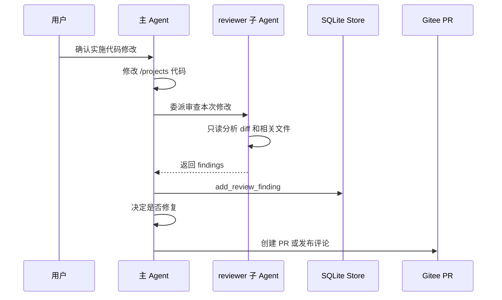
```mermaid
sequenceDiagram
    participant User as 用户
    participant Main as 主 Agent
    participant Reviewer as reviewer 子 Agent
    participant Store as SQLite Store
    participant Gitee as Gitee PR

    User->>Main: 确认实施代码修改
    Main->>Main: 修改 /projects 代码
    Main->>Reviewer: 委派审查本次修改
    Reviewer->>Reviewer: 只读分析 diff 和相关文件
    Reviewer-->>Main: 返回 findings
    Main->>Store: add_review_finding
    Main->>Main: 决定是否修复
    Main->>Gitee: 创建 PR 或发布评论
```

### 7.14 课堂重点

这一章要让学员建立四个判断：

1. `create_deep_agent(...)` 是装配点，不应该塞业务流程。
2. Agent 实例可以短生命周期，状态应该放在 checkpoint、store、backend 中。
3. 企业项目不要默认使用全局单例 Agent，多用户、多任务、多权限场景下风险很高。
4. 子 Agent 的价值不是“更多 Agent 更智能”，而是把职责、权限和上下文边界拆清楚。

---

## 8. 第七步：设计中间件

### 8.1 前置知识点

LangChain 官方文档强调 middleware 可以控制 Agent 运行过程中的多个阶段：日志、prompt 变换、工具选择、重试、fallback、rate limit、guardrails 等。

在 LX-AICODING 中，中间件主要解决三个问题：

1. 工具调用前，参数是否安全。
2. 工具执行失败后，是否能恢复。
3. Agent 运行过程中，是否超过工具调用次数或运行时间上限。

要提醒学员：middleware 不是 Prompt 的替代品。Prompt 负责“告诉模型应该怎么做”，middleware 负责“模型真的这么调用时，系统怎么拦截、修正、恢复”。

### 8.2 当前中间件总览

| 文件 | 类 | 作用 |
|---|---|---|
| `tool_sanitize.py` | `SanitizeToolInputsMiddleware` | 工具入参清洗和拒绝 |
| `tool_error.py` | `ToolErrorMiddleware` | 工具异常转可恢复 ToolMessage |
| `run_limits.py` | `AgentRunLimitTracker` | raw event 消费时检查运行上限 |
| LangChain 内置 | `ModelCallLimitMiddleware` | 限制模型调用轮数 |

注意：`SanitizeToolInputsMiddleware`、`ToolErrorMiddleware` 会直接传入 `create_deep_agent(..., middleware=[...])`。`AgentRunLimitTracker` 不在 DeepAgents middleware 列表里，而是在 `streaming_runtime.py` 消费 raw event 时工作。

```python
middleware=[
    SanitizeToolInputsMiddleware(backend=backend),
    ModelCallLimitMiddleware(run_limit=MODEL_CALL_RECURSION_LIMIT, exit_behavior="end"),
    ToolErrorMiddleware(backend=backend),
]
```

### 8.3 `tool_sanitize.py` 文件详解

核心类：

```text
SanitizeToolInputsMiddleware
```

核心异常：

```text
ToolInputRejected
```

这个中间件运行在工具真正执行之前，处理模型最容易生成错误参数的地方。

| 组成 | 说明 |
|---|---|
| `PATH_ARGUMENTS` | 统一识别路径类参数：`path`、`cwd`、`repo_dir`、`project_dir`、`file_path`、`old_path`、`new_path` |
| `GITEE_URL_ARGUMENTS` | 识别 Gitee 仓库地址参数：`repo_url` |
| `READ_FILE_INT_ARGUMENTS` | 识别读取文件时的数字参数：`offset`、`limit` |
| `sanitize_workspace_path(...)` | 清洗路径并拒绝危险路径 |
| `sanitize_tool_kwargs(...)` | 按参数名批量清洗工具入参 |
| `wrap_tool_call(...)` | 同步工具调用拦截点 |
| `awrap_tool_call(...)` | 异步工具调用拦截点 |

### 8.4 参数清洗规则

| 参数类型 | 代码处理 | 目的 |
|---|---|
| Windows 工作区内绝对路径 | 转成工作区相对路径 | 让模型从 `E:\ai_workspace\projects\demo` 回到 `projects/demo` |
| Windows 工作区外绝对路径 | 抛出 `ToolInputRejected` | 防止访问用户主目录、SSH key、系统目录 |
| `.secrets` | 直接拒绝 | 避免读取 Gitee askpass、token 等敏感文件 |
| `..` | 直接拒绝 | 防止路径穿越 |
| 空路径 | 转为 `.` | 兼容模型传空字符串 |
| Gitee URL | 调用 `normalize_gitee_repo_url` | 去掉 token，规范成标准 Gitee HTTPS 地址 |
| `offset/limit` | 调用 `_coerce_int` | 把模型生成的字符串数字转成整数 |

调用前后示例：

```text
模型参数: E:\ai_workspace\projects\demo\README.md
清洗结果: projects/demo/README.md

模型参数: C:\Users\user\.ssh\id_rsa
清洗结果: 拒绝，返回 ToolInputRejected
```

### 8.5 参数被拒绝后如何恢复

参数拒绝不是系统崩溃，而是一次可恢复的工具观察结果。

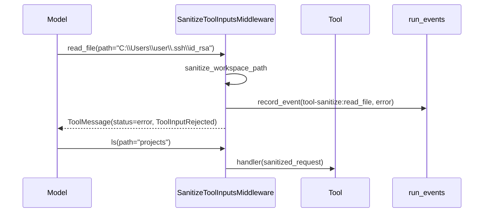
```mermaid
sequenceDiagram
    participant M as Model
    participant S as SanitizeToolInputsMiddleware
    participant T as Tool
    participant E as run_events

    M->>S: read_file(path="C:\\Users\\user\\.ssh\\id_rsa")
    S->>S: sanitize_workspace_path
    S->>E: record_event(tool-sanitize:read_file, error)
    S-->>M: ToolMessage(status=error, ToolInputRejected)
    M->>S: ls(path="projects")
    S->>T: handler(sanitized_request)
```

返回给模型的结构里包含：

| 字段 | 作用 |
|---|---|
| `ok=false` | 明确这是失败结果 |
| `tool` | 告诉模型哪个工具被拦截 |
| `error_type=ToolInputRejected` | 表示是参数问题，不是系统异常 |
| `workspace` | 告诉模型当前允许的工作区根目录 |
| `hint` | 引导模型改用相对路径、标准 Gitee 地址 |

### 8.6 `tool_error.py` 文件详解

核心类：

```text
ToolErrorMiddleware
```

核心函数：

| 函数 | 作用 |
|---|---|
| `tool_error_result(...)` | 把异常转换为中文结构化错误 |
| `_error_tool_message(...)` | 把异常包装成 `ToolMessage(status="error")` |
| `_record_original_tool_error(...)` | 把原工具事件从 `in_progress` 回写成 `error` |
| `wrap_tool_call(...)` | 同步工具异常兜底 |
| `awrap_tool_call(...)` | 异步工具异常兜底 |

`ToolErrorMiddleware` 的核心价值：

| 没有它 | 有它 |
|---|---|
| 工具抛异常，整轮 Agent failed | 异常转 ToolMessage，模型可继续修正 |
| 前端步骤卡在 in_progress | 回写原事件为 error |
| 用户只看到 500 | 用户能看到具体工具失败原因 |

### 8.7 异常类型与提示语

`tool_error_result(...)` 会根据异常类型生成不同 hint：

| 异常类型 | 典型场景 | 给模型的恢复建议 |
|---|---|---|
| `WorkspacePermissionError` | 后端拒绝访问工作区外路径 | 使用 `/projects` 或 `/projects/仓库名` |
| `IsADirectoryError` | 把目录当文件读取 | 先 `ls`，再读具体文件 |
| `FileNotFoundError` | 文件不存在 | 先确认真实路径 |
| `PermissionError` | 文件被占用或系统拒绝 | 改用工作区内具体文件路径 |
| `TimeoutError` | 命令或操作超时 | 缩小任务范围 |
| 其他异常 | 工具内部普通失败 | 根据 `error` 字段调整参数后重试 |

### 8.8 工具失败恢复流程

```mermaid
sequenceDiagram
    participant M as Model
    participant MW as ToolErrorMiddleware
    participant T as Tool
    participant E as run_events

    M->>MW: 调用 read_file(path=目录)
    MW->>T: handler(request)
    T--xMW: IsADirectoryError
    MW->>E: 原工具事件标记 error
    MW-->>M: ToolMessage(status=error, hint=先 ls 再读具体文件)
    M->>MW: 改用 ls(path)
```

### 8.9 原工具事件为什么要回写

很多工具在执行前会写入一条运行事件，例如：

| 工具 | 事件 key |
|---|---|
| `ls` / `list_files` | `list:{path}` |
| `read_file` | `read:{path}` |
| `write_file` | `write:{path}` |
| `edit_file` | `write:{file_path}` |
| `execute` | `cmd:{command}` |
| `run_command` | `cmd:{command}:{cwd}` |
| `open_gitee_pull_request` | `gitee:pr` |

如果工具异常后只新增一条 `tool-error:*` 事件，前端原来的步骤可能一直显示运行中。所以 `_record_original_tool_error(...)` 会用相同 key 把原事件更新成 `error`。

这是 Agent 产品里很实用的细节：**错误恢复不仅要让模型继续，也要让用户界面状态正确结束。**

### 8.10 `run_limits.py` 文件详解

核心类：

| 类 | 作用 |
|---|---|
| `AgentRunLimits` | 保存本轮运行保护阈值 |
| `AgentRunLimitTracker` | 观察 raw event，统计时间和工具调用次数 |
| `AgentRunLimitExceeded` | 超过阈值时抛出的异常 |

默认阈值：

| 限制 | 默认值 | 环境变量 |
|---|---:|---|
| 工具调用次数 | 120 | `AGENT_MAX_TOOL_CALLS` |
| 总运行秒数 | 900 | `AGENT_MAX_SECONDS` |

`AgentRunLimitTracker.observe_event(event)` 会在 `streaming_runtime.py` 中被调用。它重点观察：

| event 特征 | 处理 |
|---|---|
| `method == "tool_calls"` | 工具调用次数 +1 |
| `method == "tools"` 且 `event_name == "tool-started"` | 工具调用次数 +1 |
| 每次事件到达 | 检查总耗时是否超过 `max_seconds` |

为什么不直接统计模型消息数量？

> DeepAgents 的流式片段、子 Agent、中间 assistant message 都可能产生 message-start 类事件，直接统计模型消息容易误判。当前项目只保留更稳定的“时间 + 工具调用次数”保护。

### 8.11 自定义中间件的调用顺序

```mermaid
flowchart TD
    A["模型生成 tool_call"] --> B["SanitizeToolInputsMiddleware<br/>清洗或拒绝入参"]
    B --> C["ModelCallLimitMiddleware<br/>控制模型调用轮数"]
    C --> D["ToolErrorMiddleware<br/>兜底工具异常"]
    D --> E["真实工具或 DeepAgents 原生文件工具"]
    E --> F["ToolMessage 返回给模型"]
    G["streaming_runtime.py"] --> H["AgentRunLimitTracker<br/>观察 raw event"]
```

课堂提醒：这里的顺序体现了一个工程原则：

1. 先尽量把错误参数纠正或拒绝。
2. 再让真实工具执行。
3. 如果工具仍失败，把异常变成可恢复反馈。
4. 在流式层持续观察运行规模，避免 Agent 长时间失控。

### 8.12 课堂重点

中间件不是“锦上添花”，而是 Agent 工程化的稳定性基础。

初级工程师常见误区：

| 误区 | 正确做法 |
|---|---|
| 只在 prompt 里说“不要访问危险路径” | middleware 和 backend 必须硬拦截 |
| 工具异常直接 raise | 转成模型可理解的错误和 hint |
| 所有工具失败都算系统失败 | 区分可恢复错误和不可恢复错误 |
| 只关心模型输出 | 还要关心前端事件状态、运行上限、用户可观察性 |

---

## 9. 第八步：设计自定义工具

### 9.1 前置知识点

DeepAgents 已经提供文件和命令工具，本项目只保留业务相关自定义工具：

```text
agent/tools/
```

也就是说：

| 能力类型 | 来源 |
|---|---|
| 文件读写、目录查看、命令执行 | DeepAgents 原生工具 + `LocalShellBackend` |
| 联网搜索、网页读取、Gitee PR、审查发现 | 本项目自定义工具 |

### 9.2 当前工具目录结构

| 文件 | 类型 | 作用 |
|---|---|---|
| `__init__.py` | 工具导出入口 | 控制哪些工具暴露给 Agent |
| `gitee_tools.py` | Agent tool | 创建 PR、发布 PR 评论 |
| `gitee_api.py` | 支撑模块 | Gitee URL 解析、token 读取、API 请求、token 脱敏 |
| `web_search.py` | Agent tool | 智谱联网搜索 |
| `fetch_url_tools.py` | Agent tool | 读取网页并转为 Markdown/文本 |
| `safe_http.py` | 支撑模块 | SSRF 防护、DNS pin、安全重定向 |
| `reviewer_tools.py` | Agent tool | 写入和读取代码审查发现 |
| `runtime_context.py` | 支撑模块 | 从 LangGraph config 读取 `thread_id`、`task_kind` |

### 9.3 当前暴露给 Agent 的工具

| 文件 | 工具 | 作用 |
|---|---|---|
| `gitee_tools.py` | `open_gitee_pull_request` | 创建或复用 Gitee PR |
| `gitee_tools.py` | `publish_gitee_pr_comment` | 发布 Gitee PR 评论 |
| `web_search.py` | `web_search` | 智谱联网搜索 |
| `fetch_url_tools.py` | `fetch_url` | 读取公开网页并转文本 |
| `reviewer_tools.py` | `add_review_finding` | 记录审查问题 |
| `reviewer_tools.py` | `list_review_findings` | 列出审查问题 |

这些工具在 `agent/tools/__init__.py` 中统一导出，并在 `agent/server.py` 的 `create_deep_agent(tools=[...])` 中注册。

```mermaid
flowchart LR
    A["agent/tools/__init__.py"] --> B["agent/server.py"]
    B --> C["create_deep_agent(tools=[...])"]
    C --> D["模型可调用工具"]
```

### 9.4 `runtime_context.py`：工具如何知道当前线程和任务类型

自定义工具不能靠全局变量猜当前上下文，而是通过 LangGraph 的 `get_config()` 读取当前运行配置。

| 函数 | 返回 | 用途 |
|---|---|---|
| `get_runtime_configurable()` | `configurable` 字典 | 读取当前工具调用上下文 |
| `get_runtime_thread_id()` | 当前 `thread_id` 或 `None` | 写 run event、写 SQLite Store |
| `get_runtime_task_kind()` | 当前 `task_kind` | 判断任务类型 |
| `runtime_is_read_only_task()` | `True/False` | 工具内部二次权限判断 |

调用关系：

```mermaid
flowchart TD
    A["agent.server.get_agent"] --> B["with_config(config)"]
    B --> C["工具调用时 LangGraph get_config()"]
    C --> D["runtime_context.py"]
    D --> E["thread_id / task_kind"]
    E --> F["record_event / Store / read-only guard"]
```

课堂重点：

> 工具层要能拿到当前运行上下文，否则就无法把工具结果写回正确线程，也无法知道当前任务是否只读。

### 9.5 `gitee_tools.py`：Gitee PR 工具设计

`open_gitee_pull_request` 会先检查当前任务是否只读：

```text
analysis / planning / qa / inspect -> 禁止创建 PR
coding -> 允许创建 PR
```

`open_gitee_pull_request(...)` 参数：

| 参数 | 说明 |
|---|---|
| `owner` | Gitee 仓库 owner |
| `repo` | Gitee 仓库名 |
| `head` | 源分支 |
| `base` | 目标分支，默认 `master` |
| `title` | PR 标题 |
| `body` | PR 描述 |

执行流程：

```mermaid
sequenceDiagram
    participant M as Model
    participant T as open_gitee_pull_request
    participant C as runtime_context
    participant S as SQLite Store
    participant G as Gitee API

    M->>T: 调用创建 PR
    T->>C: runtime_is_read_only_task()
    alt 只读任务
        T-->>M: ok=false，拒绝创建 PR
    else coding 任务
        T->>S: record_event(gitee:pr, in_progress)
        T->>G: create_pull_request
        G-->>T: pr_url
        T->>S: update_thread_status(pr_created)
        T->>S: record_event(gitee:pr, completed)
        T-->>M: ok=true, pr_url
    end
```

`publish_gitee_pr_comment(...)` 参数：

| 参数 | 说明 |
|---|---|
| `owner` | Gitee 仓库 owner |
| `repo` | Gitee 仓库名 |
| `number` | PR 编号 |
| `body` | 评论正文 |

课堂重点：

> 权限不能只靠 prompt，工具内部也要检查 `runtime_is_read_only_task()`。

### 9.6 `gitee_api.py`：Gitee API 支撑层

这个文件不是直接暴露给 Agent 的工具，但它是 Gitee 工具的底层实现。

| 函数 | 作用 |
|---|---|
| `parse_gitee_repo_url(repo_url)` | 解析 Gitee 仓库地址，得到 owner、repo、clone_url |
| `authenticated_clone_url(repo)` | 返回普通 clone URL，认证交给 `GIT_ASKPASS` |
| `get_gitee_token()` | 从 `GITEE_TOKEN` 或 `SCM_GITEE_TOKEN` 读取 token |
| `mask_token(text)` | 日志和错误信息中脱敏 token |
| `_existing_pr_from_error(text)` | 识别“相同 head/base 的 PR 已存在”错误 |
| `create_pull_request(...)` | 调 Gitee API 创建 PR，或复用已有 PR |
| `post_pr_comment(...)` | 调 Gitee API 发布 PR 评论 |

设计亮点：

| 设计 | 价值 |
|---|---|
| clone URL 不带 token | 避免 token 写入命令、日志、`.git/config` |
| 兼容 `GITEE_TOKEN` / `SCM_GITEE_TOKEN` | 适配课程项目和 open-swe 风格配置 |
| `mask_token` 统一脱敏 | 防止异常、日志、前端事件泄露密钥 |
| 重复 PR 复用 | 同一分支重复演示时不把成功任务误判为失败 |

### 9.7 `fetch_url_tools.py`：网页读取工具

工具签名：

```python
fetch_url(url: str, timeout: int = 30) -> dict[str, Any]
```

适用场景：

| 场景 | 示例 |
|---|---|
| 用户给了官方文档链接 | 读取文档内容辅助分析 |
| 用户给了错误页面 | 抽取错误说明 |
| 需要查接口说明 | 把 HTML 转成模型更容易读的文本 |

返回结构：

| 字段 | 说明 |
|---|---|
| `ok` | 是否成功 |
| `url` | 最终 URL |
| `status_code` | HTTP 状态码 |
| `content_type` | 响应内容类型 |
| `markdown_content` | 截断后的 Markdown/文本，最多约 20000 字符 |
| `content_length` | 原始转换后文本长度 |
| `error` | 失败原因 |

HTML 转文本策略：

1. 优先尝试 `markdownify`。
2. 如果依赖不可用，使用标准库 `HTMLParser` 提取正文文本。
3. 跳过 `script`、`style`、`noscript`。
4. 对段落、标题、列表、表格行插入换行。

### 9.8 `safe_http.py`：网页读取的安全边界

`fetch_url` 不是简单 `requests.get()`，而是通过 `safe_http.py` 做安全请求。

| 风险 | 防护 |
|---|---|
| SSRF 访问内网 | DNS 解析后阻止 private、loopback、link-local、reserved 地址 |
| DNS rebinding | DNS pin，连接时使用已校验 IP |
| 无限重定向 | 最多 5 次 |
| HTML 噪声太多 | HTML 转 Markdown/文本 |

核心函数：

| 函数 | 作用 |
|---|---|
| `_resolve_and_validate(url)` | 校验 URL 协议、hostname 和解析后的 IP |
| `_pin_dns(hostname, addr_infos)` | 当前线程内固定 DNS 解析结果 |
| `_pinned_create_connection(...)` | 让 urllib3 连接使用已校验 IP |
| `blocked_response(url, reason)` | 生成统一阻断结果 |
| `request_with_safe_redirects(...)` | 每次请求和重定向前都重新做安全校验 |

安全请求流程：

```mermaid
flowchart TD
    A["fetch_url(url)"] --> B["request_with_safe_redirects"]
    B --> C["解析 URL 和 DNS"]
    C --> D{"IP 是否内网/本机/保留地址？"}
    D -->|是| E["blocked_response"]
    D -->|否| F["DNS pin"]
    F --> G["requests.request(allow_redirects=False)"]
    G --> H{"是否重定向？"}
    H -->|否| I["返回 response"]
    H -->|是| J{"是否超过 5 次？"}
    J -->|是| E
    J -->|否| B
```

课堂重点：

> 只要 Agent 能访问 URL，就必须考虑 SSRF。尤其是企业内网环境，`fetch_url` 这类工具不能裸用 `requests.get()`。

### 9.9 `web_search.py`：联网搜索工具

`web_search` 用智谱搜索，适合：

- 最新第三方文档。
- 用户提到的外部资料。
- 错误信息背景。

工具签名：

```python
web_search(query: str) -> str
```

核心实现点：

| 设计 | 说明 |
|---|---|
| `@lru_cache(maxsize=1)` | 智谱客户端懒加载并复用 |
| `require_env("ZHIPU_API_KEY")` | 调用时才强制要求密钥 |
| SDK 兼容 | 优先尝试 `zai.ZhipuAiClient`，再尝试 `zhipuai.ZhipuAI` |
| 搜索数量 | `count=3` |
| 搜索引擎 | `search_pro` |
| 事件记录 | 写入 `web_search:{query}` 的 in_progress/completed/error |
| token 脱敏 | 异常通过 `mask_token` 处理 |

但项目 prompt 明确要求：

> 搜索结果只能辅助判断，最终结论必须结合本地仓库真实代码。

### 9.10 `reviewer_tools.py`：审查发现工具

当前项目有两个 reviewer 工具：

| 工具 | 作用 |
|---|---|
| `add_review_finding` | 把一条审查发现写入 SQLite |
| `list_review_findings` | 读取当前线程的审查发现 |

`add_review_finding(...)` 参数：

| 参数 | 说明 |
|---|---|
| `file` | 问题所在文件 |
| `line` | 问题所在行号，可为空 |
| `severity` | 严重级别 |
| `title` | 简短标题 |
| `description` | 详细说明 |

实现细节：

1. 通过 `get_runtime_thread_id()` 获取当前线程。
2. 如果没有 `thread_id`，返回错误，不写库。
3. 生成 `finding-{uuid}` 格式的 finding id。
4. 调用 `get_store().add_finding(...)` 写入 SQLite。
5. 返回 `{"id": finding_id, "status": "open"}`。

`list_review_findings()` 会读取当前 `thread_id` 下的 findings。如果没有 `thread_id`，返回错误列表。

课堂价值：

> reviewer 工具让“代码审查结果”从普通文本变成结构化数据。未来 reviewer 子 Agent、PR 评论发布、前端审查面板都可以复用这张数据表。

### 9.11 自定义工具与中间件的配合关系

```mermaid
flowchart TD
    A["模型决定调用工具"] --> B["SanitizeToolInputsMiddleware"]
    B --> C{"参数是否安全？"}
    C -->|否| D["ToolMessage: ToolInputRejected"]
    C -->|是| E["自定义工具"]
    E --> F{"工具是否异常？"}
    F -->|是| G["ToolErrorMiddleware<br/>转 ToolMessage(status=error)"]
    F -->|否| H["返回工具结果"]
    E --> I["record_event / SQLite Store / Gitee API / safe_http"]
```

这也是本项目工具设计的基本模板：

| 层次 | 职责 |
|---|---|
| Prompt | 告诉模型什么时候应该调用工具 |
| Middleware | 清洗参数、兜底异常 |
| Tool | 做业务动作和业务校验 |
| Support module | 封装外部 API、安全请求、上下文读取 |
| Store/Event | 让工具动作可持久化、可观察 |

### 9.12 课堂重点

初级工程师写 Agent 工具时，要养成下面几个习惯：

| 检查项 | 本项目示例 |
|---|---|
| 工具是否真的需要暴露给模型 | `gitee_api.py` 不暴露，只作为支撑层 |
| 工具是否能读取当前上下文 | `runtime_context.py` |
| 工具是否会产生外部副作用 | `open_gitee_pull_request` 内部检查只读任务 |
| 工具是否记录运行事件 | `web_search`、`fetch_url`、`open_gitee_pull_request` |
| 工具是否保护密钥 | `mask_token`、`GIT_ASKPASS`、clone URL 不带 token |
| 工具是否有网络安全边界 | `safe_http.py` |
| 工具结果是否结构化 | `add_review_finding` 写 SQLite |

---

## 10. 第九步：实现任务分类和运行调度

### 10.1 前置知识点

Agent 不是所有请求都应该写代码。工程化 Agent 必须先识别任务意图。

这一章要解决三个问题：

1. 用户输入之后，后端从哪个接口进入？
2. 哪些代码负责判断这是 `coding`、`planning`、`analysis` 还是 `sync`？
3. 判断完成后，哪些代码负责创建任务记录、构建 Agent、流式执行和写回结果？

### 10.2 本章应该看哪些 Python 文件

| 文件 | 重点函数/类 | 作用 |
|---|---|---|
| `agent/api/dashboard_routes.py` | `dashboard_create_thread`、`dashboard_send_message`、`dashboard_approve_thread_plan` | 前端 API 入口，接收用户请求并提交后台任务 |
| `agent/core/background.py` | `run_task_safely` | FastAPI 后台任务入口，决定走轻量分支还是完整 Agent |
| `agent/core/task_intent.py` | `classify_task_kind`、`is_pull_only_task`、`is_workspace_listing_task`、`is_read_only_task` | 任务分类规则 |
| `agent/core/runtime.py` | `run_agent_task`、`run_plan_response_task`、`run_pull_only_task`、`run_workspace_listing_task` | 任务调度核心 |
| `agent/core/runtime.py` | `_build_agent_for_runtime`、`_build_agent_user_content`、`_build_plan_user_content` | 构造 Agent config 和用户输入内容 |
| `agent/core/runtime.py` | `_is_approval_prompt`、`_latest_confirmable_plan_message` | 识别“确认实施”并读取上一轮方案 |
| `agent/server.py` | `get_agent` | 根据 `thread_id`、`task_kind` 创建 DeepAgent |
| `agent/core/streaming_runtime.py` | `run_agent_with_event_stream` | 消费 DeepAgents 事件流，写入运行事件 |
| `agent/store/sqlite_store.py` | `upsert_thread`、`record_run`、`add_thread_message`、`list_thread_messages` | 保存任务、运行、消息和方案元数据 |

课堂建议讲解顺序：

```text
dashboard_routes.py
  -> background.py
  -> task_intent.py
  -> runtime.py
  -> server.py
  -> streaming_runtime.py
  -> sqlite_store.py
```

### 10.3 从前端请求到后台任务

前端创建任务时进入：

```text
agent/api/dashboard_routes.py:dashboard_create_thread
```

前端继续在同一个会话里发消息时进入：

```text
agent/api/dashboard_routes.py:dashboard_send_message
```

用户点击“确认方案”按钮时进入：

```text
agent/api/dashboard_routes.py:dashboard_approve_thread_plan
```

这三个入口都会做同一件事：先写入业务线程记录，再把真正的运行交给 FastAPI `BackgroundTasks`。

```mermaid
sequenceDiagram
    participant UI as 前端
    participant API as dashboard_routes.py
    participant Store as SQLite Store
    participant BG as background.py
    participant RT as runtime.py

    UI->>API: POST /threads 或 POST /threads/{id}/messages
    API->>Store: initialize_task_record
    API->>BG: background_tasks.add_task(run_task_safely)
    API-->>UI: 立即返回 thread payload
    BG->>RT: 后台执行具体任务
```

为什么要先返回 `thread_id`？

> Agent 任务可能运行很久。前端需要立即跳转到详情页，并通过 SSE 持续读取 `run_events` 和消息状态。

### 10.4 `background.py`：后台任务安全入口

核心函数：

```text
agent/core/background.py:run_task_safely
```

它做的是第一层轻量分流：

| 判断 | 命中后调用 |
|---|---|
| `is_workspace_listing_task(prompt)` | `run_workspace_listing_task(...)` |
| `is_pull_only_task(prompt)` | `run_pull_only_task(...)` |
| 其他请求 | `run_agent_task(...)` |

`run_task_safely` 会吞掉异常，因为真正的失败状态已经由 `runtime.py` 写入 Store。这样前端能从任务详情看到失败原因，而不是只在 Uvicorn 后台日志里看到异常。

### 10.5 `task_intent.py`：任务分类规则

核心类型：

```python
TaskKind = Literal["coding", "analysis", "planning", "qa", "sync", "inspect"]
```

核心函数：

| 函数 | 作用 |
|---|---|
| `_normalize_prompt(prompt)` | 把用户输入转成小写、压缩空白，方便关键词判断 |
| `is_pull_only_task(prompt)` | 判断是否只是同步远程仓库 |
| `is_workspace_listing_task(prompt)` | 判断是否只是询问本地工作区项目 |
| `classify_task_kind(prompt)` | 选择主任务类型 |
| `is_read_only_task(task_kind)` | 判断任务是否只读 |

为什么这里不用模型做分类？

> 任务类型会影响是否允许写文件、执行命令、创建 PR。权限边界必须在本地代码里可预测地收敛，不能完全依赖模型自由判断。

### 10.6 任务类型

| task_kind | 场景 | 是否写代码 |
|---|---|---|
| `coding` | 修改、新增、修复、实现、重构 | 先方案，确认后写 |
| `planning` | 方案、计划、设计、怎么做 | 不写 |
| `analysis` | 分析、解析、目录结构、梳理 | 不写 |
| `qa` | 为什么、在哪里、是否、请问 | 不写 |
| `sync` | pull、拉取、同步远程 | 不写业务代码 |
| `inspect` | 工作区有哪些项目 | 不写 |

### 10.7 `classify_task_kind` 的判断顺序

`classify_task_kind(prompt)` 的规则可以按下面理解：

```mermaid
flowchart TD
    A["用户 prompt"] --> B["normalize"]
    B --> C{"is_pull_only_task?"}
    C -->|是| D["sync"]
    C -->|否| E{"is_workspace_listing_task?"}
    E -->|是| F["inspect"]
    E -->|否| G{"有 planning 关键词且没有 coding 关键词?"}
    G -->|是| H["planning"]
    G -->|否| I{"有 analysis 关键词且没有 coding 关键词?"}
    I -->|是| J["analysis"]
    I -->|否| K{"有 qa 关键词且没有 coding 关键词?"}
    K -->|是| L["qa"]
    K -->|否| M{"有 coding 关键词?"}
    M -->|是| N["coding"]
    M -->|否| O["qa"]
```

关键词大致分组：

| 类型 | 关键词示例 |
|---|---|
| planning | `方案`、`计划`、`设计`、`步骤`、`怎么做`、`先帮我设计`、`由我确认` |
| analysis | `分析`、`解析`、`目录结构`、`梳理`、`解释`、`查看`、`说明` |
| qa | `为什么`、`是什么`、`在哪里`、`是否`、`能不能` |
| coding | `修改`、`修复`、`新增`、`实现`、`开发`、`改造`、`迁移`、`接入`、`重构`、`提交`、`创建pr`、`push` |
| sync | `git pull`、`拉取`、`同步远程`、`更新远程` |
| inspect | `有哪些项目`、`工作目录`、`本地工作`、`workspace` |

### 10.8 `runtime.py`：调度核心文件

核心入口：

```text
agent/core/runtime.py:run_agent_task
```

但 `runtime.py` 不是只有一个函数，它包含四类职责：

| 职责 | 相关函数 |
|---|---|
| 创建任务记录 | `initialize_task_record` |
| 轻量任务直跑 | `run_workspace_listing_task`、`run_pull_only_task` |
| 方案生成和确认 | `run_plan_response_task`、`_is_approval_prompt`、`_latest_confirmable_plan_message` |
| 完整 Agent 执行 | `run_agent_task`、`_build_agent_for_runtime`、`_build_agent_user_content` |

### 10.9 runtime 主流程

核心入口：

```text
agent/core/runtime.py:run_agent_task
```

```mermaid
flowchart TD
    A["run_agent_task(repo_url, prompt, thread_id)"] --> B{"workspace listing?"}
    B -->|是| C["run_workspace_listing_task"]
    B -->|否| D{"pull-only?"}
    D -->|是| E["run_pull_only_task"]
    D -->|否| F["classify_task_kind"]
    F --> G{"已有 thread 且是确认实施语？"}
    G -->|是| H["读取 latest_confirmable_plan_message"]
    H --> I{"找到等待确认的方案？"}
    I -->|是| J["approved_plan_text<br/>task_kind=coding"]
    I -->|否| K["按当前 prompt 重新分类"]
    G -->|否| L["保持分类结果"]
    K --> M{"coding 且没有 approved_plan_text？"}
    L --> M
    J --> N["构建 Agent 并 stream_events"]
    M -->|是| O["run_plan_response_task"]
    M -->|否| N
```

### 10.10 `initialize_task_record`：先创建业务线程

位置：

```text
agent/core/runtime.py:initialize_task_record
```

它负责在真正执行 Agent 之前先写入 dashboard 可见的数据：

| 写入内容 | 说明 |
|---|---|
| `threads` | `thread_id`、标题、仓库地址、owner、repo、状态 |
| `run_events` | 写入 `created` 事件 |
| `thread_messages` | 记录用户消息 |

为什么这一步放在前面？

> 前端需要马上拿到 `thread_id` 展示详情页。Agent 后台慢慢跑，页面通过 Store 轮询/SSE 更新。

### 10.11 `run_workspace_listing_task`：本地项目列表分支

位置：

```text
agent/core/runtime.py:run_workspace_listing_task
```

这个分支不调用模型，适合用户问：

```text
当前 workspace 有哪些项目？
```

执行步骤：

1. 调用 `initialize_task_record`。
2. 清理旧 `run_events`。
3. 创建 `LocalShellBackend`。
4. 调用 `backend.list_files("projects")`。
5. 写入 agent 消息，metadata 为 `{"task_kind": "inspect"}`。
6. 更新 run 和 thread 状态为 completed。

### 10.12 `run_pull_only_task`：只同步远程代码分支

位置：

```text
agent/core/runtime.py:run_pull_only_task
```

这个分支也不调用模型，适合用户明确说：

```text
先把远程代码 pull 一下
```

执行步骤：

| 步骤 | 说明 |
|---|---|
| 解析 Gitee URL | `parse_gitee_repo_url(repo_url)` |
| 定位本地目录 | `discover_repo_mapping(...)` |
| 已存在仓库 | `git remote set-url`、`git checkout master`、`git fetch --all`、`git pull origin master --ff-only` |
| 不存在仓库 | `git clone` 到 `projects` |
| 保存映射 | `save_clone_mapping(...)` |
| 写回状态 | run/thread completed 或 failed |

特殊处理：

```text
_run_git_with_fetch_head_retry
```

它用于处理 Windows 下偶发的 `.git/FETCH_HEAD` 权限异常：如果检测到该错误，会尝试删除 `FETCH_HEAD` 后重试一次。

### 10.13 为什么 coding 要先转 planning

这是一条产品和工程共同决定的规则。

| 原因 | 说明 |
|---|---|
| 降低误改代码风险 | 用户确认方案后才实施 |
| 便于课堂讲解 | 方案、确认、执行三个阶段清晰 |
| 便于约束 Agent | planning 阶段不允许修改和 PR |
| 提高用户信任 | 先看到影响范围和验证方式 |

对应代码在：

```text
agent/core/runtime.py:run_agent_task
```

关键逻辑：

```text
if task_kind == "coding" and approved_plan_text is None:
    return run_plan_response_task(...)
```

这意味着：用户第一次提出编码需求时，系统不会立刻改代码，而是转去生成技术方案。

### 10.14 `run_plan_response_task`：生成技术方案

位置：

```text
agent/core/runtime.py:run_plan_response_task
```

它的职责是为 coding 需求生成一个只读技术方案。

执行流程：

```mermaid
sequenceDiagram
    participant RT as runtime.py
    participant Store as SQLite Store
    participant SV as server.py
    participant Agent as DeepAgent
    participant SR as streaming_runtime.py

    RT->>Store: 清理 run_events，写 thread/run
    RT->>SV: _build_agent_for_runtime(task_kind="planning")
    SV-->>RT: DeepAgent
    RT->>SR: run_agent_with_event_stream(content=_build_plan_user_content)
    SR-->>RT: messages
    RT->>RT: _extract_best_plan_text
    RT->>Store: add_thread_message(metadata.awaiting_confirmation=true)
    RT->>Store: run completed
```

`_build_plan_user_content(...)` 会明确告诉 Agent：

- 只生成技术方案。
- 不要修改文件。
- 不要提交。
- 不要 push。
- 不要创建 Pull Request。
- 最后必须问：是否确认实施该方案？

### 10.15 技术方案保存方式

当前主流程不再依赖 `thread_plans` 表，而是把方案保存为普通 agent message：

```json
{
  "task_kind": "planning",
  "awaiting_confirmation": true,
  "source_prompt": "用户原始需求"
}
```

确认实施时，runtime 读取最近一条 `awaiting_confirmation=true` 的 agent message。

具体读取代码在：

```text
agent/core/runtime.py:_latest_confirmable_plan_message
```

metadata 解析在：

```text
agent/core/runtime.py:_message_metadata
```

### 10.16 `_is_approval_prompt`：识别用户确认

位置：

```text
agent/core/runtime.py:_is_approval_prompt
```

它识别这些确认意图：

```text
确认、确认实施、同意、同意方案、按方案实施、开始实施、可以实施、按照方案来、就按这个方案、实施
```

同时排除这些否定意图：

```text
不确认、先不要、不要实施、修改方案、重新设计、调整方案
```

当用户确认后，`run_agent_task` 会：

1. 找到上一条 `awaiting_confirmation=true` 的方案消息。
2. 读取方案正文作为 `approved_plan_text`。
3. 读取 `source_prompt` 作为真正要实施的原始需求。
4. 把原方案消息的 `awaiting_confirmation` 改为 `False`。
5. 设置 `task_kind="coding"`。

### 10.17 `_build_agent_for_runtime`：把 runtime 配置交给 DeepAgent 工厂

位置：

```text
agent/core/runtime.py:_build_agent_for_runtime
```

它构造的 config：

```python
configurable = {
    "thread_id": thread_id,
    "task_kind": task_kind,
    "__is_for_execution__": True,
    "repo_url": repo_url,
}
```

然后调用：

```text
agent/server.py:get_agent
```

这一步非常关键，因为 `server.py` 会根据 `task_kind` 选择 Prompt，根据 `thread_id` 复用 backend，并把 `__is_for_execution__` 作为是否创建完整 Agent 的判断条件。

### 10.18 `_build_agent_user_content`：给 Agent 的用户消息

位置：

```text
agent/core/runtime.py:_build_agent_user_content
```

它不是简单把用户 prompt 原样丢给模型，而是拼上了：

| 内容 | 作用 |
|---|---|
| Gitee 仓库地址 | 告诉 Agent 操作哪个仓库 |
| 任务类型 | 告诉 Agent 当前是 `coding` 还是只读任务 |
| 用户任务 | 原始需求 |
| 任务指令 | coding 允许修改和 PR；非 coding 禁止修改、提交、push、PR |
| 已确认方案 | 用户确认后，作为实施依据注入 |

这和 `prompt.py` 的系统提示词是互补关系：

| 层级 | 文件 | 作用 |
|---|---|---|
| System Prompt | `agent/prompt.py` | 长期规则、角色、任务边界 |
| User Content | `agent/core/runtime.py` | 本次任务的仓库、类型、用户需求、确认方案 |

### 10.19 完整 coding 执行分支

当用户已经确认方案后，`run_agent_task` 会进入真正 coding 流程：

1. 清理旧 `run_events`。
2. 写入 `plan:approved` 事件。
3. 解析 Gitee 仓库。
4. upsert thread，record run。
5. 调用 `_build_agent_for_runtime(...)` 构建 Agent。
6. 调用 `run_agent_with_event_stream(...)` 执行。
7. 成功后 `finish_open_run_events`，更新 run/thread completed。
8. 提取最后 assistant 消息写入 `thread_messages`。
9. 失败时写入 `model`、`failed` 事件，并把 run/thread 标记为 failed。

### 10.20 和 `streaming_runtime.py` 的边界

`runtime.py` 负责决定“跑什么任务”，`streaming_runtime.py` 负责“怎么消费 Agent 运行过程”。

| 文件 | 职责 |
|---|---|
| `runtime.py` | 分类、分支、创建 run、构造 Agent、处理最终状态 |
| `streaming_runtime.py` | 调 `agent.stream_events(version="v3")`，解析文本、工具、todo、子 Agent、运行上限 |

调用点：

```text
agent/core/runtime.py
  -> run_agent_with_event_stream(agent, thread_id, content)
```

### 10.21 任务调度全链路图

```mermaid
flowchart TD
    A["前端提交任务"] --> B["dashboard_routes.py<br/>initialize_task_record"]
    B --> C["background.py<br/>run_task_safely"]
    C --> D{"workspace listing?"}
    D -->|是| E["runtime.py<br/>run_workspace_listing_task"]
    D -->|否| F{"pull only?"}
    F -->|是| G["runtime.py<br/>run_pull_only_task"]
    F -->|否| H["task_intent.py<br/>classify_task_kind"]
    H --> I{"已有 thread 且确认实施？"}
    I -->|是| J["_latest_confirmable_plan_message"]
    J --> K{"找到方案？"}
    K -->|是| L["approved_plan_text<br/>task_kind=coding"]
    K -->|否| M["按当前 prompt 重新分类"]
    I -->|否| N["保持分类结果"]
    M --> O{"coding 且未确认方案？"}
    N --> O
    O -->|是| P["runtime.py<br/>run_plan_response_task"]
    P --> Q["thread_messages<br/>awaiting_confirmation=true"]
    O -->|否| R["server.py<br/>get_agent"]
    L --> R
    R --> S["streaming_runtime.py<br/>run_agent_with_event_stream"]
    S --> T["store.sqlite<br/>runs/events/messages"]
```

### 10.22 课堂重点

这一章要让学员记住：

| 问题 | 去哪里找代码 |
|---|---|
| 前端请求怎么进入后端 | `agent/api/dashboard_routes.py` |
| 后台任务怎么启动 | `agent/core/background.py` |
| 任务类型怎么判断 | `agent/core/task_intent.py` |
| coding 为什么先生成方案 | `agent/core/runtime.py:run_agent_task` |
| 方案保存在哪里 | `thread_messages.metadata.awaiting_confirmation` |
| 用户确认怎么识别 | `agent/core/runtime.py:_is_approval_prompt` |
| 确认后怎么找到原方案 | `agent/core/runtime.py:_latest_confirmable_plan_message` |
| Agent 怎么创建 | `agent/core/runtime.py:_build_agent_for_runtime` -> `agent/server.py:get_agent` |
| Agent 运行过程怎么写到前端 | `agent/core/streaming_runtime.py` 和 `agent/store/sqlite_store.py` |

---

## 11. 第十步：构建流式运行层

### 11.1 前置知识点

普通 `invoke()` 只能等 Agent 完成后拿最终结果。真实产品需要在执行过程中展示：

- 模型正在生成什么。
- 当前任务清单是什么。
- 正在调用什么工具。
- 是否委派了子 Agent。
- 是否达到运行上限。

DeepAgents 和 LangGraph 支持 streaming，本项目使用 raw event 解析。

### 11.2 当前核心文件

```text
agent/core/streaming_runtime.py
```

入口：

```python
run_agent_with_event_stream(agent, thread_id, content)
```

### 11.3 事件消费流程

```mermaid
sequenceDiagram
    participant RT as runtime.py
    participant DA as DeepAgent
    participant SR as streaming_runtime.py
    participant ST as store.sqlite
    participant UI as Dashboard SSE

    RT->>DA: stream_events(version="v3")
    DA-->>SR: raw event: text-delta
    SR->>ST: run_events stream:message
    DA-->>SR: raw event: tool_call_chunk(write_todos)
    SR->>ST: run_events kind=todo
    DA-->>SR: raw event: subagents
    SR->>ST: run_events subagent
    DA-->>SR: stream.output
    SR-->>RT: messages
    ST-->>UI: thread.updated
```

### 11.4 write_todos 解析

DeepAgents 内置 `write_todos`，官方文档中它用于结构化任务计划。

本项目把它转换成前端可展示的 todo：

| DeepAgents 事件 | 本项目存储 |
|---|---|
| `tool_call_chunk` 中的 `write_todos` args | `run_events.kind = "todo"` |
| todo status | `pending / in_progress / completed` |
| 前端显示 | `TodoList` |

### 11.5 运行保护

`AgentRunLimitTracker` 会观察 raw event：

| 限制 | 默认值 | 环境变量 |
|---|---:|---|
| 工具调用次数 | 120 | `AGENT_MAX_TOOL_CALLS` |
| 总运行秒数 | 900 | `AGENT_MAX_SECONDS` |

达到上限后：

1. 写入 `agent:run-limit` 事件。
2. 标记 model 事件为 error。
3. 抛出异常，由 runtime 写入失败状态。

---

## 12. 第十一步：设计业务 Store 和 Checkpoint

### 12.1 前置知识点

Agent 项目通常有两类状态：

| 状态类型 | 谁使用 | 保存内容 |
|---|---|---|
| Agent runtime state | LangGraph / DeepAgents | messages、工具调用状态、图恢复信息 |
| Business state | 应用后端和前端 | 任务列表、运行状态、事件、PR URL |

不要把两者混在一起。

如果学员只记住一句话，就是：

> Checkpoint 服务 Agent 恢复，Store 服务产品展示和业务查询。

### 12.2 本章应该看哪些 Python 文件

| 文件 | 重点函数/类 | 作用 |
|---|---|---|
| `agent/core/graph.py` | `get_store`、`get_checkpointer`、`build_agent` | 统一创建业务 Store 和 LangGraph checkpointer |
| `agent/core/persistence.py` | `make_checkpointer` | 创建 `SqliteSaver` 并执行 `setup()` |
| `agent/store/sqlite_store.py` | `LocalSqliteStore` | 业务 SQLite Store 的核心实现 |
| `agent/core/events.py` | `record_event` | 工具、中间件、runtime 写运行事件的统一入口 |
| `agent/core/runtime.py` | `initialize_task_record`、`run_agent_task` 等 | 写入 threads、runs、messages、run_events |
| `agent/core/streaming_runtime.py` | `run_agent_with_event_stream` | 把 DeepAgents raw event 转成业务事件 |
| `agent/api/dashboard_routes.py` | `get_task`、`list_tasks` 的消费侧 | 从 Store 读取数据，转换成前端 payload |
| `agent/tools/reviewer_tools.py` | `add_review_finding`、`list_review_findings` | 读写 `review_findings` |
| `agent/core/repo_mapping.py` | `discover_repo_mapping`、`save_clone_mapping` | 读写 `repo_workspace_mappings` |

课堂建议讲解顺序：

```text
graph.py
  -> persistence.py
  -> sqlite_store.py
  -> events.py
  -> runtime.py / streaming_runtime.py
  -> dashboard_routes.py
```

### 12.3 本项目两个 SQLite

| 文件 | 管理者 | 作用 |
|---|---|---|
| `data/checkpoints.sqlite` | LangGraph checkpointer | Agent thread state |
| `data/store.sqlite` | `LocalSqliteStore` | 业务展示状态 |

这两个数据库不能混用：

| 对比项 | `checkpoints.sqlite` | `store.sqlite` |
|---|---|---|
| 谁写 | LangGraph `SqliteSaver` | 项目代码 `LocalSqliteStore` |
| 谁读 | DeepAgents / LangGraph | FastAPI、Dashboard、tools、runtime |
| 数据形态 | 图状态、messages、checkpoint 元数据 | threads、runs、run_events、thread_messages、review findings |
| 是否面向前端 | 不直接面向前端 | 直接服务前端展示 |
| 是否建议手写 SQL 修改 | 不建议 | 可以按业务表结构查询和排查 |

### 12.4 `graph.py`：Store 和 Checkpoint 的统一入口

位置：

```text
agent/core/graph.py
```

核心函数：

| 函数 | 返回 | 作用 |
|---|---|---|
| `get_store()` | `LocalSqliteStore(STORE_DB_PATH)` | 获取业务 Store 单例 |
| `get_checkpointer()` | `make_checkpointer(CHECKPOINT_DB_PATH)` | 获取 LangGraph SQLite checkpointer |
| `build_agent(thread_id, task_kind)` | DeepAgent | 兼容入口，内部调用 `agent.server.get_agent` |

为什么这里要提供统一入口？

1. 避免各个模块自己创建数据库路径。
2. 确保业务 Store 和 checkpoint 是两套清晰的生命周期。
3. 让 `server.py` 创建 DeepAgent 时可以稳定拿到同一个 checkpointer。

### 12.5 `persistence.py`：Checkpoint 怎么创建

位置：

```text
agent/core/persistence.py
```

核心函数：

```python
def make_checkpointer(db_path: Path) -> SqliteSaver:
    db_path.parent.mkdir(parents=True, exist_ok=True)
    conn = sqlite3.connect(str(db_path), check_same_thread=False)
    saver = SqliteSaver(conn)
    saver.setup()
    return saver
```

关键点：

| 代码 | 说明 |
|---|---|
| `sqlite3.connect(...)` | 创建 SQLite 连接 |
| `check_same_thread=False` | 允许 checkpointer 被不同线程调用 |
| `SqliteSaver(conn)` | 使用 LangGraph 官方 SQLite checkpointer |
| `saver.setup()` | 初始化 LangGraph checkpoint 所需表结构 |

课堂提醒：

> `checkpoints.sqlite` 的表结构由 LangGraph 管理，课程里不要把它当业务表讲。我们只需要知道它负责 Agent thread state 恢复。

### 12.6 `store.sqlite` 表结构

| 表 | 作用 |
|---|---|
| `threads` | 会话和任务摘要 |
| `runs` | 每次运行记录 |
| `run_events` | 实时运行步骤 |
| `thread_messages` | 用户和 Agent 可见消息 |
| `thread_plans` | 历史遗留方案表，当前主流程较少使用 |
| `review_findings` | 审查发现 |
| `settings` | 少量键值配置 |
| `repo_workspace_mappings` | Gitee repo 与本地目录映射 |

### 12.7 每张业务表在哪里写、在哪里读

| 表 | 主要写入位置 | 主要读取位置 | 课堂说明 |
|---|---|---|---|
| `threads` | `runtime.py:initialize_task_record`、`update_thread_status` | `runtime.py:get_task`、`dashboard_routes.py` | 任务列表和当前状态 |
| `runs` | `runtime.py:record_run` | `get_latest_run`、Dashboard payload | 每一次后台执行的开始、完成、失败 |
| `run_events` | `events.py:record_event`、`streaming_runtime.py`、middleware/tools | `dashboard_routes.py` | 前端实时步骤，如读取文件、执行命令、生成 todo |
| `thread_messages` | `runtime.py:add_thread_message` | `runtime.py:_latest_confirmable_plan_message`、Dashboard 对话区 | 用户和 Agent 的可见消息 |
| `thread_plans` | 历史兼容方法 `add_thread_plan` | 历史兼容方法 `get_latest_thread_plan` | 当前主流程较少使用，方案主要进 `thread_messages.metadata` |
| `review_findings` | `reviewer_tools.py:add_review_finding` | `reviewer_tools.py:list_review_findings`、`get_task` | 结构化代码审查发现 |
| `settings` | 配置类逻辑 | 配置读取逻辑 | 少量 key-value 设置 |
| `repo_workspace_mappings` | `repo_mapping.py:save_clone_mapping` | `repo_mapping.py:discover_repo_mapping` | 远程 Gitee 仓库和本地目录映射 |

### 12.8 `LocalSqliteStore` 的核心方法

位置：

```text
agent/store/sqlite_store.py
```

| 方法 | 作用 |
|---|---|
| `upsert_thread(...)` | 创建或更新任务摘要 |
| `get_thread(thread_id)` | 读取单个任务 |
| `list_threads(limit)` | 读取任务列表 |
| `update_thread_status(...)` | 更新任务状态、PR URL、分支名 |
| `record_run(...)` | 创建或更新 run 记录 |
| `add_run_event(...)` | 写入或更新运行事件 |
| `list_run_events(thread_id)` | 读取前端运行步骤 |
| `clear_run_events(thread_id)` | 新一轮运行前清理临时事件 |
| `finish_open_run_events(...)` | 任务结束时关闭残留 in_progress 事件 |
| `add_thread_message(...)` | 写入用户或 Agent 可见消息 |
| `list_thread_messages(thread_id)` | 读取会话消息 |
| `delete_thread(thread_id)` | 删除业务 Store 中的 thread 及附属记录 |
| `add_finding(...)` / `list_findings(...)` | 写入和读取 reviewer findings |

这里的一个重要设计是：很多写入都是“可重复写”的。

| 方法 | 幂等设计 |
|---|---|
| `upsert_thread` | `ON CONFLICT(thread_id) DO UPDATE` |
| `record_run` | `ON CONFLICT(run_id) DO UPDATE` |
| `add_run_event` | `ON CONFLICT(id) DO UPDATE` |
| `add_thread_message` | `ON CONFLICT(message_id) DO UPDATE` |

这样做的原因是 Agent 运行过程中同一个步骤会先写 `in_progress`，完成后再用同一个 key 更新成 `completed` 或 `error`。

### 12.9 `events.py`：为什么运行事件单独封装

位置：

```text
agent/core/events.py
```

核心函数：

```text
record_event(thread_id, key, title, kind, status, detail)
```

它会把事件 ID 拼成：

```text
{thread_id}:{key}
```

然后调用：

```text
LocalSqliteStore.add_run_event(...)
```

为什么不直接在工具里导入 `graph.get_store()`？

> 因为 tools、middleware、runtime、graph 之间容易形成循环导入。`events.py` 用独立的 `_event_store` 延迟创建 Store，专门服务事件写入，降低模块耦合。

事件写入失败时，`record_event` 会捕获异常并记录日志，不中断真实 Agent 任务。原因是：

| 事件失败 | 真实任务 |
|---|---|
| 前端少一个展示步骤 | 不应该导致代码修改、搜索、PR 创建失败 |
| 属于可观察性问题 | 属于业务执行问题 |

### 12.10 数据流

```mermaid
flowchart TD
    A["DeepAgent 执行"] --> B["LangGraph checkpointer<br/>checkpoints.sqlite"]
    A --> C["streaming_runtime 写 run_events"]
    R["runtime 写 thread/runs/messages"] --> D["store.sqlite"]
    C --> D
    D --> E["dashboard_routes.py"]
    E --> F["SSE thread.updated"]
    F --> G["前端展示"]
```

更细一点的写入链路：

```mermaid
sequenceDiagram
    participant API as dashboard_routes.py
    participant RT as runtime.py
    participant Agent as DeepAgent
    participant SR as streaming_runtime.py
    participant EV as events.py
    participant Store as store.sqlite
    participant CP as checkpoints.sqlite

    API->>RT: 后台执行 run_agent_task
    RT->>Store: upsert_thread / record_run
    RT->>Agent: get_agent(checkpointer=SqliteSaver)
    Agent->>CP: 保存 LangGraph thread state
    Agent-->>SR: stream_events
    SR->>Store: add_run_event / add_thread_message
    EV->>Store: 工具和中间件写 run_events
    RT->>Store: update_thread_status / record_run finished
```

### 12.11 SQLite 并发处理：为什么不能简单带过

`LocalSqliteStore` 使用：

- `check_same_thread=False`
- `threading.RLock`
- `PRAGMA journal_mode=WAL`
- `PRAGMA busy_timeout=30000`

课堂解释：

> FastAPI 后台任务在写事件，前端 SSE 在读事件，所以本地 SQLite 必须考虑多线程读写稳定性。

但这里不能只背配置项，要理解它们分别解决什么问题。

### 12.12 并发场景从哪里来

本项目虽然是课程版本地 SQLite，但运行时至少有这些并发读写来源：

| 来源 | 典型操作 | 读/写 |
|---|---|---|
| FastAPI 请求线程 | 创建 thread、读取 thread detail | 读写 |
| FastAPI BackgroundTasks | 执行 `run_agent_task`，写 runs/messages/events | 写 |
| SSE stream | 定时读取 thread payload 和 run_events | 读 |
| `streaming_runtime.py` | 消费 Agent raw event，持续写 run_events | 写 |
| tools/middleware | `record_event` 写工具步骤、错误步骤 | 写 |
| reviewer tools | 写 `review_findings` | 写 |

如果不做并发处理，常见问题是：

| 问题 | 表现 |
|---|---|
| 同一个 SQLite connection 被跨线程使用 | 抛出 `SQLite objects created in a thread can only be used in that same thread` |
| 多个线程同时使用同一个 connection 写入 | 事务状态混乱，偶发 `database is locked` |
| 后台写事件时前端正好读取 | 读请求被写锁阻塞或失败 |
| 工具高频写 event | 页面步骤丢失、任务状态卡住 |

### 12.13 `check_same_thread=False` 解决什么，不解决什么

代码位置：

```python
self._conn = sqlite3.connect(str(db_path), check_same_thread=False, timeout=30)
```

它解决的是：

| 能力 | 说明 |
|---|---|
| 跨线程使用同一个连接 | FastAPI 请求线程、后台任务线程、事件写入线程可以访问同一个 connection |

但它不解决：

| 不解决的问题 | 说明 |
|---|---|
| 同一连接上的并发写安全 | 多线程同时 execute/commit 仍然需要应用层加锁 |
| SQLite 文件级写锁 | SQLite 同一时间本来就只能有一个 writer |
| 长事务导致的锁等待 | 需要缩短事务、设置 busy timeout |

所以 `check_same_thread=False` 必须和 `RLock` 一起看。

### 12.14 `threading.RLock` 为什么必要

代码位置：

```python
self._lock = threading.RLock()
```

并且每个数据库方法基本都使用：

```python
with self._lock:
    ...
    self._conn.commit()
```

它解决的是：

| 问题 | 解释 |
|---|---|
| 同一个连接同时执行 SQL | 串行化 `execute`、`fetchall`、`commit` |
| 写入和读取交错导致状态异常 | 保证一次 Store 方法内部的 SQL 是完整临界区 |
| 方法内部调用其他 Store 方法 | `RLock` 可重入，允许 `upsert_thread` 内部调用 `get_thread` |

为什么用 `RLock`，不是普通 `Lock`？

`upsert_thread(...)` 内部会在持锁状态下调用：

```text
existing = self.get_thread(thread_id)
```

而 `get_thread(...)` 自己也会 `with self._lock`。如果使用普通 `Lock`，同一线程二次获取锁会死锁；`RLock` 允许同一线程重入。

### 12.15 `WAL` 模式解决什么

代码位置：

```python
self._conn.execute("PRAGMA journal_mode=WAL")
```

WAL 是 Write-Ahead Logging。简化理解：

| 默认 rollback journal | WAL |
|---|---|
| 写事务更容易阻塞读 | 读写并发能力更好 |
| 写入时需要改主数据库文件 | 先写 WAL 日志，再合并 |
| 适合简单脚本 | 更适合本项目这种“后台写、前端读”的服务 |

在本项目中，WAL 的价值是：

1. Agent 后台持续写 `run_events`。
2. 前端 SSE 每 1.5 秒读取 thread payload。
3. WAL 让读请求更不容易被写请求卡住。

注意：WAL 不是让 SQLite 支持多个 writer 同时写。SQLite 仍然是单 writer，只是读写并发体验更好。

### 12.16 `busy_timeout=30000` 解决什么

代码位置：

```python
self._conn.execute("PRAGMA busy_timeout=30000")
```

含义：

| 配置 | 说明 |
|---|---|
| `30000` | 最长等待 30000 毫秒，也就是 30 秒 |

当 SQLite 遇到短时间锁冲突时，不会立刻失败，而是等待一段时间再重试。

典型场景：

```text
后台线程正在 commit run_events
前端 SSE 同时读取 run_events
SQLite 短暂锁冲突
busy_timeout 让读取或写入等待，而不是马上 database is locked
```

它解决的是“短时间锁等待”，不是“长期事务卡死”。所以 Store 方法里必须避免长事务，不要在 `with self._lock` 里面执行网络请求、模型调用或 Git 命令。

### 12.17 为什么关闭 foreign_keys

代码位置：

```python
self._conn.execute("PRAGMA foreign_keys=OFF")
```

这不是说外键不重要，而是本项目对运行事件做了工程取舍：

| 取舍 | 原因 |
|---|---|
| 不启用外键强校验 | 事件记录有时可能早于 thread 主记录写入 |
| 删除 thread 时手动清理附属记录 | `delete_thread` 主动删除 findings、plans、messages、events、runs、threads |
| 保障展示不中断 | run_events 只服务前端展示，不应该因为外键顺序影响主任务 |

课堂提醒：

> 企业生产系统可以启用外键，但要保证写入顺序、事务边界和错误处理更严格。课程项目优先保证 Agent 运行过程可观察且不中断。

### 12.18 为什么 Store 使用单连接 + 锁，而不是每次新建连接

当前项目选择：

```text
LocalSqliteStore 单实例
  -> 一个 sqlite3 connection
  -> check_same_thread=False
  -> RLock 串行化访问
```

优势：

| 优势 | 说明 |
|---|---|
| 简单 | 课程项目容易讲清楚 |
| 可控 | 所有操作都经过同一个锁 |
| 足够 | 本地单机、低并发、教学演示场景足够稳定 |

代价：

| 代价 | 说明 |
|---|---|
| 写入吞吐有限 | 同一个 Store 实例内部写入被串行化 |
| 不适合高并发多用户平台 | 生产级平台更适合 PostgreSQL 或连接池 |
| 多个 Store 实例之间仍可能文件级锁竞争 | `events.py` 有独立 `_event_store`，所以仍依赖 WAL 和 busy_timeout 缓解 |

为什么 `events.py` 又创建了独立 `_event_store`？

> 主要是为了避免循环导入，不是为了提升并发。由于两个 Store 实例会连接同一个 `store.sqlite` 文件，所以 SQLite 文件级锁仍然存在，`busy_timeout` 和 WAL 仍然重要。

### 12.19 当前 SQLite 并发设计的边界

这套设计适合：

| 适合 | 说明 |
|---|---|
| 本地课程演示 | 单机、少量任务、少量前端连接 |
| 个人或小团队内部工具 | 并发不高，易部署 |
| Agent 运行过程展示 | 高频事件写入但规模可控 |

不适合：

| 不适合 | 原因 |
|---|---|
| 大规模多租户 SaaS | SQLite 单 writer 成为瓶颈 |
| 多进程多实例部署 | 多进程写同一 SQLite 文件更容易锁冲突 |
| 需要复杂查询和权限隔离 | 应迁移 PostgreSQL/MySQL |

如果未来企业化升级，推荐路线：

1. `store.sqlite` 迁移到 PostgreSQL。
2. `LocalSqliteStore` 抽象成 Store Protocol。
3. `record_event` 改成队列或批量写入。
4. run_events 做分页、归档或 TTL。
5. checkpoint 根据部署方式选择 LangGraph 官方持久化方案。

### 12.20 课堂重点

这一章要让学员能回答：

| 问题 | 答案 |
|---|---|
| Agent 状态保存在哪里 | `data/checkpoints.sqlite`，由 LangGraph `SqliteSaver` 管理 |
| 页面任务列表保存在哪里 | `data/store.sqlite`，由 `LocalSqliteStore` 管理 |
| 为什么不能混用 | checkpoint 面向图恢复，store 面向业务展示 |
| 运行步骤怎么写入 | `agent/core/events.py:record_event` -> `run_events` |
| 方案确认状态在哪里 | 当前主流程在 `thread_messages.metadata.awaiting_confirmation` |
| 为什么用 `check_same_thread=False` | 允许同一个 connection 跨线程使用 |
| 为什么还要 `RLock` | 串行化同一 connection 的 SQL 和 commit |
| 为什么用 WAL | 改善后台写、前端读的并发体验 |
| 为什么用 busy_timeout | 遇到短时间锁冲突时等待，而不是立即失败 |
| 生产环境是否还建议 SQLite | 高并发平台不建议，应迁移到 PostgreSQL |

---

## 13. 第十二步：接入 FastAPI 和 Dashboard 展示

### 13.1 前置知识点

前端不直接消费 DeepAgents 或 LangGraph 事件。后端先把事件转成业务 Store，再通过 Dashboard API 输出。

这样做的好处：

| 好处 | 说明 |
|---|---|
| 前端简单 | 只处理 thread payload |
| 可恢复 | 页面刷新后仍能从 SQLite 恢复 |
| 可过滤 | 隐藏英文过程、内部 tool noise |
| 可格式化 | todo、tool execution、final summary 统一生成 |

### 13.2 API 分层

| 文件 | 作用 |
|---|---|
| `agent/api/routes.py` | 普通 API：health、tasks、logs |
| `agent/api/dashboard_routes.py` | open-swe dashboard 适配 API |

### 13.3 Dashboard 创建任务流程

```mermaid
sequenceDiagram
    participant UI as 前端
    participant API as dashboard_routes.py
    participant Store as store.sqlite
    participant BG as BackgroundTasks
    participant RT as runtime.py

    UI->>API: POST /dashboard/api/threads
    API->>Store: initialize_task_record
    API->>BG: add_task(run_task_safely)
    API-->>UI: 返回 thread payload
    BG->>RT: run_agent_task
    RT->>Store: 持续写 run_events/messages
    UI->>API: GET /threads/{id}/stream
    API-->>UI: thread.updated
```

### 13.4 Dashboard payload 转换

`dashboard_routes.py` 负责把数据库里的业务状态转成前端组件能理解的结构：

| 数据来源 | 转换成 |
|---|---|
| `thread_messages` | 对话消息 |
| `run_events.kind=todo` | todo chunk |
| `run_events.kind=read/search/edit/execute/fetch` | tool-execution chunk |
| `thread.pr_url` | PR 卡片 |
| `latest_run.error` | 错误摘要 |
| `stream:message` | 运行中正文 |

---

## 14. 第十三步：加入 Gitee 仓库映射和认证

### 14.1 前置知识点

Coding Agent 要操作代码仓库，需要解决两个映射：

1. 远程仓库 URL 是哪个。
2. 本地目录在哪里。

还要解决两个认证场景：

| 场景 | 例子 | 认证方式 |
|---|---|---|
| Git 命令认证 | `git clone`、`git fetch`、`git pull`、`git push` | `LocalShellBackend` 注入 `GIT_ASKPASS` |
| Gitee REST API 认证 | 创建 PR、发布 PR 评论 | `gitee_api.py` 读取 token，调用 Gitee API |

这两类认证不要混在一起讲。Git 命令走命令行凭据注入，PR API 走 HTTP access_token。

### 14.2 本章应该看哪些 Python 文件

| 文件 | 重点函数/类 | 作用 |
|---|---|---|
| `agent/core/repo_mapping.py` | `discover_repo_mapping`、`save_clone_mapping`、`remote_matches_repo` | 远程仓库到本地目录的发现和保存 |
| `agent/store/sqlite_store.py` | `repo_workspace_mappings` 表、`upsert_repo_mapping`、`get_repo_mapping`、`mark_repo_mapping_verified` | 保存仓库映射数据 |
| `agent/core/runtime.py` | `run_pull_only_task`、`run_agent_task` | 在同步或执行任务时解析仓库、发现本地目录 |
| `agent/tools/gitee_api.py` | `parse_gitee_repo_url`、`get_gitee_token`、`create_pull_request`、`post_pr_comment`、`mask_token` | Gitee URL 解析和 REST API 认证 |
| `agent/backends/local_shell.py` | `_ensure_gitee_askpass_files`、`_prepare_git_command`、`_execution_env`、`_mask_token` | Git 命令认证和 token 脱敏 |
| `agent/env_utils.py` | `load_environment`、`get_env`、`require_env` | 加载 `.env`，兼容 `GITEE_TOKEN` / `SCM_GITEE_TOKEN` |
| `agent/core/settings.py` | `WORKSPACE_ROOT`、`PROJECTS_DIR`、`STORE_DB_PATH` | 工作区和 SQLite 文件位置 |

课堂建议讲解顺序：

```text
settings.py
  -> gitee_api.py
  -> repo_mapping.py
  -> sqlite_store.py
  -> local_shell.py
  -> runtime.py
```

### 14.3 仓库映射数据存在哪里

仓库映射数据保存在：

```text
data/store.sqlite
```

具体表：

```text
repo_workspace_mappings
```

建表位置：

```text
agent/store/sqlite_store.py:_init_schema
```

表字段：

| 字段 | 说明 |
|---|---|
| `id` | 映射 ID，由标准 repo URL + project_dir 生成 sha1 |
| `repo_url` | 标准化后的 Gitee clone URL，例如 `https://gitee.com/owner/repo.git` |
| `repo_owner` | Gitee owner |
| `repo_name` | Gitee repo name |
| `project_dir` | 工作区内相对目录，例如 `projects/ai_coding` |
| `local_path` | Windows 绝对路径，例如 `E:\ai_workspace\projects\ai_coding` |
| `is_active` | 是否当前启用 |
| `source` | 映射来源，如 `auto_discovered`、`projects_scan`、`clone_created` |
| `notes` | 备注 |
| `created_at` | 创建时间 |
| `updated_at` | 更新时间 |
| `last_verified_at` | 最近一次通过本地 remote 验证的时间 |

关键约束：

```sql
CREATE UNIQUE INDEX IF NOT EXISTS idx_repo_workspace_active
  ON repo_workspace_mappings(repo_url)
  WHERE is_active = 1;
```

含义：

> 同一个标准 Gitee 仓库，同一时间只允许有一个 active 映射，避免 Agent 在多个本地目录之间摇摆。

### 14.4 `repo_mapping.py` 的职责

| 函数 | 作用 |
|---|---|
| `normalize_gitee_repo_url` | 标准化 Gitee URL |
| `repo_mapping_id` | 生成稳定映射 ID |
| `_candidate_remote_urls` | 生成 HTTPS 和 SSH remote 候选地址 |
| `_clean_remote_url` | 清理 remote URL 中的 token、`.git` 等差异 |
| `_read_origin_remote` | 读取本地 `.git/config` 里的 origin URL |
| `remote_matches_repo` | 判断本地 `.git/config` remote 是否匹配 |
| `discover_repo_mapping` | 自动发现 repo 到本地目录 |
| `save_clone_mapping` | clone 成功后保存映射 |

核心数据结构：

```python
@dataclass(frozen=True)
class RepoMappingResult:
    repo: GiteeRepo
    project_dir: str
    local_path: str
    source: str
    mapping: dict | None = None
    remote_matched: bool = False
```

它告诉 runtime：

| 字段 | 说明 |
|---|---|
| `repo` | 解析后的 Gitee 仓库信息 |
| `project_dir` | 给 backend/Git 命令使用的工作区相对路径 |
| `local_path` | 真实 Windows 路径 |
| `source` | 这个映射从哪里来 |
| `mapping` | SQLite 中已有或刚保存的映射记录 |
| `remote_matched` | 是否已经通过本地 Git remote 验证 |

### 14.5 Gitee URL 标准化

位置：

```text
agent/tools/gitee_api.py:parse_gitee_repo_url
agent/core/repo_mapping.py:normalize_gitee_repo_url
```

它会把不同写法统一成：

```text
https://gitee.com/{owner}/{repo}.git
```

例如：

| 输入 | 标准结果 |
|---|---|
| `https://gitee.com/msb-goldbin/ai_coding` | `https://gitee.com/msb-goldbin/ai_coding.git` |
| `https://www.gitee.com/msb-goldbin/ai_coding.git` | `https://gitee.com/msb-goldbin/ai_coding.git` |
| 带账号或 token 信息的 HTTPS URL | 解析时只取 hostname 和 path 中的 owner/repo，映射表只保存普通 clone URL |

为什么必须标准化？

> 如果不标准化，同一个仓库可能因为 `.git`、`www`、token、大小写差异写出多条映射，后续 Agent 不知道该用哪个本地目录。

### 14.6 自动发现流程

```mermaid
flowchart TD
    A["Gitee repo_url"] --> B["标准化 URL"]
    B --> C{"store 是否已有 active mapping?"}
    C -->|有| D{"目录存在且 remote 匹配?"}
    D -->|是| E["使用 stored mapping"]
    D -->|否| F["继续发现"]
    C -->|无| F
    F --> G{"projects/<repo> 是否匹配?"}
    G -->|是| H["保存 auto_discovered"]
    G -->|否| I["扫描 projects/* 的 .git/config"]
    I --> J{"是否找到匹配 remote?"}
    J -->|是| K["保存 projects_scan mapping"]
    J -->|否| L["返回默认 clone 路径 projects/<repo>"]
```

对应代码：

```text
agent/core/repo_mapping.py:discover_repo_mapping
```

详细顺序：

| 顺序 | 逻辑 | 命中后的 source |
|---|---|---|
| 1 | 读取 `store.get_repo_mapping(repo.clone_url)` | `stored` |
| 2 | 验证 stored 映射的目录存在、含 `.git`、origin remote 匹配 | `stored`，并更新 `last_verified_at` |
| 3 | 检查默认目录 `projects/<repo>` 是否存在并匹配 remote | `default_name` / 保存为 `auto_discovered` |
| 4 | 扫描 `projects/*` 下一级 Git 仓库，读取 `.git/config` 比较 origin | `projects_scan` / 保存为 `auto_discovered` |
| 5 | 都找不到 | 返回 `projects/<repo>`，source 为 `default_clone_path`，等待后续 clone |

### 14.7 映射如何写入 SQLite

写入函数：

```text
agent/store/sqlite_store.py:upsert_repo_mapping
```

读取函数：

```text
agent/store/sqlite_store.py:get_repo_mapping
```

验证时间更新：

```text
agent/store/sqlite_store.py:mark_repo_mapping_verified
```

写入逻辑：

1. 如果新映射是 active，先把同一个 `repo_url` 的其他 active 映射置为 inactive。
2. `INSERT ... ON CONFLICT(id) DO UPDATE` 保存当前映射。
3. 如果 `verified=True`，写入 `last_verified_at`。
4. 保存后重新查询该映射并返回。

这个设计保证：

| 目标 | 实现 |
|---|---|
| 同仓库只有一个启用目录 | active 唯一索引 + 写入前停用旧映射 |
| 重复发现不产生脏数据 | 稳定 `repo_mapping_id` + upsert |
| 能知道映射是否可靠 | `last_verified_at` |
| 能追踪映射来源 | `source` 和 `notes` |

### 14.8 runtime 里什么时候使用仓库映射

主要在只同步远程代码的分支：

```text
agent/core/runtime.py:run_pull_only_task
```

关键步骤：

```text
repo = parse_gitee_repo_url(repo_url)
workspace = Workspace(WORKSPACE_ROOT)
backend = LocalShellBackend(workspace)
mapping = discover_repo_mapping(repo_url=repo.clone_url, workspace=workspace, store=store)
relative_dir = Path(mapping.project_dir)
target = workspace.resolve(relative_dir)
```

如果本地仓库已存在：

```text
git remote set-url origin <clone_url>
git checkout master
git fetch --all
git pull origin master --ff-only
```

如果本地仓库不存在：

```text
git clone <clone_url> <target.name>
```

成功后调用：

```text
save_clone_mapping(...)
```

把最终目录保存进 `repo_workspace_mappings`。

完整 coding Agent 执行时，Prompt 会把 Gitee 仓库地址告诉 Agent；Agent 后续通过 backend 的文件和命令能力准备/操作仓库。仓库映射让后端轻量同步分支和后续管理页面能稳定知道“这个远程仓库对应哪个本地目录”。

### 14.9 Gitee 认证总览

当前项目不建议把 token 写进命令或 URL。

认证来源：

| 环境变量 | 作用 |
|---|---|
| `GITEE_TOKEN` | 当前项目优先使用的 Gitee token |
| `SCM_GITEE_TOKEN` | 兼容 open-swe 风格的源码管理 token |
| `GITEE_API_BASE_URL` | Gitee API 地址，默认 `https://gitee.com/api/v5` |

加载位置：

```text
agent/env_utils.py:load_environment
```

加载顺序：

1. 先读取 `G:\Codex\open-swe\.env`，不覆盖已有环境变量。
2. 再读取当前项目 `.env`，非空值覆盖默认值。
3. 如果没有 `GITEE_TOKEN`，但有 `SCM_GITEE_TOKEN`，则同步：

```python
os.environ["GITEE_TOKEN"] = scm_gitee_token
```

### 14.10 Git 命令认证：LocalShellBackend + GIT_ASKPASS

实现文件：

```text
agent/backends/local_shell.py
```

相关函数：

| 函数 | 作用 |
|---|---|
| `_ensure_gitee_askpass_files` | 创建 `.secrets/gitee_askpass.ps1` 和 `.cmd` |
| `_prepare_git_command` | 给所有 git 命令加 `credential.helper=` 和 `core.askPass` |
| `_execution_env` | 执行命令前注入 `GIT_ASKPASS`、用户名和 token |
| `_mask_token` | 日志和工具输出里隐藏 token |

认证文件位置：

```text
E:\ai_workspace\.secrets\gitee_askpass.ps1
E:\ai_workspace\.secrets\gitee_askpass.cmd
```

`gitee_askpass.ps1` 的逻辑：

```text
如果 Git 问 username，输出 GITEE_ASKPASS_USERNAME
否则输出 GITEE_ASKPASS_TOKEN
```

执行 Git 命令前，`_execution_env()` 会注入：

```text
GIT_TERMINAL_PROMPT=0
GCM_INTERACTIVE=Never
GIT_ASKPASS=E:\ai_workspace\.secrets\gitee_askpass.cmd
GITEE_ASKPASS_USERNAME=oauth2
GITEE_ASKPASS_TOKEN=<token>
```

为什么要这么做？

| 设计 | 原因 |
|---|---|
| 不把 token 拼进 clone URL | 避免 token 出现在命令行、日志、`.git/config` |
| `GIT_TERMINAL_PROMPT=0` | 禁止 Git 卡住等待交互输入 |
| `GCM_INTERACTIVE=Never` | 禁止 Windows Git Credential Manager 弹窗 |
| `core.askPass` | 让 Git 非交互式读取用户名和 token |
| `.secrets` 目录 | askpass 脚本放在工作区私密目录，并被 backend/middleware 保护 |

`_prepare_git_command(...)` 还会把：

```text
git pull
```

改写为类似：

```text
git -c credential.helper= -c core.askPass="E:\ai_workspace\.secrets\gitee_askpass.cmd" pull
```

这能避免 Git 使用系统凭据管理器里的旧凭据。

### 14.11 Gitee REST API 认证：gitee_api.py

实现文件：

```text
agent/tools/gitee_api.py
```

相关函数：

| 函数 | 作用 |
|---|---|
| `get_gitee_token()` | 读取 `GITEE_TOKEN` 或 `SCM_GITEE_TOKEN` |
| `create_pull_request(...)` | 使用 `access_token` 调 Gitee 创建 PR API |
| `post_pr_comment(...)` | 使用 `access_token` 调 Gitee PR 评论 API |
| `mask_token(text)` | 隐藏错误信息和日志里的 token |
| `_existing_pr_from_error(text)` | 把重复 PR 错误转成“复用已有 PR” |

创建 PR 时的 payload：

```python
payload = {
    "access_token": token,
    "title": title,
    "head": head,
    "base": base,
    "body": body,
}
```

发布评论时：

```python
client.post(url, data={"access_token": token, "body": body})
```

调用入口在：

```text
agent/tools/gitee_tools.py:open_gitee_pull_request
agent/tools/gitee_tools.py:publish_gitee_pr_comment
```

### 14.12 Git 认证和 API 认证的区别

| 对比项 | Git 命令认证 | Gitee REST API 认证 |
|---|---|---|
| 主要文件 | `local_shell.py` | `gitee_api.py` |
| 使用场景 | clone/fetch/pull/push | 创建 PR、发 PR 评论 |
| token 使用方式 | 环境变量 + askpass 输出 | HTTP form 参数 `access_token` |
| 是否写入 URL | 不写入 | 不涉及 clone URL |
| 脱敏函数 | `local_shell.py:_mask_token` | `gitee_api.py:mask_token` |
| 防交互 | `GIT_TERMINAL_PROMPT=0`、`GCM_INTERACTIVE=Never` | HTTP 请求无交互 |

### 14.13 Token 为什么不能写进 URL

不要使用这种方式：

```text
https://<token>@gitee.com/owner/repo.git
```

原因：

| 风险 | 说明 |
|---|---|
| 命令日志泄露 | Agent 会记录命令、stdout、stderr |
| `.git/config` 泄露 | remote origin 可能把带 token 的 URL 持久化 |
| 前端事件泄露 | 工具失败时可能把命令或错误展示到页面 |
| 难以轮换 | token 分散写入多个仓库 config 后很难清理 |

当前项目的正确做法是：

1. clone URL 保持普通地址。
2. token 只存在环境变量和进程环境中。
3. Git 需要认证时由 askpass 临时输出。
4. 日志、事件、异常统一脱敏。

### 14.14 认证链路图

```mermaid
flowchart TD
    A[".env / open-swe .env"] --> B["env_utils.py<br/>load_environment"]
    B --> C{"GITEE_TOKEN 是否存在？"}
    C -->|否但有 SCM_GITEE_TOKEN| D["同步到 GITEE_TOKEN"]
    C -->|是| E["可用 token"]
    D --> E
    E --> F["local_shell.py<br/>_execution_env"]
    F --> G["Git 命令<br/>GIT_ASKPASS"]
    E --> H["gitee_api.py<br/>get_gitee_token"]
    H --> I["Gitee REST API<br/>access_token"]
    G --> J["clone / fetch / pull / push"]
    I --> K["create PR / comment"]
```

### 14.15 仓库映射和认证的完整协作流程

```mermaid
sequenceDiagram
    participant User as 用户
    participant RT as runtime.py
    participant Map as repo_mapping.py
    participant Store as store.sqlite
    participant Backend as LocalShellBackend
    participant Git as Git/Gitee
    participant API as gitee_api.py

    User->>RT: 输入 Gitee repo_url
    RT->>Map: parse + discover_repo_mapping
    Map->>Store: get_repo_mapping(repo_url)
    Map->>Map: 验证 local_path/.git/config
    Map-->>RT: project_dir/local_path/source
    RT->>Backend: run git clone/fetch/pull
    Backend->>Backend: 注入 GIT_ASKPASS 环境变量
    Backend->>Git: 非交互认证执行 Git 命令
    RT->>Store: save_clone_mapping
    RT->>API: 创建 PR 或发布评论
    API->>API: get_gitee_token
    API->>Git: REST API access_token
```

### 14.16 常见问题排查

| 现象 | 优先检查 |
|---|---|
| `Missing required environment variable: GITEE_TOKEN or SCM_GITEE_TOKEN` | `.env` 或 `G:\Codex\open-swe\.env` 是否配置 token |
| Git 命令卡住 | `GIT_TERMINAL_PROMPT=0` 是否生效，askpass 文件是否存在 |
| clone 成功但后续找错目录 | 查询 `repo_workspace_mappings` 是否有多个历史 inactive 映射 |
| PR 创建失败 401/403 | token 权限是否包含仓库和 PR 权限 |
| 日志里出现 token | 检查是否绕过了 `_mask_token` / `mask_token` |
| remote 不匹配 | 打开本地 `.git/config`，确认 `origin.url` 是否指向目标 Gitee 仓库 |

### 14.17 课堂重点

这一章要让学员能回答：

| 问题 | 答案 |
|---|---|
| 仓库映射数据存在哪里 | `data/store.sqlite` 的 `repo_workspace_mappings` 表 |
| 谁负责发现本地目录 | `agent/core/repo_mapping.py:discover_repo_mapping` |
| 谁负责保存映射 | `agent/store/sqlite_store.py:upsert_repo_mapping` 和 `save_clone_mapping` |
| 如何判断本地目录是不是目标仓库 | 读取 `.git/config` 的 `remote "origin"`，用 `remote_matches_repo` 比较 |
| Git 命令怎么认证 | `LocalShellBackend` 创建 askpass 脚本并注入 `GIT_ASKPASS` |
| PR API 怎么认证 | `gitee_api.py` 把 token 作为 `access_token` 调 Gitee API |
| token 从哪里来 | `GITEE_TOKEN` 或 `SCM_GITEE_TOKEN`，由 `env_utils.py` 加载 |
| 为什么 token 不写进 URL | 防止命令日志、`.git/config`、前端事件泄露 |

---

## 15. 第十四步：把所有模块串成真实运行流程

### 15.1 方案生成流程

```mermaid
sequenceDiagram
    participant User as 用户
    participant API as FastAPI
    participant RT as runtime.py
    participant Agent as DeepAgent
    participant Store as store.sqlite

    User->>API: 提交“实现某功能”
    API->>RT: run_agent_task
    RT->>RT: classify_task_kind = coding
    RT->>RT: 未确认方案，转 planning
    RT->>Agent: get_agent(task_kind=planning)
    Agent-->>RT: 中文技术方案
    RT->>Store: 保存 agent-plan message
    Store-->>API: 展示“是否确认实施该方案？”
```

### 15.2 确认实施流程

```mermaid
sequenceDiagram
    participant User as 用户
    participant API as FastAPI
    participant RT as runtime.py
    participant Store as store.sqlite
    participant Agent as DeepAgent
    participant Gitee as Gitee

    User->>API: 发送“确认实施”
    API->>RT: run_agent_task
    RT->>Store: 读取最近 awaiting_confirmation 方案
    RT->>Agent: get_agent(task_kind=coding)
    Agent->>Agent: 读取文件、修改文件、执行测试
    Agent->>Gitee: git push + open_gitee_pull_request
    Agent-->>RT: 最终总结
    RT->>Store: 保存 final message、run completed
```

### 15.3 只读分析流程

```mermaid
flowchart LR
    A["用户：分析项目结构"] --> B["classify_task_kind=analysis"]
    B --> C["get_agent(task_kind=analysis)"]
    C --> D["Prompt 禁止修改和 PR"]
    D --> E["工具和 middleware 继续兜底"]
    E --> F["输出中文分析"]
```

---

## 16. 第十五步：验证和课堂演示

### 16.1 推荐先跑的验证脚本

| 脚本 | 验证点 |
|---|---|
| `scripts/verify_backend.py` | FastAPI 基础接口 |
| `scripts/verify_task_intent.py` | 任务分类 |
| `scripts/verify_tool_middleware.py` | 工具参数清洗和异常恢复 |
| `scripts/verify_streaming_runtime.py` | raw event、todo、正文流 |
| `scripts/verify_run_limits.py` | 运行上限 |
| `scripts/verify_repo_mapping.py` | repo 到本地目录映射 |
| `scripts/verify_fetch_url_tool.py` | fetch_url 和安全 HTTP |
| `scripts/verify_gitee_auth_flow.py` | Gitee askpass 认证 |

### 16.2 课堂演示路线

1. 打开目录结构，说明 `agent/` 是核心。
2. 打开 `agent/app.py`，讲服务启动。
3. 打开 `agent/server.py`，讲 `create_deep_agent`。
4. 打开 `agent/backends/local_shell.py`，讲文件后端和虚拟目录。
5. 打开 `agent/core/middleware/tool_sanitize.py`，讲参数清洗。
6. 打开 `agent/core/runtime.py`，讲任务分类和方案确认。
7. 打开 `agent/core/streaming_runtime.py`，讲流式事件。
8. 打开 `agent/store/sqlite_store.py`，讲业务状态。
9. 前端发起任务，观察日志和页面变化。

### 16.3 推荐演示 prompt

```text
请分析这个 Gitee 仓库的项目结构，说明启动方式、测试方式和核心模块。
```

```text
我想新增一个健康检查接口，请先给出技术方案，不要直接修改代码。
```

```text
确认实施
```

### 16.4 日志观察

打开：

```text
http://127.0.0.1:2024/api/logs/backend
http://127.0.0.1:2024/api/logs/agent
```

课堂重点：

> Agent 项目必须可观测。只看最终回答无法定位模型、工具、backend、Gitee、SQLite 哪一层出了问题。

当前日志使用 Python 标准库 `TimedRotatingFileHandler`：

| 日志 | 当前文件 | 历史轮转文件 |
|---|---|---|
| 后端全量日志 | `logs/backend.log` | `logs/backend.log.YYYY-MM-DD` |
| Agent 执行日志 | `logs/agent-runs.log` | `logs/agent-runs.log.YYYY-MM-DD` |

---

## 17. 工程原则总结

### 17.1 初级工程师必须记住的五句话

1. Agent 不是模型本身，而是模型、工具、上下文、状态和运行时的组合。
2. Prompt 只能做软约束，真正的边界要放在 backend、permissions 和 middleware。
3. 文件后端是 Coding Agent 的核心，不理解 backend 就无法控制代码读写风险。
4. 工具错误要尽量变成可恢复反馈，而不是直接中断整轮任务。
5. 业务 Store 和 LangGraph checkpoint 要分开设计。

### 17.2 当前项目架构一页图

```mermaid
flowchart TD
    A["FastAPI<br/>app.py / api/"] --> B["Runtime<br/>runtime.py"]
    B --> C["Agent Factory<br/>server.py"]
    C --> D["DeepAgent"]
    D --> E["Model<br/>model.py"]
    D --> F["Prompt<br/>prompt.py"]
    D --> G["Backend<br/>local_shell.py"]
    D --> H["Middleware<br/>tool_sanitize / tool_error"]
    D --> I["Skills<br/>repo-bootstrap-analysis"]
    D --> J["Tools<br/>Gitee / web_search / fetch_url"]
    D --> K["Checkpoint<br/>checkpoints.sqlite"]
    B --> L["Business Store<br/>store.sqlite"]
    G --> M["Workspace<br/>E:\\ai_workspace"]
    J --> N["External APIs<br/>Gitee / Web"]
    D --> O["Streaming Events<br/>streaming_runtime.py"]
    O --> L
    L --> P["Dashboard SSE"]
```

### 17.3 咨询师视角的判断标准

评估一个 Agent Coding 项目，不要只看模型效果，要问这些问题：

| 问题 | 本项目答案 |
|---|---|
| Agent 能操作哪里？ | `E:\ai_workspace` 虚拟工作区 |
| 谁限制路径和命令？ | `LocalShellBackend` + middleware + permissions |
| 谁负责构建 Agent？ | `agent/server.py:get_agent` |
| 谁负责运行调度？ | `agent/core/runtime.py` |
| 谁负责流式展示？ | `agent/core/streaming_runtime.py` 和 `dashboard_routes.py` |
| 谁保存业务状态？ | `LocalSqliteStore` |
| 谁保存 Agent 状态？ | LangGraph checkpointer |
| 任务为什么不会直接改代码？ | coding 先转 planning，用户确认后才执行 |
| 工具失败会怎样？ | middleware 转成可恢复 ToolMessage |

---

## 18. 附录：当前 Agent 核心文件索引

| 文件 | 课堂定位 |
|---|---|
| `agent/app.py` | 服务入口 |
| `agent/server.py` | Agent 工厂，最核心 |
| `agent/prompt.py` | 行为规约 |
| `agent/env_utils.py` | 配置加载 |
| `agent/core/runtime.py` | 任务调度 |
| `agent/core/streaming_runtime.py` | 事件流消费 |
| `agent/core/model.py` | 模型接入 |
| `agent/core/settings.py` | 路径配置 |
| `agent/core/task_intent.py` | 任务分类 |
| `agent/core/events.py` | 运行事件写入 |
| `agent/core/background.py` | 后台任务入口 |
| `agent/core/repo_mapping.py` | 仓库映射 |
| `agent/core/persistence.py` | checkpoint |
| `agent/core/middleware/tool_sanitize.py` | 参数清洗 |
| `agent/core/middleware/tool_error.py` | 工具异常恢复 |
| `agent/core/middleware/run_limits.py` | 运行限制 |
| `agent/backends/local_shell.py` | DeepAgents 本地 backend |
| `agent/backends/workspace.py` | 工作区路径解析 |
| `agent/backends/permissions.py` | 命令和 Git 安全校验 |
| `agent/tools/gitee_tools.py` | Gitee PR 工具 |
| `agent/tools/gitee_api.py` | Gitee API 封装 |
| `agent/tools/web_search.py` | 联网搜索 |
| `agent/tools/fetch_url_tools.py` | URL 内容读取 |
| `agent/tools/safe_http.py` | 安全 HTTP |
| `agent/tools/runtime_context.py` | 工具读取 runtime config |
| `agent/tools/reviewer_tools.py` | Reviewer findings 工具 |
| `agent/store/sqlite_store.py` | 业务 Store |
| `agent/api/dashboard_routes.py` | 前端 dashboard 适配 |
| `agent/api/routes.py` | 普通 REST API |

---

## 19. 面试表达：项目亮点和工程特色

### 19.1 面试时先给项目一句话定位

可以这样讲：

> 这个项目不是简单套一个大模型聊天接口，而是围绕 DeepAgents 构建了一个本地 Windows Coding Agent。它把 Agent 工厂、文件后端、权限控制、长期记忆、任务规划、中间件、工具系统、业务 Store、checkpoint 和 Dashboard 流式展示串成了一套可落地的工程方案。

这句话的重点是：**不是模型 Demo，而是 Agent 工程系统**。

### 19.2 亮点总览

| 亮点 | 解决的问题 | 体现的工程能力 |
|---|---|---|
| 自定义 `LocalShellBackend` | Agent 如何安全读写本地代码和执行命令 | 文件后端、安全边界、Windows 适配 |
| DeepAgents permissions | 如何限制主 Agent 和子 Agent 的文件权限 | 声明式权限设计 |
| 非单例 Agent 工厂 | 多线程、多任务、多权限场景下如何隔离上下文 | 生命周期管理 |
| 子 Agent 设计 | 大任务如何拆分分析和执行职责 | 多 Agent 协作与权限隔离 |
| 长期记忆 `workspace.md` | Agent 如何记住工作区规则和项目约定 | 可持久上下文设计 |
| coding 先 planning | 如何降低误改代码风险 | 人在回路、任务规划 |
| 自定义中间件 | 如何把危险参数和工具异常变成可恢复反馈 | 稳定性和安全兜底 |
| 自定义工具体系 | 如何接入 Gitee、联网搜索、网页读取、审查发现 | 工具工程化 |
| Store 与 Checkpoint 分离 | 如何区分 Agent 状态和业务状态 | 状态架构设计 |
| 流式事件与 Dashboard | 如何让 Agent 运行过程可观察 | 可观测性和产品化 |
| Gitee 映射与认证 | 如何安全管理仓库目录和 token | 真实企业接入能力 |

### 19.3 亮点一：自定义 LocalShellBackend

面试官可能会问：

> 你们为什么不直接用框架默认的本地 shell？

可以这样回答：

> Coding Agent 的核心风险在文件系统和命令执行，不在模型调用本身。我们自定义了 `LocalShellBackend`，把 Agent 能访问的范围收敛到 `E:\ai_workspace`，并把 `/projects`、`/skills`、`/reviews`、`/tmp` 等虚拟路径映射到真实目录。同时在 backend 层做路径解析、写保护、危险命令拦截、Gitee askpass 认证和 token 脱敏。这样即使模型产生了不安全路径或命令，也会被 backend 硬拦截。

可展开的工程点：

| 工程点 | 面试表达 |
|---|---|
| 虚拟目录 | “模型看到的是 `/projects`，真实路径由 backend 解析，避免模型直接操作任意磁盘路径。” |
| 写保护 | “`/skills`、`/policies`、`/logs` 等目录默认只读，源码修改集中在 `/projects`。” |
| Git 认证 | “Git token 不写入 URL，通过 `GIT_ASKPASS` 临时注入，避免泄露到日志和 `.git/config`。” |
| 命令防护 | “backend 对危险命令、路径穿越、工作区外绝对路径做硬拦截。” |

### 19.4 亮点二：DeepAgents permissions 和多层安全边界

可以这样讲：

> 我们没有只靠 Prompt 约束模型，而是做了多层边界。Prompt 告诉模型规则，DeepAgents permissions 限制文件工具的读写范围，middleware 清洗工具参数，`LocalShellBackend` 做最终路径和命令校验。主 Agent 和子 Agent 还使用不同 permissions，子 Agent 主要做分析，不允许写 `/projects`。

多层边界：

```mermaid
flowchart TD
    A["Prompt 软约束"] --> B["DeepAgents permissions"]
    B --> C["Middleware 参数清洗"]
    C --> D["LocalShellBackend 硬边界"]
    D --> E["真实文件系统 / 命令执行"]
```

面试时要强调：

> Agent 安全不能靠一句“不要乱改文件”的 Prompt，必须把风险控制下沉到工具、中间件和后端。

### 19.5 亮点三：非单例 Agent 工厂

可以这样讲：

> 我们没有把 Agent 实例做成全局单例。`get_agent(config)` 会根据 `thread_id`、`task_kind` 和执行态创建 DeepAgent；backend 按 thread 缓存，checkpoint 和 Store 负责持久状态。这样每次运行都能拿到最新 Prompt、长期记忆、权限和任务类型，同时避免不同会话之间共享错误上下文。

工程价值：

| 设计 | 价值 |
|---|---|
| Agent 按运行配置创建 | 避免 Prompt、权限、任务类型陈旧 |
| backend 按 `thread_id` 复用 | 保留工作区和 Git 认证环境 |
| checkpoint 持久化 Agent state | Agent 对象销毁后仍可恢复上下文 |
| Store 持久化业务状态 | 页面刷新后仍能看到任务、事件、消息、PR |

如果面试官追问“为什么不单例”，可以回答：

> 单例适合 Demo，但企业 Agent 会有多用户、多任务类型、多权限、多工作区。单例容易出现上下文污染和配置陈旧。我们把长期状态放到 checkpoint、Store 和 backend，而不是藏在一个长期存活的 Agent 对象里。

### 19.6 亮点四：子 Agent 的职责隔离

可以这样讲：

> 项目里设计了 general-purpose 子 Agent，用来承担大范围阅读、分析、总结和方案建议。它的权限比主 Agent 更窄，可以读项目和资料，但不能写 `/projects` 源码。主 Agent 保留最终决策和执行权。

这体现的是：

| 角色 | 职责 |
|---|---|
| 主 Agent | 理解用户目标、调度工具、修改代码、创建 PR、输出最终结果 |
| 子 Agent | 分析复杂上下文、总结风险、提供建议 |

可以补一句未来规划：

> 后续 reviewer 子 Agent 可以专门审查 diff，只输出结构化 findings，主 Agent 决定是否修复或发布 PR 评论。这样能把“写代码”和“审代码”的职责分开。

### 19.7 亮点五：长期记忆和 Skills

可以这样讲：

> 项目把工作区规则、目录约定和行为边界放在 `agent/memory/workspace.md`，通过 `load_workspace_memory()` 注入系统提示词。它不是替代 Prompt，而是补充项目上下文。Prompt 定义稳定行为原则，workspace memory 记录本地工作区事实和约定。文件持久存在，所以服务重启后仍然有效。

长期记忆的工程价值：

| 设计 | 价值 |
|---|---|
| `workspace.md` 文件化 | 可审查、可版本管理、可手动修改 |
| 注入 system prompt | 每次构建 Agent 都能读取最新记忆 |
| 与 Prompt 分层 | 避免把环境事实硬编码进基础 Prompt |
| 与 Skills 配合 | Skills 提供任务方法论，memory 提供本地上下文 |

面试时可以强调：

> 我们没有把所有知识都塞进一个超长 Prompt，而是把系统规则、长期记忆和 Skills 分层管理。

### 19.8 亮点六：任务规划和人在回路

可以这样讲：

> 项目不会在用户提出 coding 需求后立刻改代码，而是先把任务转成 planning，输出技术方案，保存到 `thread_messages.metadata.awaiting_confirmation=true`。用户确认后，runtime 再读取上一轮方案和原始需求，切换到 `coding` 执行。

流程：

```mermaid
sequenceDiagram
    participant U as 用户
    participant RT as runtime.py
    participant Agent as DeepAgent
    participant Store as Store

    U->>RT: 提出 coding 需求
    RT->>Agent: task_kind=planning
    Agent-->>RT: 输出技术方案
    RT->>Store: 保存 awaiting_confirmation=true
    U->>RT: 确认实施
    RT->>Store: 读取上一轮方案
    RT->>Agent: task_kind=coding + approved_plan
```

工程价值：

| 问题 | 方案 |
|---|---|
| Agent 误改代码 | 先方案，确认后实施 |
| 用户不知道影响范围 | 方案里说明模块、步骤、验证、风险 |
| Prompt 约束不够 | runtime 层强制 coding 先转 planning |
| 确认状态如何保存 | `thread_messages.metadata` |

### 19.9 亮点七：中间件让工具调用可恢复

可以这样讲：

> 我们做了两个自定义中间件：`SanitizeToolInputsMiddleware` 和 `ToolErrorMiddleware`。前者在工具执行前清洗路径、Gitee URL、offset/limit，并拒绝 `.secrets`、`..`、工作区外绝对路径；后者把工具异常转换成 `ToolMessage(status="error")`，让模型能根据 hint 自我修正，而不是整轮任务失败。

面试官关心的是稳定性：

| 中间件 | 工程价值 |
|---|---|
| `SanitizeToolInputsMiddleware` | 把不安全参数挡在工具调用前 |
| `ToolErrorMiddleware` | 把异常变成模型可理解的反馈 |
| `AgentRunLimitTracker` | 防止工具调用次数和运行时间失控 |

可以补充：

> 这类中间件是 Agent 产品化的关键。没有它，模型一旦传错路径或工具抛异常，用户看到的就是失败；有了它，模型还有机会调整参数继续完成任务。

### 19.10 亮点八：工具体系的工程化

可以这样讲：

> 自定义工具不是简单函数，而是有上下文、权限和可观察性的业务能力。比如 Gitee PR 工具会检查当前任务是否只读；`fetch_url` 不是裸 `requests.get()`，而是通过 `safe_http.py` 做 SSRF 防护、DNS pin 和重定向校验；reviewer 工具把审查发现写成结构化数据。

工具亮点：

| 工具 | 特色 |
|---|---|
| `open_gitee_pull_request` | 只允许 coding 任务创建 PR，并写回 PR 状态 |
| `publish_gitee_pr_comment` | 支持把审查结果发布到 PR |
| `web_search` | 懒加载智谱 SDK，失败时返回可理解错误 |
| `fetch_url` | 安全 HTTP，不直接裸连 URL |
| `add_review_finding` | 把审查发现结构化保存到 SQLite |
| `runtime_context.py` | 工具能读取当前 `thread_id` 和 `task_kind` |

面试表达重点：

> 工具层既要实现能力，也要知道当前运行上下文，并把动作写入 Store 或事件流，方便追踪和恢复。

### 19.11 亮点九：Store 和 Checkpoint 分离

可以这样讲：

> 我们把 LangGraph checkpoint 和业务 Store 分开。`checkpoints.sqlite` 由 LangGraph 管理，保存 Agent thread state；`store.sqlite` 由项目管理，保存 threads、runs、run_events、thread_messages、review_findings 和 repo mappings。这样 Agent 恢复和前端展示不会互相污染。

面试官可能追问 SQLite 并发，可以这样回答：

> 本地课程版使用 SQLite，但考虑了 FastAPI 后台任务写、SSE 读、工具写事件的并发场景。`LocalSqliteStore` 使用 `check_same_thread=False` 允许跨线程访问，用 `RLock` 串行化同一连接的 SQL 和 commit，用 WAL 改善读写并发，用 `busy_timeout=30000` 缓解短时间锁冲突。这个方案适合本地和低并发场景；如果企业化多租户部署，会把 Store 迁移到 PostgreSQL。

### 19.12 亮点十：可观测的流式运行

可以这样讲：

> 项目不是等 Agent 跑完才返回结果，而是消费 DeepAgents 的 `stream_events(version="v3")`，把文本增量、工具调用、todo、子 Agent、运行上限等事件转成 `run_events`，再通过 Dashboard SSE 推给前端。这样用户能看到 Agent 正在读文件、执行命令、生成计划还是遇到错误。

工程价值：

| 价值 | 说明 |
|---|---|
| 可观察 | 用户知道 Agent 当前在做什么 |
| 可调试 | 出错时能定位模型、工具、backend、Gitee、SQLite 哪一层 |
| 可恢复 | 页面刷新后仍能从 Store 读取历史消息和运行步骤 |
| 产品化 | 不是命令行黑盒，而是可交互的任务系统 |

### 19.13 亮点十一：Gitee 映射和认证

可以这样讲：

> 项目针对 Gitee 做了工程化接入。仓库 URL 会标准化，本地目录映射保存在 `repo_workspace_mappings`，自动发现时会验证 `.git/config` 的 origin remote。认证分两条链路：Git 命令通过 `GIT_ASKPASS` 注入 token，PR API 通过 `gitee_api.py` 使用 access_token。token 不写入 clone URL，避免泄露到日志或 `.git/config`。

这体现了企业落地能力：

| 能力 | 说明 |
|---|---|
| 仓库映射持久化 | 远程 repo 和本地目录关系可查询、可验证 |
| 自动发现 | 支持已有本地仓库，不必每次重新 clone |
| token 安全 | 不把 token 写入 URL、命令、日志 |
| PR 集成 | 支持创建或复用 Gitee PR |

### 19.14 面试时的三分钟讲法

可以按这个顺序说：

1. **项目定位**：这是一个基于 DeepAgents 的本地 Coding Agent，不是聊天 Demo。
2. **核心架构**：FastAPI 接收任务，runtime 分类和调度，server.py 创建 DeepAgent，LocalShellBackend 提供文件和命令能力，Store 和 checkpoint 分别保存业务状态和 Agent 状态。
3. **安全边界**：Prompt、permissions、middleware、backend 四层约束，尤其是自定义 LocalShellBackend 限定工作区和命令。
4. **任务规划**：coding 请求先生成方案，用户确认后才实施，体现人在回路。
5. **上下文体系**：系统 Prompt、workspace 长期记忆、Skills 分层管理，不把所有规则塞进一个 Prompt。
6. **稳定性**：中间件清洗参数、工具异常可恢复、运行限制防止失控。
7. **产品化**：DeepAgents streaming 转成 run_events，通过 Dashboard SSE 展示执行过程。
8. **企业接入**：Gitee 仓库映射、Git askpass 认证、PR API、SQLite Store 并发处理。

### 19.15 面试官深挖时的回答模板

| 面试官问题 | 推荐回答方向 |
|---|---|
| 为什么要自定义 backend？ | Coding Agent 的风险在文件和命令，自定义 backend 才能做工作区、命令、认证和脱敏的硬边界。 |
| 为什么 Agent 不是单例？ | 多线程、多任务、多权限下单例容易污染上下文；状态放 checkpoint、Store、backend，Agent 按配置装配。 |
| Prompt 能不能保证安全？ | 不能。Prompt 是软约束，真正安全靠 permissions、middleware、backend。 |
| 子 Agent 有什么价值？ | 拆分分析和执行职责，降低主 Agent 上下文压力，并通过更窄权限控制风险。 |
| 长期记忆和 Prompt 会不会重复？ | 不重复。Prompt 是稳定行为规则，workspace memory 是本地工作区事实和约定。 |
| 为什么 coding 要先 planning？ | 降低误改风险，让用户确认影响范围和实施步骤，是人在回路的工程控制。 |
| 工具失败怎么办？ | 中间件把异常转成 ToolMessage，模型可以根据 hint 修正参数继续执行。 |
| SQLite 并发怎么处理？ | `check_same_thread=False + RLock + WAL + busy_timeout`，适合本地低并发；企业化可迁移 PostgreSQL。 |
| Gitee token 如何保护？ | Git 命令用 askpass，API 用 access_token，日志和事件统一脱敏，token 不写入 URL。 |

### 19.16 最终总结话术

可以用这段作为收尾：

> 这个项目最大的价值，是把 Agent 从“能调用模型回答问题”推进到“能在受控工作区里完成代码任务”。它不仅有 DeepAgents 的模型、工具和子 Agent 能力，还补齐了企业落地需要的文件后端、安全权限、长期记忆、任务规划、人类确认、中间件兜底、业务 Store、checkpoint、流式可观测、Gitee 认证和 PR 集成。面试时我不会只说用了某个框架，而会重点讲这些工程边界如何配合，如何降低 Agent 写代码时的风险，并让整个运行过程可恢复、可追踪、可解释。

---

## 20. 讲师备课索引：章节与代码位置对照表

### 20.1 本章使用方式

这一章给讲课老师使用。建议讲课时把它当作“代码导航表”：

1. 先按课件章节讲清楚概念。
2. 再按表格打开对应 Python 文件。
3. 每次只讲一个主入口函数，再顺着调用链展开。
4. 遇到安全、状态、认证、并发、流式事件等内容时，优先讲“为什么这样设计”，再讲代码细节。

### 20.2 章节总览索引

| 课件章节 | 讲课目标 | 主要代码文件 | 重点函数/类 | 建议打开顺序 |
|---|---|---|---|---|
| 0. 课件使用方式 | 明确课程范围和官方资料 | `docs/LX_AICODING_AGENT_CORE_COURSE.md` | 无 | 先讲课程目标，再讲官方 DeepAgents/LangGraph 资料 |
| 1. 项目全局画像 | 建立项目整体架构 | `agent/app.py`、`agent/server.py`、`agent/core/runtime.py` | `get_agent`、`run_agent_task` | 从架构图进入，再打开 `server.py` |
| 2. 服务入口和配置加载 | 讲 FastAPI 启动、环境变量、路径配置 | `agent/app.py`、`agent/env_utils.py`、`agent/core/settings.py` | `create_app`、`load_environment`、`get_env` | 先配置，再服务入口 |
| 3. 本地工作区和文件后端 | 讲 Coding Agent 的文件与命令边界 | `agent/backends/local_shell.py`、`agent/backends/workspace.py`、`agent/backends/permissions.py` | `LocalShellBackend`、`execute`、`_resolve_virtual_path`、`_prepare_run_command` | 先 `LocalShellBackend.__init__`，再讲读写和执行 |
| 4. 接入模型 | 讲模型配置和实例创建 | `agent/core/model.py`、`.env` | `make_main_model` | 先环境变量，再模型工厂 |
| 5. Prompt 和任务规则 | 讲系统提示词、任务类型和 runtime user content | `agent/prompt.py`、`agent/core/task_intent.py`、`agent/core/runtime.py` | `get_system_prompt`、`classify_task_kind`、`_build_agent_user_content` | 先 Prompt，再任务分类，再 runtime 内容 |
| 6. 长期记忆和 Skills | 讲 workspace memory 和 skills 加载 | `agent/core/memory.py`、`agent/memory/workspace.md`、`agent/skills/`、`agent/prompt.py` | `load_workspace_memory`、`get_system_prompt` | 先打开 `workspace.md`，再看注入函数 |
| 7. DeepAgent 工厂 | 讲 Agent 实例生命周期、subagent、permissions、middleware | `agent/server.py` | `get_agent`、`ensure_backend_for_thread`、`_general_purpose_subagent`、`_agent_filesystem_permissions` | 直接从 `get_agent` 开始 |
| 8. 中间件 | 讲工具入参清洗、异常恢复、运行上限 | `agent/core/middleware/tool_sanitize.py`、`tool_error.py`、`run_limits.py` | `SanitizeToolInputsMiddleware`、`ToolErrorMiddleware`、`AgentRunLimitTracker` | 先 sanitize，再 error，再 limits |
| 9. 自定义工具 | 讲业务工具和支撑模块 | `agent/tools/` | `open_gitee_pull_request`、`fetch_url`、`web_search`、`add_review_finding` | 先 `__init__.py` 看暴露工具 |
| 10. 任务分类和运行调度 | 讲从用户输入到 Agent 执行的主流程 | `agent/api/dashboard_routes.py`、`agent/core/background.py`、`agent/core/task_intent.py`、`agent/core/runtime.py` | `run_task_safely`、`classify_task_kind`、`run_agent_task`、`run_plan_response_task` | 从 API 到 background，再到 runtime |
| 11. 流式运行层 | 讲 DeepAgents event streaming 如何转成前端事件 | `agent/core/streaming_runtime.py` | `run_agent_with_event_stream`、`_consume_raw_event_stream`、`_record_todos` | 先主入口，再讲 raw event 消费 |
| 12. Store 和 Checkpoint | 讲业务状态和 Agent 状态分离 | `agent/core/graph.py`、`agent/core/persistence.py`、`agent/store/sqlite_store.py`、`agent/core/events.py` | `get_store`、`get_checkpointer`、`LocalSqliteStore`、`record_event` | 先 graph，再 store，再 events |
| 13. FastAPI 和 Dashboard | 讲 API 如何适配前端展示 | `agent/api/dashboard_routes.py`、`agent/api/routes.py` | `dashboard_create_thread`、`dashboard_thread_stream`、`_thread_payload` | 先创建任务，再 SSE |
| 14. Gitee 映射和认证 | 讲仓库目录映射、Git askpass、PR API token | `agent/core/repo_mapping.py`、`agent/backends/local_shell.py`、`agent/tools/gitee_api.py`、`agent/store/sqlite_store.py` | `discover_repo_mapping`、`_execution_env`、`create_pull_request`、`upsert_repo_mapping` | 先 mapping，再认证 |
| 15. 真实运行流程 | 串联方案生成、确认实施、只读分析 | `agent/core/runtime.py`、`agent/server.py`、`agent/tools/gitee_tools.py` | `run_agent_task`、`get_agent`、`open_gitee_pull_request` | 按 Mermaid 顺序讲 |
| 16. 验证和演示 | 讲验证脚本和课堂演示路线 | `scripts/` | `verify_*` 脚本 | 按脚本逐个演示 |
| 17. 工程原则总结 | 抽象项目设计原则 | 多文件综合 | 无固定入口 | 结合前面所有章节总结 |
| 18. 文件索引 | 快速查找核心文件 | `agent/` | 各文件入口 | 作为备课查表 |
| 19. 面试表达 | 帮学员组织面试话术 | 多文件综合 | 无固定入口 | 按亮点讲代码证据 |

### 20.3 第 2 章：服务入口和配置加载

| 讲解点 | 文件 | 函数/类 | 讲课提示 |
|---|---|---|---|
| FastAPI 应用如何启动 | `agent/app.py` | `create_app` 或应用实例创建逻辑 | 讲清楚后端服务是 Agent 产品外壳，不是 Agent 本体 |
| 环境变量加载顺序 | `agent/env_utils.py` | `load_environment` | 重点讲 open-swe `.env` 和本项目 `.env` 的覆盖关系 |
| 环境变量读取 | `agent/env_utils.py` | `get_env`、`require_env` | `get_env` 可给默认值，`require_env` 缺失时直接报错 |
| 关键路径配置 | `agent/core/settings.py` | `DATA_DIR`、`STORE_DB_PATH`、`CHECKPOINT_DB_PATH`、`WORKSPACE_ROOT` | 强调项目源码目录和 Agent 工作区分离 |

### 20.4 第 3 章：本地工作区和文件后端

| 讲解点 | 文件 | 函数/类 | 讲课提示 |
|---|---|---|---|
| backend 总入口 | `agent/backends/local_shell.py` | `LocalShellBackend` | 先讲它继承 DeepAgents `BaseSandbox` |
| 初始化工作区 | `agent/backends/local_shell.py` | `LocalShellBackend.__init__`、`_ensure_layout` | 解释 `/projects` 等虚拟目录对应真实目录 |
| 原生文件工具 | `agent/backends/local_shell.py` | `ls`、`read`、`write`、`edit`、`glob`、`grep` | 对应 DeepAgents 文件工具协议 |
| 兼容旧工具接口 | `agent/backends/local_shell.py` | `read_file`、`write_file`、`list_files`、`run` | 解释为什么保留兼容方法 |
| 命令执行 | `agent/backends/local_shell.py` | `execute`、`run`、`_prepare_run_command` | 讲命令防护、cwd 解析、超时和 token 脱敏 |
| 虚拟路径解析 | `agent/backends/local_shell.py` | `_resolve_virtual_path`、`_to_virtual_path`、`_virtual_command_path_replacement` | 说明模型看到虚拟路径，不直接操作任意磁盘 |
| 写入保护 | `agent/backends/local_shell.py` | `_write_deny_reason`、`_is_under_root` | 强调 backend 是最终硬边界 |
| 安全命令归一化 | `agent/backends/permissions.py` | `normalize_safe_command` | 解释命令不是完全相信模型生成 |
| 工作区封装 | `agent/backends/workspace.py` | `Workspace` | 讲路径解析和 workspace root |

### 20.5 第 5 章：Prompt 和任务规则

| 讲解点 | 文件 | 函数/类 | 讲课提示 |
|---|---|---|---|
| 基础系统提示词 | `agent/prompt.py` | `BASE_SYSTEM_PROMPT` | 讲角色、行为边界、语言要求 |
| coding 任务规则 | `agent/prompt.py` | `CODING_PROMPT` | 讲为什么开发任务可以改代码和创建 PR |
| 只读任务规则 | `agent/prompt.py` | `READ_ONLY_PROMPTS` | 讲 analysis/planning/qa/inspect 的边界 |
| 长期记忆注入 | `agent/prompt.py` | `get_system_prompt` | 重点讲 `workspace.md` 是如何拼进 system prompt |
| 任务分类 | `agent/core/task_intent.py` | `classify_task_kind` | 解释本地关键词分类比模型分类更可控 |
| 是否只读 | `agent/core/task_intent.py` | `is_read_only_task` | 工具层和 Prompt 层都会用到这个判断 |
| runtime user message | `agent/core/runtime.py` | `_build_agent_user_content`、`_build_plan_user_content` | 区分 system prompt 和本轮用户内容 |

### 20.6 第 6 章：长期记忆和 Skills

| 讲解点 | 文件 | 函数/类 | 讲课提示 |
|---|---|---|---|
| 长期记忆文件 | `agent/memory/workspace.md` | Markdown 内容 | 讲它保存稳定工作区事实，不保存临时任务 |
| 读取长期记忆 | `agent/core/memory.py` | `load_workspace_memory` | 讲文件不存在时如何降级 |
| 注入 Prompt | `agent/prompt.py` | `get_system_prompt` | 每次构建 Agent 都会读取最新 memory |
| Skills 目录 | `agent/skills/` | `SKILL.md` | 讲 skill 是任务方法论，不是长期环境事实 |
| DeepAgents 加载 Skills | `agent/server.py` | `create_deep_agent(..., skills=["/skills/"])` | 结合 backend 的 `/skills` 路由讲 |

### 20.7 第 7 章：DeepAgent 工厂

| 讲解点 | 文件 | 函数/类 | 讲课提示 |
|---|---|---|---|
| 判断执行态 | `agent/server.py` | `graph_loaded_for_execution` | 非执行态返回轻量空 Agent，避免图探测副作用 |
| backend 生命周期 | `agent/server.py` | `ensure_backend_for_thread`、`_get_cached_backend` | backend 按 thread 缓存，Agent 按运行配置创建 |
| 子 Agent | `agent/server.py` | `_general_purpose_subagent` | 讲职责是分析，不是直接改源码 |
| 主 Agent 权限 | `agent/server.py` | `_agent_filesystem_permissions` | 主 Agent 可写 `/projects`、`/reviews`、`/tmp` |
| 任务类型读取 | `agent/server.py` | `_task_kind_from_config` | 非法值回退 `coding` |
| DeepAgent 创建 | `agent/server.py` | `get_agent` | 重点讲 model/tools/system_prompt/subagents/backend/permissions/middleware/skills/checkpointer |

### 20.8 第 8 章：中间件

| 讲解点 | 文件 | 函数/类 | 讲课提示 |
|---|---|---|---|
| 参数清洗入口 | `agent/core/middleware/tool_sanitize.py` | `SanitizeToolInputsMiddleware` | 讲 middleware 在工具执行前介入 |
| 路径参数清洗 | `tool_sanitize.py` | `sanitize_workspace_path` | 重点讲工作区外路径、`.secrets`、`..` |
| URL 和整数修正 | `tool_sanitize.py` | `_sanitize_gitee_url`、`_coerce_int` | 讲模型常见参数错误如何修复 |
| 拒绝后恢复 | `tool_sanitize.py` | `_reject_tool_message` | 拒绝不是崩溃，而是 ToolMessage |
| 工具异常处理 | `agent/core/middleware/tool_error.py` | `ToolErrorMiddleware` | 讲异常转可恢复 ToolMessage |
| 错误 hint | `tool_error.py` | `tool_error_result` | 针对不同异常给不同修正建议 |
| 前端事件回写 | `tool_error.py` | `_record_original_tool_error` | 避免原工具步骤一直 in_progress |
| 运行保护 | `agent/core/middleware/run_limits.py` | `AgentRunLimitTracker` | 讲工具次数和总耗时限制 |

### 20.9 第 9 章：自定义工具

| 讲解点 | 文件 | 函数/类 | 讲课提示 |
|---|---|---|---|
| 工具导出 | `agent/tools/__init__.py` | `__all__` | 只有这里导出的工具才进入 Agent |
| 工具上下文 | `agent/tools/runtime_context.py` | `get_runtime_thread_id`、`get_runtime_task_kind`、`runtime_is_read_only_task` | 讲工具如何知道当前 thread 和任务类型 |
| Gitee PR | `agent/tools/gitee_tools.py` | `open_gitee_pull_request` | 重点讲只读任务禁止创建 PR |
| PR 评论 | `agent/tools/gitee_tools.py` | `publish_gitee_pr_comment` | 讲 reviewer 结果未来如何发布 |
| Gitee API | `agent/tools/gitee_api.py` | `get_gitee_token`、`create_pull_request`、`post_pr_comment` | 区分 API token 和 Git askpass |
| 联网搜索 | `agent/tools/web_search.py` | `_get_zhipu_client`、`web_search` | 讲懒加载 SDK 和事件记录 |
| 网页读取 | `agent/tools/fetch_url_tools.py` | `fetch_url`、`_html_to_markdown` | 讲 HTML 转文本和长度截断 |
| 安全 HTTP | `agent/tools/safe_http.py` | `request_with_safe_redirects`、`_resolve_and_validate`、`_pin_dns` | 讲 SSRF 和 DNS pin |
| 审查发现 | `agent/tools/reviewer_tools.py` | `add_review_finding`、`list_review_findings` | 讲结构化 findings |

### 20.10 第 10 章：任务分类和运行调度

| 讲解点 | 文件 | 函数/类 | 讲课提示 |
|---|---|---|---|
| API 创建任务 | `agent/api/dashboard_routes.py` | `dashboard_create_thread` | 前端先拿 thread_id，后台慢慢跑 |
| API 继续对话 | `dashboard_routes.py` | `dashboard_send_message` | 同 thread 继续触发后台任务 |
| 确认方案接口 | `dashboard_routes.py` | `dashboard_approve_thread_plan` | 讲按钮式确认和自然语言确认都支持 |
| 后台入口 | `agent/core/background.py` | `run_task_safely` | 异常由 runtime 写 Store，这里只记录日志 |
| 分类规则 | `agent/core/task_intent.py` | `is_pull_only_task`、`is_workspace_listing_task`、`classify_task_kind` | 先轻量任务，再分类 |
| 创建业务记录 | `agent/core/runtime.py` | `initialize_task_record` | 先写 Store，前端才能展示 |
| 本地项目列表 | `runtime.py` | `run_workspace_listing_task` | 不调用模型 |
| 只同步远程 | `runtime.py` | `run_pull_only_task` | 不调用模型，不创建 PR |
| 方案生成 | `runtime.py` | `run_plan_response_task` | coding 未确认前先 planning |
| 确认识别 | `runtime.py` | `_is_approval_prompt`、`_latest_confirmable_plan_message` | 讲 `awaiting_confirmation` metadata |
| 完整执行 | `runtime.py` | `run_agent_task` | 最核心调度入口 |

### 20.11 第 11 章：流式运行层

| 讲解点 | 文件 | 函数/类 | 讲课提示 |
|---|---|---|---|
| 主入口 | `agent/core/streaming_runtime.py` | `run_agent_with_event_stream` | 讲 `agent.stream_events(version="v3")` |
| raw event 消费 | `streaming_runtime.py` | `_consume_raw_event_stream` | 同时解析正文、todo、subagent、运行上限 |
| 正文增量 | `streaming_runtime.py` | `_text_delta_from_event`、`_record_stream_message` | 讲前端为什么能看到逐步生成 |
| todo 解析 | `streaming_runtime.py` | `_record_write_todos`、`_todos_from_args_text`、`_record_todos` | DeepAgents `write_todos` 到前端 todo |
| 子 Agent 展示 | `streaming_runtime.py` | `_subagent_from_event`、`_record_subagent` | 展示委派分析过程 |
| 运行保护 | `streaming_runtime.py` | `AgentRunLimitTracker.observe_event` | 限制工具次数和总时间 |

### 20.12 第 12 章：Store 和 Checkpoint

| 讲解点 | 文件 | 函数/类 | 讲课提示 |
|---|---|---|---|
| 统一入口 | `agent/core/graph.py` | `get_store`、`get_checkpointer` | 讲业务状态和 Agent 状态分离 |
| Checkpoint 创建 | `agent/core/persistence.py` | `make_checkpointer` | 由 LangGraph `SqliteSaver` 管理 |
| Store 初始化 | `agent/store/sqlite_store.py` | `LocalSqliteStore.__init__`、`_configure_connection`、`_init_schema` | 讲 SQLite 并发和表结构 |
| 线程和运行 | `sqlite_store.py` | `upsert_thread`、`record_run`、`update_thread_status` | Dashboard 任务列表依赖这些 |
| 运行事件 | `sqlite_store.py` | `add_run_event`、`finish_open_run_events` | 实时步骤和收尾 |
| 会话消息 | `sqlite_store.py` | `add_thread_message`、`list_thread_messages` | 技术方案和最终回答 |
| 事件入口 | `agent/core/events.py` | `record_event` | 工具和中间件都从这里写事件 |
| 仓库映射 | `sqlite_store.py` | `upsert_repo_mapping`、`get_repo_mapping` | 第 14 章会继续展开 |

### 20.13 第 13 章：FastAPI 和 Dashboard

| 讲解点 | 文件 | 函数/类 | 讲课提示 |
|---|---|---|---|
| Dashboard 线程列表 | `agent/api/dashboard_routes.py` | `dashboard_threads` | 读取 `list_tasks` |
| 线程详情 | `dashboard_routes.py` | `dashboard_thread_detail` | 读取 `get_task` |
| payload 转换 | `dashboard_routes.py` | `_thread_payload`、`_message_payload` | 后端把 Store 转成前端结构 |
| todo 转换 | `dashboard_routes.py` | `_todos_from_events` | `run_events.kind=todo` 到前端 todo |
| 正文过滤 | `dashboard_routes.py` | `_user_visible_text`、`_user_visible_stream_text` | 过滤过程噪声 |
| SSE | `dashboard_routes.py` | `dashboard_thread_stream` | 定时推送 `thread.updated` |

### 20.14 第 14 章：Gitee 映射和认证

| 讲解点 | 文件 | 函数/类 | 讲课提示 |
|---|---|---|---|
| URL 解析 | `agent/tools/gitee_api.py` | `parse_gitee_repo_url` | 只支持 Gitee，统一 clone URL |
| 映射 ID | `agent/core/repo_mapping.py` | `repo_mapping_id` | 标准 repo URL + project_dir 生成稳定 id |
| remote 比较 | `repo_mapping.py` | `_read_origin_remote`、`remote_matches_repo` | 通过 `.git/config` 验证本地目录 |
| 自动发现 | `repo_mapping.py` | `discover_repo_mapping` | stored -> default path -> scan projects -> default clone path |
| 保存映射 | `repo_mapping.py` | `save_clone_mapping` | clone 或发现成功后持久化 |
| 映射表写入 | `agent/store/sqlite_store.py` | `upsert_repo_mapping`、`mark_repo_mapping_verified` | 同一 repo 只保留一个 active |
| Git askpass | `agent/backends/local_shell.py` | `_ensure_gitee_askpass_files`、`_prepare_git_command`、`_execution_env` | Git 命令认证，不把 token 写进 URL |
| Gitee API token | `agent/tools/gitee_api.py` | `get_gitee_token`、`create_pull_request`、`post_pr_comment` | REST API 的 access_token |

### 20.15 第 15-19 章：综合串讲和面试表达

| 章节 | 代码证据 | 讲课提示 |
|---|---|---|
| 15. 真实运行流程 | `runtime.py:run_agent_task`、`server.py:get_agent`、`streaming_runtime.py:run_agent_with_event_stream` | 用三张流程图串起来，不再逐行讲 |
| 16. 验证和演示 | `scripts/verify_*` | 每个脚本对应一个工程能力 |
| 17. 工程原则 | `local_shell.py`、`tool_sanitize.py`、`sqlite_store.py` | 用代码证明原则不是口号 |
| 18. 文件索引 | `agent/` 全目录 | 适合课前备课 |
| 19. 面试表达 | 前面所有核心文件 | 帮学员把技术点转成工程化表达 |

### 20.16 讲师课堂代码打开顺序

如果只有 60-90 分钟，建议按这个顺序打开代码：

1. `agent/server.py:get_agent`
2. `agent/backends/local_shell.py:LocalShellBackend`
3. `agent/prompt.py:get_system_prompt`
4. `agent/core/task_intent.py:classify_task_kind`
5. `agent/core/runtime.py:run_agent_task`
6. `agent/core/runtime.py:run_plan_response_task`
7. `agent/core/streaming_runtime.py:run_agent_with_event_stream`
8. `agent/core/middleware/tool_sanitize.py:SanitizeToolInputsMiddleware`
9. `agent/core/middleware/tool_error.py:ToolErrorMiddleware`
10. `agent/store/sqlite_store.py:LocalSqliteStore`
11. `agent/core/repo_mapping.py:discover_repo_mapping`
12. `agent/tools/gitee_tools.py:open_gitee_pull_request`

如果只有 20 分钟，只讲四个文件：

| 文件 | 为什么必须讲 |
|---|---|
| `agent/server.py` | Agent 是怎么装配出来的 |
| `agent/backends/local_shell.py` | Agent 为什么能安全操作代码 |
| `agent/core/runtime.py` | 为什么不会直接乱改代码 |
| `agent/store/sqlite_store.py` | 产品状态如何持久化和展示 |

### 20.17 源码中文注释检查结果

本次检查发现，核心文件大部分已经有中文 docstring，但为了方便讲师课堂讲解，建议重点关注这些注释：

| 文件 | 已补充或建议重点讲的注释位置 | 说明 |
|---|---|---|
| `agent/server.py` | `get_agent` 内非执行态、backend_factory、create_deep_agent 前 | 解释为什么 Agent 非单例、backend 按 thread 复用 |
| `agent/core/runtime.py` | `run_agent_task` 确认方案分支、coding 转 planning 分支 | 解释人在回路和防误执行 |
| `agent/backends/local_shell.py` | `_ensure_gitee_askpass_files`、`_prepare_git_command`、`_execution_env` | 解释 Git 认证和 token 防泄露 |
| `agent/core/repo_mapping.py` | `discover_repo_mapping` 每个发现阶段 | 解释映射来源和验证逻辑 |
| `agent/store/sqlite_store.py` | `_configure_connection`、`upsert_repo_mapping` | 解释 SQLite 并发和 active 映射 |
| `agent/core/streaming_runtime.py` | `run_agent_with_event_stream`、`_consume_raw_event_stream` | 解释为什么用 raw event |

课堂提醒：

> 源码注释不需要把每行代码翻译成中文，真正有价值的是解释工程取舍：为什么这里要分支、为什么要落库、为什么不能只靠 Prompt、为什么 token 不能出现在 URL、为什么状态要分 Store 和 checkpoint。

---

## 21. 新建教学项目：环境一致性与前端命令验证方案

本章用于课堂开始前的环境准备，也用于演示“如何从当前 LX-AICODING 项目复制出一个新的教学项目，并保证前端运行环境尽量一致”。

本章只验证前端项目命令，不验证 Python 虚拟环境。Python 环境的创建、依赖安装和后端启动，可以放到前面 Python 环境章节或后端部署章节中讲解。

### 21.1 本章目标

课堂中新建项目时，最容易出现的问题不是代码逻辑，而是环境不一致：

| 问题 | 表现 | 影响 |
|---|---|---|
| Node 版本不一致 | Vite、TanStack Start、Vitest 运行异常 | 前端无法启动或构建 |
| 包管理器不一致 | 同一个项目里混用 `npm`、`yarn`、`bun` | 锁文件冲突，依赖解析结果不同 |
| 锁文件不统一 | 同时存在 `yarn.lock`、`bun.lock` | 学员机器安装结果不可控 |
| 命令入口未生成 | `vite`、`vitest` 找不到 | `yarn build`、`yarn dev` 失败 |
| lint 依赖不完整 | `eslint` 找不到 | `yarn lint` 无法作为验收命令 |

所以本章不是简单告诉学员“复制代码后运行一下”，而是训练学员建立一个标准动作：

1. 先复制项目。
2. 再确认前端工具链。
3. 再安装前端依赖。
4. 再分别验证构建、类型检查、测试、开发服务。
5. 最后把失败原因分类为“源码问题”还是“环境问题”。

### 21.2 当前项目的前端技术栈

当前前端项目位于：

```text
E:\my_project\LX_AICoding\ui
```

核心文件如下：

| 文件 | 作用 |
|---|---|
| `package.json` | 定义前端依赖和脚本命令 |
| `yarn.lock` | Yarn 依赖锁文件 |
| `bun.lock` | Bun 依赖锁文件，当前机器未安装 Bun 时不建议作为课堂默认方案 |
| `vite.config.ts` | Vite、TanStack Start、PWA 等构建配置 |
| `tsconfig.json` | TypeScript 类型检查配置 |
| `src/` | 前端源码 |
| `public/` | 静态资源 |
| `assets/` | 项目资源 |

当前 `package.json` 中比较关键的脚本：

| 脚本 | 命令 | 用途 |
|---|---|---|
| `dev` | `vite dev --port 3000` | 启动前端开发服务 |
| `build` | `vite build` | 构建生产产物 |
| `preview` | `vite preview` | 预览构建产物 |
| `test` | `vitest run` | 运行前端测试 |
| `lint` | `eslint` | 运行静态检查 |
| `format` | `prettier --write "**/*.{ts,tsx,js,jsx}"` | 格式化前端代码 |
| `typecheck` | `tsc --noEmit` | TypeScript 类型检查 |

### 21.3 推荐的新项目目录结构

课堂中新建项目时，建议统一放到：

```text
E:\my_project\LX_AICoding_Teaching
```

如果只是验证前端环境，可以使用：

```text
E:\my_project\LX_AICoding_Frontend_Verify
```

目录建议如下：

```text
E:\my_project\LX_AICoding_Teaching
├── agent                  # 后端 Agent 核心代码
├── data                   # SQLite 数据库、运行数据
├── docs                   # 课程文档
├── logs                   # 后端日志
├── scripts                # 启停脚本
├── ui                     # 前端项目
├── .env                   # 本地真实配置，不提交
├── pyproject.toml         # Python 项目依赖定义
└── README.md
```

课堂强调：

> `ui` 是一个完整的前端子项目，前端依赖安装和命令验证都应该在 `ui` 目录下执行，而不是在项目根目录执行。

### 21.4 从当前项目复制出新教学项目

复制时不要复制这些目录：

| 目录 | 为什么不复制 |
|---|---|
| `.venv` | Python 虚拟环境和本机路径强绑定 |
| `ui/node_modules` | 前端依赖体积大，且和 Node/npm/Yarn 环境相关 |
| `ui/.output` | 前端构建产物，应该重新生成 |
| `ui/dist` | 如果存在，也属于构建产物 |
| `ui/.tanstack` | TanStack 运行缓存 |
| `logs` | 运行日志不应带到新项目 |
| `data/*.sqlite` | 教学新项目可重新初始化 |

课堂推荐复制逻辑：

```powershell
# 1. 创建新项目目录
New-Item -ItemType Directory -Force -Path E:\my_project\LX_AICoding_Teaching

# 2. 复制项目源码
# 注意：课堂中可以使用资源管理器复制，也可以使用 PowerShell。
# 如果用 PowerShell，应该排除 .venv、node_modules、.output、logs 等目录。
```

如果只是验证前端，可以只复制 `ui`：

```text
E:\my_project\LX_AICoding\ui
        ↓
E:\my_project\LX_AICoding_Frontend_Verify\ui
```

### 21.5 前端环境基线

本次验证时，当前机器环境为：

| 工具 | 版本或状态 |
|---|---|
| Node.js | `v20.19.6` |
| npm | `10.8.2`，但本机 npm 安装存在内部异常 |
| Yarn | 通过 `corepack yarn` 使用 Yarn v1.22.22 |
| Bun | 未安装 |
| Vite | 依赖解析到 `v7.3.3` |
| Vitest | `v4.1.0` |

课堂建议把 Node.js 版本统一到 Node 20 LTS 系列，避免不同学员使用 Node 18、Node 22 或更高版本造成不一致。

### 21.6 前端安装命令的真实验证结论

本次在新目录：

```text
E:\my_project\LX_AICoding_Frontend_Verify\ui
```

中进行了验证。

#### 21.6.1 标准 Yarn 安装

命令：

```powershell
corepack yarn install
```

结果：失败。

关键错误：

```text
could not find a copy of vite to link in ...\node_modules\vitest\node_modules
```

结论：

| 判断 | 说明 |
|---|---|
| 不是源码构建错误 | 依赖还没有安装成功，构建尚未开始 |
| 是 Yarn v1 链接阶段问题 | `vite` 与 `vitest` 的依赖解析和命令链接出现异常 |
| 不建议把它作为课堂唯一安装方案 | 学员机器上容易复现同类问题 |

#### 21.6.2 使用 `--no-bin-links` 安装

命令：

```powershell
corepack yarn install --no-bin-links
```

结果：依赖本体可以安装。

但是会带来一个重要后果：不会生成 `.bin` 命令入口。

因此下面这些标准脚本会失败：

```powershell
corepack yarn build
corepack yarn dev
corepack yarn test
```

典型错误：

```text
'vite' is not recognized as an internal or external command
```

结论：

| 判断 | 说明 |
|---|---|
| 可以作为临时诊断手段 | 能验证依赖包本体是否下载完整 |
| 不适合作为课堂标准安装方式 | 因为学员不能直接使用 `yarn build`、`yarn dev` |
| 后续需要统一修复包管理方案 | 让标准脚本可以直接运行 |

#### 21.6.3 npm 安装验证

命令：

```powershell
npm install
```

结果：失败。

关键错误：

```text
Class extends value undefined is not a constructor or null
```

错误位置在：

```text
E:\nodejs\node_modules\npm\node_modules\minipass-collect\index.js
```

结论：

| 判断 | 说明 |
|---|---|
| 不是项目依赖问题 | 错误发生在本机 npm 自身依赖中 |
| 是本机 npm 安装损坏或环境异常 | 需要单独修复 Node/npm |
| 不建议本课堂当前阶段切换到 npm | 否则会引入新的环境变量 |

### 21.7 前端命令验证结果

虽然标准 `yarn build` 因 `.bin` 入口缺失失败，但依赖本体可用后，可以直接调用包内真实入口进行验证。

#### 21.7.1 构建验证

命令：

```powershell
node .\node_modules\vite\bin\vite.js build
```

结果：通过。

生成产物：

```text
E:\my_project\LX_AICoding_Frontend_Verify\ui\.output
```

产物目录包含：

| 目录或文件 | 说明 |
|---|---|
| `.output/public` | 前端静态资源 |
| `.output/server` | Nitro 服务端构建产物 |
| `.output/nitro.json` | Nitro 构建元数据 |

构建中出现的常见警告：

| 警告 | 是否阻断 |
|---|---|
| 某些 chunk 超过 500 KB | 不阻断 |
| `"use client" was ignored` | 不阻断 |
| `shiki onig.wasm fallback` | 不阻断 |

课堂解释：

> 这些是 Vite/Rollup/TanStack/Nitro 打包阶段的兼容性或体积警告，不等于构建失败。判断构建是否通过，要看命令退出码和最后是否生成 `.output`。

#### 21.7.2 TypeScript 类型检查

命令：

```powershell
node .\node_modules\typescript\bin\tsc --noEmit
```

结果：通过。

说明：

| 判断 | 说明 |
|---|---|
| TypeScript 配置可用 | `tsconfig.json` 能被正常解析 |
| 前端源码类型层面无阻断错误 | 当前验证没有类型错误 |
| 适合放入课堂验收命令 | 类型检查比只启动页面更可靠 |

#### 21.7.3 前端测试

命令：

```powershell
node .\node_modules\vitest\vitest.mjs run
```

结果：通过。

测试结果：

```text
Test Files  1 passed (1)
Tests       4 passed (4)
```

但测试结束时出现提示：

```text
close timed out after 10000ms
Tests closed successfully but something prevents Vite server from exiting
```

结论：

| 判断 | 说明 |
|---|---|
| 测试本身通过 | 1 个测试文件、4 个测试全部通过 |
| 退出阶段存在清理提示 | 可能是 Vite/Vitest 环境里有未释放资源 |
| 当前不是阻断问题 | 命令退出码为 0 |
| 后续可优化 | 可以使用 `hanging-process` reporter 定位 |

#### 21.7.4 开发服务启动

命令：

```powershell
node .\node_modules\vite\bin\vite.js dev --port 3100
```

结果：通过。

输出：

```text
VITE v7.3.3 ready
Local: http://localhost:3100/
```

课堂说明：

> 课堂验证时建议使用 `3100` 或其他临时端口，避免和真实项目默认端口 `3000` 冲突。验证结束后要停止临时 Vite 进程。

#### 21.7.5 lint 静态检查

命令：

```powershell
node .\node_modules\eslint\bin\eslint.js .
```

结果：失败。

原因：

```text
Cannot find module '...\node_modules\eslint\bin\eslint.js'
```

实际检查发现，项目依赖中存在一些 eslint 插件，但没有直接安装 `eslint` 包。

结论：

| 判断 | 说明 |
|---|---|
| 不是代码风格错误 | eslint 程序本身不存在 |
| 是依赖声明不完整 | `package.json` 有 `lint` 脚本，但缺少直接 `eslint` 依赖 |
| 后续应修复 | 如果课堂要求 `lint` 作为验收命令，需要补充 `eslint` |

### 21.8 当前验证结论汇总

| 命令或动作 | 结果 | 结论 |
|---|---|---|
| 复制 `ui` 到新项目 | 通过 | 前端源码可以独立复制 |
| `corepack yarn install` | 失败 | Yarn v1 链接 `vite/vitest` 有问题 |
| `corepack yarn install --no-bin-links` | 部分通过 | 依赖本体可用，但标准脚本入口缺失 |
| `corepack yarn build` | 失败 | `.bin/vite.cmd` 未生成 |
| `node .\node_modules\vite\bin\vite.js build` | 通过 | 前端可以成功构建 |
| `node .\node_modules\typescript\bin\tsc --noEmit` | 通过 | 类型检查正常 |
| `node .\node_modules\vitest\vitest.mjs run` | 通过 | 测试通过，但退出阶段有清理提示 |
| `node .\node_modules\vite\bin\vite.js dev --port 3100` | 通过 | 开发服务可启动 |
| lint | 失败 | 缺少直接 `eslint` 依赖 |
| `npm install` | 失败 | 本机 npm 内部异常，不是项目源码问题 |

### 21.9 课堂推荐的最终前端环境方案

基于本次验证，课堂环境建议不要让学员自由选择包管理器。建议采用下面的统一方案。

#### 方案一：短期课堂可用方案

适合当前马上讲课，需要尽快保证项目能跑起来。

步骤：

1. 统一安装 Node.js 20 LTS。
2. 使用 `corepack yarn`。
3. 如果标准安装失败，临时使用：

```powershell
corepack yarn install --no-bin-links
```

4. 验证命令改为直接调用包内入口：

```powershell
node .\node_modules\vite\bin\vite.js dev --port 3000
node .\node_modules\vite\bin\vite.js build
node .\node_modules\typescript\bin\tsc --noEmit
node .\node_modules\vitest\vitest.mjs run
```

优点：

| 优点 | 说明 |
|---|---|
| 不改当前项目 | 课堂风险低 |
| 能证明源码可运行 | 构建、类型检查、测试都可以验证 |
| 适合临时教学 | 学员能继续往下学习 Agent 核心 |

缺点：

| 缺点 | 说明 |
|---|---|
| 命令不够标准 | 学员不能直接使用 `yarn dev` |
| 不适合长期维护 | 每次都写完整入口路径不友好 |
| 没解决 lint 依赖缺失 | `eslint` 仍需要后续补齐 |

#### 方案二：推荐长期标准方案

适合后续把本项目作为正式课程模板。

建议调整：

1. 在 `ui/package.json` 中明确 `packageManager`。
2. 只保留一种锁文件。
3. 优先选择课堂最稳定的包管理器。
4. 补齐 `eslint` 直接依赖。
5. 重新生成锁文件。
6. 重新验证标准脚本。

目标命令应该恢复为：

```powershell
corepack yarn install
corepack yarn dev
corepack yarn build
corepack yarn typecheck
corepack yarn test
corepack yarn lint
```

长期标准应该达到：

| 命令 | 目标 |
|---|---|
| `corepack yarn install` | 无异常完成依赖安装 |
| `corepack yarn dev` | 能直接启动 Vite |
| `corepack yarn build` | 能直接生成 `.output` |
| `corepack yarn typecheck` | 能直接完成类型检查 |
| `corepack yarn test` | 能直接运行 Vitest |
| `corepack yarn lint` | 能直接运行 ESLint |

### 21.10 新建项目时的详细操作步骤

下面给出完整课堂流程。讲师可以照着演示。

#### 第一步：创建新项目目录

```powershell
New-Item -ItemType Directory -Force -Path E:\my_project\LX_AICoding_Teaching
```

讲解点：

| 要点 | 说明 |
|---|---|
| 不要直接在原项目上演示 | 避免误改真实课程项目 |
| 新目录要固定 | 方便排查路径问题 |
| 路径尽量不要有中文和空格 | 减少 Node、Python、Git 工具链兼容问题 |

#### 第二步：复制项目文件

复制源码时保留：

```text
agent
data
docs
scripts
ui
pyproject.toml
README.md
.env
```

复制时排除：

```text
.venv
ui\node_modules
ui\.output
ui\dist
ui\.tanstack
logs
__pycache__
.pytest_cache
```

讲解点：

> 源码和配置可以复制，运行环境和构建产物应该重新生成。

#### 第三步：进入前端目录

```powershell
cd E:\my_project\LX_AICoding_Teaching\ui
```

确认当前目录：

```powershell
Get-Location
```

应该看到：

```text
E:\my_project\LX_AICoding_Teaching\ui
```

#### 第四步：确认 Node 环境

```powershell
node --version
corepack --version
```

推荐结果：

```text
node v20.x
corepack 可用
```

如果 `corepack` 不可用，可以先执行：

```powershell
corepack enable
```

#### 第五步：安装前端依赖

标准命令：

```powershell
corepack yarn install
```

如果出现本次验证中的链接错误，可以临时执行：

```powershell
corepack yarn install --no-bin-links
```

课堂讲解时要强调：

> `--no-bin-links` 只是临时绕过脚本入口生成问题，不是最终推荐方案。

#### 第六步：验证构建

标准方案下执行：

```powershell
corepack yarn build
```

如果使用了 `--no-bin-links`，执行：

```powershell
node .\node_modules\vite\bin\vite.js build
```

通过标准：

| 检查项 | 标准 |
|---|---|
| 命令退出码 | 0 |
| 构建产物 | 出现 `.output` |
| 关键目录 | `.output/public`、`.output/server` |
| 警告 | 可以有非阻断警告 |

#### 第七步：验证类型检查

标准方案下执行：

```powershell
corepack yarn typecheck
```

如果使用了 `--no-bin-links`，执行：

```powershell
node .\node_modules\typescript\bin\tsc --noEmit
```

通过标准：

| 检查项 | 标准 |
|---|---|
| 命令退出码 | 0 |
| 输出 | 没有 TypeScript 报错 |

#### 第八步：验证测试

标准方案下执行：

```powershell
corepack yarn test
```

如果使用了 `--no-bin-links`，执行：

```powershell
node .\node_modules\vitest\vitest.mjs run
```

通过标准：

```text
Test Files  1 passed
Tests       4 passed
```

如果出现：

```text
Tests closed successfully but something prevents Vite server from exiting
```

可以先记录为“测试进程清理提示”，不作为当前课堂阻断项。

#### 第九步：验证开发服务

标准方案下执行：

```powershell
corepack yarn dev
```

如果使用了 `--no-bin-links`，执行：

```powershell
node .\node_modules\vite\bin\vite.js dev --port 3000
```

为了避免和真实项目冲突，也可以使用：

```powershell
node .\node_modules\vite\bin\vite.js dev --port 3100
```

通过标准：

```text
VITE ready
Local: http://localhost:3000/
```

或者：

```text
Local: http://localhost:3100/
```

#### 第十步：验证 lint

标准方案下执行：

```powershell
corepack yarn lint
```

当前验证结论是：该命令会失败，因为缺少直接 `eslint` 依赖。

后续修复建议：

```powershell
corepack yarn add -D eslint
```

但课堂中是否执行这一步，要看是否已经决定调整前端依赖锁文件。不要在正式课程项目中临时添加依赖后忘记提交锁文件。

### 21.11 推荐写入 README 的前端命令

如果当前暂时不修复包管理器，只保证课堂能跑，README 可以写：

```powershell
cd E:\my_project\LX_AICoding_Teaching\ui
corepack yarn install --no-bin-links
node .\node_modules\vite\bin\vite.js dev --port 3000
```

验证命令：

```powershell
node .\node_modules\vite\bin\vite.js build
node .\node_modules\typescript\bin\tsc --noEmit
node .\node_modules\vitest\vitest.mjs run
```

如果后续修复为长期标准方案，README 应改为：

```powershell
cd E:\my_project\LX_AICoding_Teaching\ui
corepack yarn install
corepack yarn dev
```

验证命令：

```powershell
corepack yarn build
corepack yarn typecheck
corepack yarn test
corepack yarn lint
```

### 21.12 课堂故障排查表

| 现象 | 可能原因 | 处理方式 |
|---|---|---|
| `vite is not recognized` | `.bin` 命令入口未生成 | 使用 `node .\node_modules\vite\bin\vite.js ...` 临时验证，后续修复安装方案 |
| `could not find a copy of vite to link` | Yarn v1 依赖链接问题 | 尝试 `--no-bin-links` 诊断，长期应统一包管理器和锁文件 |
| `Class extends value undefined...` | 本机 npm 损坏 | 修复 Node/npm，不要先怀疑项目代码 |
| `eslint.js` 找不到 | 缺少直接 `eslint` 依赖 | 在长期方案中补齐 `eslint` |
| 构建有 chunk 体积警告 | 部分包体积较大 | 当前不阻断，后续可做代码拆分 |
| Vitest 测试通过但关闭超时 | Vite/Vitest 进程清理提示 | 当前不阻断，后续用 `hanging-process` reporter 定位 |
| 页面端口打不开 | 端口冲突或服务没启动 | 换 `3100` 端口验证 |

### 21.13 讲师课堂讲解重点

本章不只是环境安装说明，还可以作为“工程化排障训练”来讲。

建议重点讲这四点：

1. 前端项目是独立工程，必须进入 `ui` 目录执行前端命令。
2. 锁文件决定依赖解析结果，不能随意混用 `npm`、`yarn`、`bun`。
3. 构建失败要先判断阶段：安装阶段、命令入口阶段、源码编译阶段、测试阶段。
4. 真实工程中，能运行不等于环境方案合格；课堂模板必须追求可复制、可解释、可排查。

### 21.14 本章最终结论

本次验证证明：

| 结论 | 说明 |
|---|---|
| 前端源码可以在新项目中构建 | 直接调用 Vite 入口构建成功 |
| 前端类型检查通过 | TypeScript 无阻断错误 |
| 前端测试通过 | 1 个测试文件、4 个测试通过 |
| 前端开发服务可以启动 | Vite 在测试端口 `3100` 成功启动 |
| 当前包管理方案需要后续标准化 | Yarn v1 标准安装和 `.bin` 命令入口存在问题 |
| lint 依赖需要补齐 | `package.json` 有 lint 脚本，但缺少直接 `eslint` 依赖 |

课堂短期可以采用“直接调用包内入口”的方式保证演示顺利；课程模板长期应该统一包管理器、锁文件和脚本入口，让学员可以直接使用标准命令。
